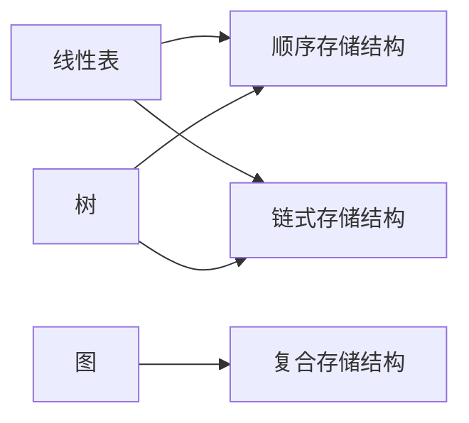
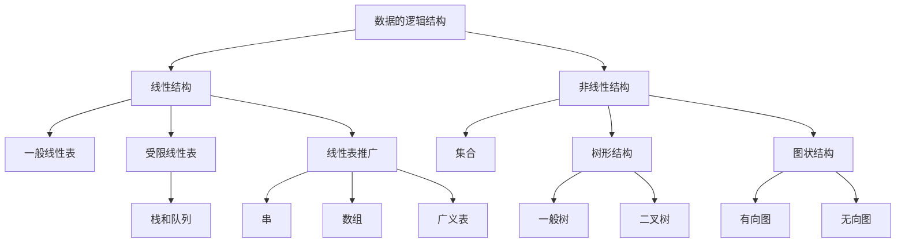

# 数据结构

## 课程信息

- **课程名称**：数据结构
- **教学形式**：线上 + 线下
- **学时**：14 周
- **教材**：清华大学《数据结构》
- **平台**：PTA 网站注册并绑定
- **作业要求**：每周一次作业，实验课上交，纸质版（手写）

### 评分标准

| 项目 | 占比 |
| --- | --- |
| 期末考 | 40% |
| **平时成绩** | **60%** |
| ├ 出勤 | 5% |
| ├ 平时作业 & 实验 | 10% |
| ├ 实验考试 | 25% |
| └ 期中考试 | 20% |

> [!note] 网课要求  
> 自学网课的时长需 **≥ 视频总时长的 60%**。

---

## 第1章 绪论

### 1.1 数据结构及其概念

《数据结构》是介于数学、计算机硬件、计算机软件三者之间的一门**核心课程**。

计算机求解问题的一般步骤：

1. 由问题抽象出一个适当的**数学模型**（如何用数据形式描述问题）
2. 分析问题所涉及的数据量大小及数据之间的关系
3. 考虑如何在计算机中**存储数据**及体现数据之间的关系
4. 确定处理问题时需要对数据作的**运算**
5. 评估所编写程序的性能是否良好

#### 1.1.1 数据结构的例子

| 逻辑结构类型 | 元素间关系 | 生活实例 |
| --- | --- | --- |
| 线性结构 | 一对一 | 电话号码簿（名字 ↔ 号码） |
| 树型结构 | 一对多 | 磁盘目录文件系统 |
| 图状 / 网状结构 | 多对多 | 交通网络图 |

### 1.2 基本概念和术语

| 术语 | 定义 |
| --- | --- |
| **数据**（Data） | 客观事物的符号表示，指所有能输入到计算机中并被程序处理的符号的总称 |
| **数据元素**（Data Element） | 数据的**基本单位**，在程序中通常作为一个整体来考虑和处理 |
| **数据项**（Data Item） | 组成数据元素的、不可分割的**最小单位** |
| **数据对象**（Data Object） | 性质相同的数据元素的**集合**，是数据的一个子集 |
| **数据结构**（Data Structure） | 相互之间存在特定关系的数据元素的**集合** |

#### 逻辑结构

数据元素之间的逻辑结构有**四种基本类型**：

| 类型 | 关系 |
| --- | --- |
| ① 集合 | 除"同属于一个集合"外，无其它关系 |
| ② 线性结构 | 一对一 |
| ③ 树型结构 | 一对多 |
| ④ 图状 / 网状结构 | 多对多 |

> 形式化定义（二元组）：  
>
> $$\text{Data\_Structure} = (D, S)$$
>
> 其中 $D$ 是数据元素的有限集，$S$ 是 $D$ 上**关系**的有限集。

#### 存储结构（物理结构）

数据结构在计算机内存中的存储，包括**数据元素的存储**和**元素之间关系的表示**：

| 存储方式 | 特点 |
| --- | --- |
| **顺序存储结构** | 用元素在存储器中的**相对位置**表示逻辑关系；地址连续 |
| **链式存储结构** | 在每个元素中增加存放另一元素地址的**指针**来表示逻辑关系；地址无连续要求 |

> [!important] 逻辑结构与物理结构的对应  
> 逻辑结构与存储结构的对应是**多对多**的：**线性表和树既可采用顺序存储，也可采用链式存储**；图采用复合存储结构。
>
> **算法的设计取决于所选定的逻辑结构，而算法的实现依赖于所采用的存储结构。**



#### 数据逻辑结构层次关系



#### C 语言实现提示

- 一维数组 → 对应 **顺序存储**
- 结构体 → 对应 **链式存储**
- 算法用 **C 语言**描述；上机实践时写成完整的 **C++** 程序。

### 1.3 抽象数据类型的表示与实现

**抽象数据类型**（Abstract Data Type, **ADT**）：一个数学模型以及定义在该模型上的一组操作。

- ADT 的定义仅是一组**逻辑特性描述**，与其在计算机内的表示和实现无关
- 形式化定义是**三元组**：  

  $$\text{ADT} = (D, S, P)$$

  其中 $D$ 是数据对象，$S$ 是 $D$ 上的关系集，$P$ 是对 $D$ 的基本操作集

一般定义形式：

```text
ADT <抽象数据类型名> {
    数据对象：<数据对象的定义>
    数据关系：<数据关系的定义>
    基本操作：<基本操作的定义>
} ADT <抽象数据类型名>
```

基本操作的定义格式：

```text
<基本操作名>(<参数表>)
    初始条件：<操作执行之前数据结构和参数应满足的条件>
    操作结果：<操作正常完成之后，数据结构的变化状况和返回结果>
```

数据结构的主要运算：建立（Create）、消除（Destroy）、删除（Delete）、插入（Insert）、访问（Access）、修改（Modify）、排序（Sort）、查找（Search）。

> [!tip] 课程要求  
> 建议熟悉 **C++ STL** 的常用容器（`vector`、`stack`、`queue`、`map` 等）和 `sort` 等常用算法，会基本用法即可；C++ 输入输出和面向对象部分可忽略。

### 1.4 算法和算法分析

#### 1.4.1 算法及其特性

**算法**（Algorithm）：对特定问题求解方法（步骤）的一种描述，是指令的有限序列。

算法的**五个特性**：

1. **有穷性**：算法必须在执行有穷步之后结束，每一步都在有穷时间内完成
2. **确定性**：每条指令有确切含义，不存在二义性
3. **可行性**：算法描述的操作都可以通过已实现的基本运算执行有限次来实现
4. **输入**：零个或多个输入
5. **输出**：一个或多个输出

> [!note] 算法 vs 程序  
> 程序是对算法用某种程序设计语言的具体实现。算法必须可终止，因此**不是所有程序都是算法**。

#### 1.4.2 算法设计的要求

1. **正确性**（Correctness）
2. **可读性**（Readability）
3. **健壮性**（Robustness）：输入非法数据时能适当作出反应或处理
4. **效率与存储量需求**：执行时间短、所需最大存储空间少

#### 1.4.3 算法效率的度量

度量方法有两种：

1. **事后统计**：必须先运行程序，依赖软硬件环境，容易掩盖算法本身的优劣，没有实际价值
2. **事前分析**：求出该算法的一个时间界限函数（常用）

时间复杂度记为：

$$T(n) = O(f(n))$$

即算法的**渐近时间复杂度**，一般用最深层循环内语句（原操作）的执行频度表示。

##### 常见时间复杂度

| 名称 | 复杂度 |
| --- | --- |
| 常量时间阶 | $O(1)$ |
| 对数时间阶 | $O(\log_2 n)$ |
| 线性时间阶 | $O(n)$ |
| 线性对数时间阶 | $O(n \log n)$ |
| k 次方时间阶（k≥2） | $O(n^k)$ |

##### 时间复杂度增长顺序

$$O(1) < O(\log n) < O(n) < O(n \log n) < O(n^2) < O(n^3)$$

指数时间：

$$O(2^n) < O(n!) < O(n^n)$$

> 当 n 取得很大时，指数时间算法和多项式时间算法在所需时间上非常悬殊。

##### 多项式定理

> [!theorem] 多项式时间复杂度定理  
> 若  
>
> $$A(n) = a_m n^m + a_{m-1} n^{m-1} + \cdots + a_1 n + a_0$$
>
> 是一个 $m$ 次多项式，则  
>
> $$A(n) = O(n^m)$$

##### 基础例子

**例 1**：两个 n 阶方阵乘法，三重循环，总次数 $n \times n \times n = n^3$，时间复杂度 $O(n^3)$。

**例 2**：`{ ++x; s = 0; }` 语句频度为 1（或 2），时间复杂度均为 $O(1)$，即**常量阶**。

**例 3**：`for(i=1; i<=n; ++i) { ++x; s += x; }` 语句频度 $2n$，时间复杂度 $O(n)$，**线性阶**。

**例 4**：二重循环，语句频度 $2n^2$，时间复杂度 $O(n^2)$，**平方阶**。

**例 5**：嵌套循环

```c
for (i = 2; i <= n; ++i)
    for (j = 2; j <= i - 1; ++j)
        { ++x; a[i][j] = x; }
```

语句频度：

$$1 + 2 + 3 + \cdots + (n-2) = \frac{(1 + n - 2)(n - 2)}{2} = \frac{(n - 1)(n - 2)}{2} = n^2 - 3n + 2$$

因此，时间复杂度为 $O(n^2)$，即**平方阶**。

> - $O(1)$：基本运算执行次数固定，总时间由常数（零次多项式）限界。
> - $O(n^2)$：算法执行时间由二次多项式限界。

##### 特殊时间复杂度案例

**例 1：素数判断算法**

```c
void prime(int n)
{
    int i = 2;
    while ((n % i) != 0 && i * 1.0 < sqrt(n))
        i++;
    if (i * 1.0 > sqrt(n))
        printf("%d 是一个素数\n", n);
    else
        printf("%d 不是一个素数\n", n);
}
```

- 嵌套最深层语句：`i++`
- 频度由条件 `(n % i) != 0 && i * 1.0 < sqrt(n)` 决定
- 时间复杂度：$O(n^{1/2})$

**例 2：冒泡排序法**

```c
void bubble_sort(int a[], int n)
{
    for (i = n - 1; change = TRUE; i > 1 && change; --i) {
        change = FALSE;
        for (j = 0; j < i; ++j)
            if (a[j] > a[j + 1]) {
                a[j] <-> a[j + 1];
                change = TRUE;
            }
    }
}
```

| 情况 | 比较/交换次数 | 时间复杂度 |
| --- | --- | --- |
| 最好 | 0 次交换 | $O(n)$ |
| 最坏 | $1 + 2 + \cdots + (n-1) = \frac{n(n-1)}{2}$ | $O(n^2)$ |
| 平均 | — | $O(n^2)$ |

> [!question] 待补充  
> 平均时间复杂度的计算方法（等概率分析法，可参考第 2 章顺序表插入/删除的复杂度分析：$E = \sum p_i \times \text{移动次数}$）

#### 1.4.4 算法的存储空间需求

**空间复杂度**（Space Complexity）：算法编写成程序后在计算机中运行时所需**存储空间大小**的度量：

$$S(n) = O(f(n))$$

所需存储空间一般包括三个方面：

1. 指令、常数、变量所占用的存储空间
2. 输入数据所占用的存储空间
3. **辅助（存储）空间** ← 一般地，空间复杂度指的是**辅助空间**

例子：

- 一维数组 `a[n]`：空间复杂度 $O(n)$
- 二维数组 `a[n][m]`：空间复杂度 $O(n \times m)$

---

## 第2章 线性表

### 2.1 线性表的类型定义

**线性表**（Linear List）：由 $n$（$n \geq 0$）个**数据元素**（结点）$a_1, a_2, \ldots, a_n$ 组成的**有限序列**。所有结点具有相同的数据类型，元素个数 $n$ 称为线性表的**长度**。

- $n = 0$：**空表**
- $n > 0$：记作 $(a_1, a_2, \ldots, a_n)$
- $a_1$：首结点；$a_n$：尾结点
- $a_{i-1}$ 是 $a_i$ 的**直接前驱**，$a_{i+1}$ 是 $a_i$ 的**直接后继**

#### 线性表的特点

1. 存在唯一的"第一个"**数据元素
2. 存在唯一的"最后一个"**数据元素
3. 除第一个元素外，每个元素均有唯一一个**直接前驱**
4. 除最后一个元素外，每个元素均有唯一一个**直接后继**

#### 线性表的逻辑结构

- 结点可以是**单值元素**（每个元素只有一个数据项）：
  - 26 个英文字母：$(A, B, C, \ldots, Z)$
  - 某校 1978–1983 年计算机拥有量：$(6, 17, 28, 50, 92, 188)$
- 也可以是**记录型元素**（每个元素含多个数据项，能唯一标识结点的数据项组称为**关键字**）
- 若结点按值（或关键字值）从小到大（或从大到小）排列，称线性表是**有序的**

#### 线性表的抽象数据类型定义

```text
ADT List {
    数据对象：
        D = { a_i | a_i ∈ ElemSet, i = 1, 2, ..., n, n ≥ 0 }

    数据关系：
        R = { <a_{i-1}, a_i> | a_{i-1}, a_i ∈ D, i = 2, 3, ..., n }

    基本操作：
        InitList(&L)  // & 表示 C++ 的引用，见下方示例
        操作结果：构造一个空的线性表 L；

        ListLength(L)
        初始条件：线性表 L 已存在；
        操作结果：返回 L 中数据元素个数；

        GetElem(L, i, &e)
        初始条件：线性表 L 已存在，1 ≤ i ≤ ListLength(L)；
        操作结果：用 e 返回 L 中第 i 个数据元素的值；

        ListInsert(&L, i, e)
        初始条件：线性表 L 已存在，1 ≤ i ≤ ListLength(L)；
        操作结果：在 L 中第 i 个位置插入元素 e；
        ...
} ADT List
```

#### C++ 引用

> [!note] 引用本质  
> C++ 的引用相当于**形参与实参共享同一块内存**，非常适合用来改变实参的值。

##### 示例：传值 vs 传引用

```cpp
#include <stdio.h>

// 修改形参，实参不影响
void f1(int i, int *q) {
    i++;
    q++;
}

// 修改形参，实参同时改变
void f2(int &i, int *&q) {
    i++;
    q++;
}

int main() {
    int a = 10, b[] = {20, 30};
    int *p = b;

    f1(a, p);
    printf("a = %d, *p = %d\n", a, *p);  // a=10, *p=20

    f2(a, p);
    printf("a = %d, *p = %d\n", a, *p);  // a=11, *p=30

    return 0;
}
```

##### 运行结果

```text
a=10, *p=20
a=11, *p=30
```

> [!tip] 引用 vs return  
> **引用**比 `return` 更方便传出结果。

---

## 附录：速查表

### 常见时间复杂度速记

```text
O(1) < O(log n) < O(n) < O(n log n) < O(n^2) < O(n^3) < O(2^n) < O(n!) < O(n^n)
```
