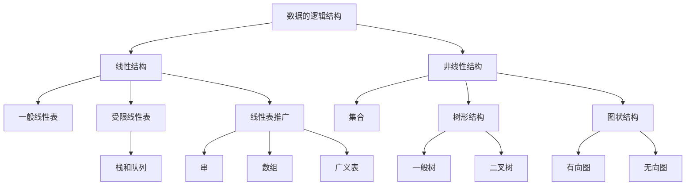

# 数据结构

> [!info] 本笔记范围
> - 依据课件《第1章 绪论》（35 页）与《第2章 线性表》（74 页）整理，主讲：黄绍辉
> - 覆盖：第 1 章 1.1–1.4 全部、第 2 章 2.1–2.4 全部（顺序表、单链表、静态链表、循环链表、双向链表、一元多项式）
> - 已删：章节封面与致谢页、重复过渡页
> - 9/7 首版来自手写课堂笔记；9/14 按课件补全 2.2–2.4，并压缩了 callout 用量

## 目录

1. [[#课程信息]]
  1.1 [[#评分标准]]
2. [[#第1章 绪论]]
  2.1 [[#1.1 数据结构及其概念]]
  2.2 [[#1.2 基本概念和术语]]
  2.3 [[#1.3 抽象数据类型的表示与实现]]
  2.4 [[#1.4 算法和算法分析]]
3. [[#第2章 线性表]]
  3.1 [[#2.1 线性表的类型定义]]
  3.2 [[#2.2 线性表的顺序表示和实现]]
  3.3 [[#2.3 线性表的链式表示和实现]]
  3.4 [[#静态链表]]
  3.5 [[#2.3.2 循环链表]]
  3.6 [[#2.3.3 双向链表]]
  3.7 [[#2.4 一元多项式的表示及相加]]
4. [[#本章小结]]
5. [[#相关链接]]

## 课程信息

- **课程名称**：数据结构
- **教学形式**：线上 + 线下
- **学时**：14 周
- **教材**：清华大学《数据结构》
- **平台**：PTA 网站注册并绑定
- **作业要求**：每周一次作业，实验课上交，纸质版（手写）
- **网课要求**：自学网课时长需 **≥ 视频总时长的 60%**

### 评分标准

| 项目 | 占比 |
| --- | --- |
| 期末考 | 40% |
| **平时成绩** | **60%** |
| ├ 出勤 | 5% |
| ├ 平时作业 & 实验 | 10% |
| ├ 实验考试 | 25% |
| └ 期中考试 | 20% |

---

## 第1章 绪论

### 1.1 数据结构及其概念

《数据结构》是介于数学、计算机硬件、计算机软件三者之间的一门**核心课程**，不仅是一般程序设计的基础，也是设计和实现编译程序、操作系统、数据库系统及其他系统程序和大型应用程序的重要基础。

随着应用问题不断复杂，信息量剧增、信息范围拓宽，必须先分析待处理问题中**对象的特征**及**各对象之间存在的关系**——这正是数据结构这门课研究的问题。

**编写解决实际问题的程序的一般过程**：

1. 如何用数据形式描述问题——由问题抽象出一个适当的**数学模型**
2. 问题所涉及的数据量大小及数据之间的关系
3. 如何在计算机中存储数据及体现数据之间的关系
4. 处理问题时需要对数据作何种运算
5. 所编写的程序的性能是否良好

#### 1.1.1 数据结构的例子

| 例子 | 数据间关系 | 结构类型 |
| --- | --- | --- |
| 电话号码查询系统：$(a_1, b_1), (a_2, b_2), \ldots, (a_n, b_n)$（$a_i$ 姓名，$b_i$ 号码） | 一对一 | 线性结构（表格问题） |
| 磁盘目录文件系统：每个子目录只有一个父目录，可包含多个子目录和文件 | 一对多 | 树型结构 |
| 交通网络图：从一个地方到另一个地方可以有多条路径 | 多对多 | 网状结构 |

### 1.2 基本概念和术语

| 术语 | 定义 |
| --- | --- |
| **数据**（Data） | 客观事物的符号表示；在计算机科学中指所有能输入到计算机中并被计算机程序处理的符号的总称 |
| **数据元素**（Data Element） | 数据的**基本单位**，在程序中通常作为一个整体来考虑和处理 |
| **数据项**（Data Item） | 数据的**不可分割的最小单位**，是对客观事物某一方面特性的数据描述。一个数据元素可由若干数据项组成 |
| **数据对象**（Data Object） | 性质相同的数据元素的**集合**，是数据的一个子集，如字符集合 $C = \{'A', 'B', 'C', \ldots\}$ |
| **数据结构**（Data Structure） | 相互之间存在一定联系（关系）的数据元素的集合 |

#### 逻辑结构

元素之间的相互联系（关系）称为**逻辑结构**，有四种基本类型：

| 类型 | 关系 |
| --- | --- |
| ① 集合 | 结构中的数据元素除了"同属于一个集合"外，没有其它关系 |
| ② 线性结构 | 一对一 |
| ③ 树型结构 | 一对多 |
| ④ 图状 / 网状结构 | 多对多 |

> [!definition] 数据结构的形式定义
> 数据结构是一个**二元组**：
> $$\text{Data\_Structure} = (D, S)$$
> 其中 $D$ 是数据元素的有限集，$S$ 是 $D$ 上关系的有限集。

数据元素之间的关系可以是元素之间代表某种含义的**自然关系**，也可以是为处理问题方便而**人为定义**的关系。

**例（课件）**：设数据逻辑结构 $B = (K, R)$

$$K = \{k_1, k_2, \ldots, k_9\}$$

$$R = \{\langle k_1, k_3\rangle, \langle k_1, k_8\rangle, \langle k_2, k_3\rangle, \langle k_2, k_4\rangle, \langle k_2, k_5\rangle, \langle k_3, k_9\rangle, \langle k_5, k_6\rangle, \langle k_8, k_9\rangle, \langle k_9, k_7\rangle, \langle k_4, k_7\rangle, \langle k_4, k_6\rangle\}$$

根据以上描述可以画出逻辑结构 $B$ 的图示，并确定哪些是起点、哪些是终点。

#### 存储结构（物理结构）

数据结构在计算机内存中的存储包括**数据元素的存储**和**元素之间关系的表示**。元素之间的关系有两种不同的表示方法（顺序表示 / 非顺序表示），由此得到两种不同的存储结构：

| 存储方式 | 特点 |
| --- | --- |
| **顺序存储结构** | 用数据元素在存储器中的**相对位置**表示数据元素之间的逻辑结构；地址连续 |
| **链式存储结构** | 在每个数据元素中增加一个存放另一个元素地址的**指针**（pointer），用该指针表示逻辑结构；地址是否连续没有要求 |

**例**：设有数据集合 $A = \{3.0, 2.3, 5.0, -8.5, 11.0\}$，可以设计两种不同的存储结构——顺序结构（存放地址连续）与链式结构（对地址连续性无要求）。

**数据结构的三个组成部分**：

1. **逻辑结构**：数据元素之间逻辑关系的描述，$D\_S = (D, S)$
2. **存储结构**：数据元素在计算机中的存储及其逻辑关系的表现，又称**物理结构**
3. **数据操作**：对数据要进行的运算

> [!important] 逻辑结构与存储结构的对应关系
> 二者是**多对多**的：线性表和树既可采用顺序存储，也可采用链式存储；图采用复合存储结构。
>
> ```mermaid
> flowchart LR
>     A1[线性表] --> B1[顺序存储结构]
>     A1 --> B2[链式存储结构]
>     A2[树] --> B1
>     A2 --> B2
>     A3[图] --> B3[复合存储结构]
> ```
>
> **算法的设计取决于所选定的逻辑结构，而算法的实现依赖于所采用的存储结构。**

**在 C 语言中**：用一维数组表示顺序存储结构；用结构体类型表示链式存储结构。

#### 数据逻辑结构层次关系



#### 数据类型

**数据类型**（Data Type）：一个值的集合和定义在该值集上的一组操作的总称。在 C 语言中有基本类型和构造类型。

数据结构不同于数据类型，也不同于数据对象：它不仅要描述数据类型的数据对象，而且要描述数据对象**各元素之间的相互关系**。

#### 数据结构的运算

数据结构的主要运算包括：

1. 建立（Create）一个数据结构
2. 消除（Destroy）一个数据结构
3. 从一个数据结构中删除（Delete）一个数据元素
4. 把一个数据元素插入（Insert）到一个数据结构中
5. 对一个数据结构进行访问（Access）
6. 对一个数据结构（中的数据元素）进行修改（Modify）
7. 对一个数据结构进行排序（Sort）
8. 对一个数据结构进行查找（Search）

### 1.3 抽象数据类型的表示与实现

**抽象数据类型**（Abstract Data Type，**ADT**）：一个数学模型以及定义在该模型上的一组操作。

ADT 的定义仅是一组**逻辑特性描述**，与其在计算机内的表示和实现无关。因此不论 ADT 的内部结构如何变化，只要其数学特性不变，都不影响其外部使用。

**ADT 的形式化定义是三元组**：

$$\text{ADT} = (D, S, P)$$

其中 $D$ 是数据对象，$S$ 是 $D$ 上的关系集，$P$ 是对 $D$ 的基本操作集。

**ADT 的一般定义形式**：

```text
ADT <抽象数据类型名> {
    数据对象：<数据对象的定义>
    数据关系：<数据关系的定义>
    基本操作：<基本操作的定义>
} ADT <抽象数据类型名>
```

其中数据对象和数据关系的定义用伪码描述。

**基本操作的定义格式**：

```text
<基本操作名>(<参数表>)
    初始条件：<初始条件描述>
    操作结果：<操作结果描述>
```

- **初始条件**：描述操作执行之前数据结构和参数应满足的条件；若不满足，则操作失败，返回相应的出错信息
- **操作结果**：描述操作正常完成之后，数据结构的变化状况和应返回的结果

### 1.4 算法和算法分析

#### 1.4.1 算法及其特性

**算法**（Algorithm）：对特定问题求解方法（步骤）的一种描述，是指令的有限序列，其中每一条指令表示一个或多个操作。

**算法的五个特性**：

1. **有穷性**：一个算法必须总是在执行有穷步之后结束，且每一步都在有穷时间内完成
2. **确定性**：算法中每一条指令必须有确切的含义，不存在二义性；且算法只有一个入口和一个出口
3. **可行性**：算法描述的操作都可以通过已经实现的基本运算执行有限次来实现
4. **输入**：有零个或多个输入，这些输入取自于某个特定的对象集合
5. **输出**：有一个或多个输出，这些输出是同输入有着某些特定关系的量

一个算法可以用自然语言、形式语言或计算机程序设计语言来描述。

**算法和程序是两个不同的概念**：一个计算机程序是对一个算法使用某种程序设计语言的具体实现。算法必须可终止，意味着**不是所有的计算机程序都是算法**。

本门课程的学习、作业练习、上机实践等环节，算法都用 **C 语言**来描述；上机实践时为了检查算法是否正确，应编写成完整的 **C++ 语言程序**（不是 C 语言）。

建议熟悉 **C++ 的标准模板库 STL**（包括 `vector`、`stack`、`queue`、`map` 等常用容器和 `sort` 等常用算法，会基本用法就行）。至于 C++ 输入输出和面向对象的部分，可以忽略。

#### 1.4.2 算法设计的要求

1. **正确性**（Correctness）：算法应满足具体问题的需求
2. **可读性**（Readability）：算法应容易供人阅读和交流，可读性好的算法有助于理解与修改
3. **健壮性**（Robustness）：算法应具有容错处理；当输入非法或错误数据时，应能适当地作出反应或进行处理，而不会产生莫名其妙的输出结果
4. **效率与存储量需求**：效率指算法执行的时间；存储量需求指算法执行过程中所需要的最大存储空间。一般地，这两者与问题的规模有关

#### 1.4.3 算法效率的度量

算法执行时间需通过依据该算法编制的程序在计算机上运行所消耗的时间来度量，通常有两种方法：

| 方法 | 说明 |
| --- | --- |
| **事后统计** | 计算机内部进行执行时间和实际占用空间的统计。缺陷：必须先运行依据算法编制的程序；依赖软硬件环境，容易掩盖算法本身的优劣；**没有实际价值** |
| **事前分析** | 求出该算法的一个时间界限函数（常用） |

与此相关的因素有：算法选用的策略、问题的规模、程序设计的语言、编译程序所产生的机器代码的质量、机器执行指令的速度。撇开软硬件等有关因素，可以认为一个特定算法"运行工作量"的大小只依赖于**问题的规模**（通常用 $n$ 表示），是问题规模的函数。

**时间复杂度**：算法中基本操作重复执行的次数是问题规模 $n$ 的某个函数，其时间量度记作

$$T(n) = O(f(n))$$

称作算法的**渐近时间复杂度**（Asymptotic Time Complexity），简称时间复杂度。一般地，常用**最深层循环内的语句**中的原操作的执行频度（重复执行的次数）来表示。

"$O$"的定义：若 $f(n)$ 是正整数 $n$ 的一个函数，则 $O(f(n))$ 表示存在 $M \geq 0$，使得当 $n \geq n_0$ 时，$|f(n)| \leq M|f(n_0)|$。

**表示时间复杂度的阶有**：

| 名称 | 复杂度 |
| --- | --- |
| 常量时间阶 | $O(1)$ |
| 对数时间阶 | $O(\log_2 n)$ |
| 线性时间阶 | $O(n)$ |
| 线性对数时间阶 | $O(n \log n)$ |
| k 次方时间阶（$k \geq 2$） | $O(n^k)$ |

**六种常用多项式的大小关系**：

$$O(1) < O(\log n) < O(n) < O(n \log n) < O(n^2) < O(n^3)$$

**指数时间的关系为**：

$$O(2^n) < O(n!) < O(n^n)$$

当 $n$ 取得很大时，指数时间算法和多项式时间算法在所需时间上非常悬殊。

> [!important] 定理：多项式的时间复杂度
> 若
> $$A(n) = a_m n^m + a_{m-1} n^{m-1} + \cdots + a_1 n + a_0$$
> 是一个 $m$ 次多项式，则
> $$A(n) = O(n^m)$$

##### 例 1：两个 n 阶方阵的乘法

```c
for (i = 1; i <= n; ++i)
    for (j = 1; j <= n; ++j)
    { c[i][j] = 0;
      for (k = 1; k <= n; ++k)
          c[i][j] += a[i][k] * b[k][j];
    }
```

三重循环，每个循环从 1 到 $n$，总次数为 $n \times n \times n = n^3$，时间复杂度 $T(n) = O(n^3)$。

##### 例 2：`{ ++x; s = 0; }`

将 `x` 自增看成基本操作，语句频度为 1，时间复杂度为 $O(1)$；如果将 `s = 0` 也看成基本操作，语句频度为 2，时间复杂度仍为 $O(1)$，即**常量阶**。

##### 例 3：`for (i = 1; i <= n; ++i) { ++x; s += x; }`

语句频度为 $2n$，时间复杂度为 $O(n)$，即**线性阶**。

##### 例 4：二重循环

```c
for (i = 1; i <= n; ++i)
    for (j = 1; j <= n; ++j)
    { ++x; s += x; }
```

语句频度为 $2n^2$，时间复杂度为 $O(n^2)$，即**平方阶**。

##### 例 5：嵌套循环

```c
for (i = 2; i <= n; ++i)
    for (j = 2; j <= i - 1; ++j)
        { ++x; a[i][j] = x; }
```

语句频度为：

$$1 + 2 + 3 + \cdots + (n-2) = \frac{(1 + n - 2)(n - 2)}{2} = \frac{(n-1)(n-2)}{2} = n^2 - 3n + 2$$

时间复杂度为 $O(n^2)$，即**平方阶**。

一个算法时间为 $O(1)$ 的算法，它的基本运算执行的次数是固定的，因此总的时间由一个常数（即零次多项式）来限界；而一个时间为 $O(n^2)$ 的算法则由一个二次多项式来限界。

##### 例 6：素数的判断算法

```c
void prime(int n)          /* n 是一个正整数 */
{   int i = 2;
    while ((n % i) != 0 && i * 1.0 < sqrt(n))  i++ ;
    if (i * 1.0 > sqrt(n))
        printf("%d 是一个素数\n", n);
    else
        printf("%d 不是一个素数\n", n);
}
```

嵌套的最深层语句是 `i++`；其频度由条件 `(n % i) != 0 && i * 1.0 < sqrt(n)` 决定，时间复杂度 $O(n^{1/2})$。

##### 例 7：冒泡排序法

```c
void bubble_sort(int a[], int n)
{
    for (i = n - 1; change = TURE; i > 1 && change; --i)
        change = FALSE;
        for (j = 0; j < i; ++j)
            if (a[j] > a[j + 1])
            { a[j] <-> a[j + 1]; change = TURE; }
}
```

- 最好情况：0 次
- 最坏情况：$1 + 2 + 3 + \cdots + (n-1) = \dfrac{n(n-1)}{2}$
- 平均时间复杂度为：$O(n^2)$

有的情况下，算法中基本操作重复执行的次数还随问题的**输入数据集**不同而不同。平均时间复杂度按各输入情况等概率加权平均求得，具体算法见 2.2 节顺序表插入 / 删除的分析（$E = \sum p_i \times \text{移动次数}$）。

#### 1.4.4 算法的存储空间需求

**空间复杂度**（Space Complexity）：算法编写成程序后，在计算机中运行时所需存储空间大小的度量，记作

$$S(n) = O(f(n))$$

其中 $n$ 为问题的规模（或大小）。

该存储空间一般包括三个方面：

1. 指令、常数、变量所占用的存储空间
2. 输入数据所占用的存储空间
3. **辅助（存储）空间**

一般地，算法的空间复杂度指的是**辅助空间**。

- 一维数组 `a[n]`：空间复杂度 $O(n)$
- 二维数组 `a[n][m]`：空间复杂度 $O(n \times m)$

---

## 第2章 线性表

线性结构是最常用、最简单的一种数据结构，而线性表是一种典型的线性结构。其基本特点是线性表中的数据元素是**有序且有限**的。

### 2.1 线性表的类型定义

> [!definition] 线性表（Linear List）
> 由 $n$（$n \geq 0$）个数据元素（结点）$a_1, a_2, \ldots, a_n$ 组成的**有限序列**，序列中的所有结点具有相同的数据类型。数据元素的个数 $n$ 称为线性表的**长度**。

- $n = 0$ 时称为**空表**
- $n > 0$ 时，将非空的线性表记作 $(a_1, a_2, \ldots, a_n)$
- $a_1$ 称为线性表的第一个（首）结点，$a_n$ 称为最后一个（尾）结点
- $a_1, a_2, \ldots, a_{i-1}$ 都是 $a_i$（$2 \leq i \leq n$）的前驱，其中 $a_{i-1}$ 是**直接前驱**
- $a_{i+1}, a_{i+2}, \ldots, a_n$ 都是 $a_i$（$1 \leq i \leq n-1$）的后继，其中 $a_{i+1}$ 是**直接后继**

#### 线性表的特点

在这种结构中：

1. 存在一个唯一的被称为"**第一个**"的数据元素
2. 存在一个唯一的被称为"**最后一个**"的数据元素
3. 除第一个元素外，每个元素均有唯一一个**直接前驱**
4. 除最后一个元素外，每个元素均有唯一一个**直接后继**

#### 线性表的逻辑结构

线性表中的数据元素 $a_i$ 所代表的具体含义随具体应用的不同而不同，在线性表的定义中只不过是一个抽象的表示符号。

结点可以是**单值元素**（每个元素只有一个数据项）：

- 26 个英文字母组成的字母表：$(A, B, C, \ldots, Z)$
- 某校从 1978 年到 1983 年各种型号的计算机拥有量的变化情况：$(6, 17, 28, 50, 92, 188)$
- 一副扑克的点数：$(2, 3, 4, \ldots, J, Q, K, A)$

结点也可以是**记录型元素**——每个元素含有多个数据项，每个项称为结点的一个**域**；每个元素有一个可以唯一标识每个结点的数据项组，称为**关键字**：

- 某校 2001 级同学的基本情况：$\{('2001414101', '张三', '男', 06/24/1983), \ldots, ('2001414102', '李四', '女', 08/12/1984)\}$

若线性表中的结点是按值（或按关键字值）由小到大（或由大到小）排列的，称线性表是**有序的**。线性表长度可根据需要增长或缩短，对线性表的数据元素可以访问、插入和删除。

#### 线性表的抽象数据类型定义

```text
ADT List {
    数据对象：D = { a_i | a_i ∈ ElemSet, i = 1, 2, …, n, n ≥ 0 }
    数据关系：R = { <a_{i-1}, a_i> | a_{i-1}, a_i ∈ D, i = 2, 3, …, n }
    基本操作：
        InitList(&L)          // & 表示 C++ 的引用，见下节
            操作结果：构造一个空的线性表 L；
        ListLength(L)
            初始条件：线性表 L 已存在；
            操作结果：返回 L 中数据元素个数；
        GetElem(L, i, &e)
            初始条件：线性表 L 已存在，1 ≤ i ≤ ListLength(L)；
            操作结果：用 e 返回 L 中第 i 个数据元素的值；
        ListInsert(&L, i, e)
            初始条件：线性表 L 已存在，1 ≤ i ≤ ListLength(L)；
            操作结果：在 L 中第 i 个位置插入元素 e；
        …
} ADT List
```

#### C++ 的引用

C++ 的引用相当于**形参实参内存共享**，很适合用来改变实参的值。

```cpp
#include <stdio.h>

void f1(int i, int *q)
{   // 修改形参，实参不影响
    i++; q++;
}

void f2(int &i, int *&q)
{   // 修改形参，实参同时改变
    i++; q++;
}

int main()
{
    int a = 10, b[] = {20, 30};
    int *p = b;
    f1(a, p);
    printf("a = %d, *p = %d\n", a, *p);
    f2(a, p);
    printf("a = %d, *p = %d\n", a, *p);
    return 0;
}
```

运行结果：

```text
a=10, *p=20
a=11, *p=30
```

引用比 `return` 更方便传出结果。

#### 例 2-1：求集合并集 $A = A \cup B$

假设利用两个线性表 LA 和 LB 分别表示两个集合 A 和 B，求一个新集合 $A = A \cup B$。

```c
void union(List &La, List Lb) {          // La 变，Lb 不变
    // 将所有在 Lb 中但不在 La 中的元素插入 La
    La_len = ListLength(La);  Lb_len = ListLength(Lb);
    for (i = 1; i <= Lb_len; i++) {
        GetElem(Lb, i, e);               // 取 Lb 中第 i 个元素赋给 e
        if (!LocateElem(La, e, equal))   // La 中不存在和 e 相同的元素
            ListInsert(La, ++La_len, e); // 插入
    }
} // union
```

#### 例 2-2：归并两个有序线性表

线性表 LA 和 LB 的元素按值**非递减**有序排列，现要求将 La 和 Lb 归并为一个新的线性表 Lc，且 Lc 按值非递减有序排列。

```c
void MergeList(List La, List Lb, List &Lc) {
    InitList(Lc);  i = j = 1;  k = 0;
    La_len = ListLength(La);  Lb_len = ListLength(Lb);
    while ((i <= La_len) && (j <= Lb_len)) {      // La 和 Lb 均非空
        GetElem(La, i, ai);  GetElem(Lb, j, bj);
        if (ai <= bj) { ListInsert(Lc, ++k, ai); ++i; }
        else          { ListInsert(Lc, ++k, bj); ++j; }
    }
    while (i <= La_len) { GetElem(La, i++, ai); ListInsert(Lc, ++k, ai); }
    while (j <= Lb_len) { GetElem(Lb, j++, bj); ListInsert(Lc, ++k, bj); }
} // MergeList
```

### 2.2 线性表的顺序表示和实现

**顺序存储**：把线性表的结点按逻辑顺序依次存放在一组**地址连续**的存储单元里。用这种方法存储的线性表简称**顺序表**。

顺序存储的线性表的特点：

- 线性表的**逻辑顺序与物理顺序一致**
- 数据元素之间的关系是以元素在计算机内"**物理位置相邻**"来体现

#### 地址计算公式

设线性表的每个元素需占用 $L$ 个存储单元，以所占的第一个单元的存储地址作为数据元素的存储位置，则线性表中第 $i+1$ 个数据元素的存储位置 $\text{LOC}(a_{i+1})$ 和第 $i$ 个数据元素的存储位置 $\text{LOC}(a_i)$ 之间满足：

$$\text{LOC}(a_{i+1}) = \text{LOC}(a_i) + L$$

线性表的第 $i$ 个数据元素 $a_i$ 的存储位置为：

$$\text{LOC}(a_i) = \text{LOC}(a_1) + (i-1) \times L$$

在高级语言（如 C 语言）环境下，数组具有**随机存取**的特性，因此可以借助数组来描述顺序表。除了用数组来存储线性表的元素之外，顺序表还应该有表示线性表**长度**的属性。

#### 顺序表类型定义

```c
#define LIST_INIT_SIZE 100    // 空间初始分配量
#define LISTINCREMENT   10    // 空间分配增量

typedef struct
{   ElemType *elem;      // 存储空间基址
    int      length;     // 当前长度
    int      listsize;   // 当前分配容量
} SqList;
```

顺序存储结构中，很容易实现线性表的初始化、赋值、查找、修改、插入、删除、求长度等操作。

#### 顺序线性表初始化

```c
Status InitList_Sq(SqList &L)
{   L.elem = (ElemType *)malloc(LIST_INIT_SIZE * sizeof(ElemType));
    if (!L.elem)  exit(OVERFLOW);       // 存储分配失败
    L.length   = 0;                     // 空表长度为 0
    L.listsize = LIST_INIT_SIZE;        // 初始存储容量
    return OK;
}
```

#### 顺序线性表的插入

在线性表 $L = (a_1, \ldots, a_{i-1}, a_i, a_{i+1}, \ldots, a_n)$ 中的第 $i$（$1 \leq i \leq n$）个位置上插入一个新结点 $e$，使其成为：

$$L = (a_1, \ldots, a_{i-1}, e, a_i, a_{i+1}, \ldots, a_n)$$

**实现步骤**：

1. 将线性表 $L$ 中的第 $i$ 个至第 $n$ 个结点**后移一个位置**
2. 将结点 $e$ 插入到结点 $a_{i-1}$ 之后
3. 线性表长度加 1

```c
Status ListInsert_Sq(Sqlist &L, int i, ElemType e) {
    if (i < 1 || i > L.length + 1)  return ERROR;    // i 值不合法
    if (L.length >= L.listsize) {                    // 空间已满
        // 重新分配内存，代码参考课本
    }
    q = &(L.elem[i - 1]);                            // q 指示插入位置
    for (p = &(L.elem[L.length - 1]); p >= q; --p)
        *(p + 1) = *p;                               // 插入位置之后的元素右移
    *q = e;                                          // 插入 e
    ++L.length;                                      // 表长加 1
    return OK;
}
```

##### 插入的时间复杂度分析

时间主要耗费在**表中结点的移动**上，因此可用结点的移动次数来估计算法的时间复杂度。设在线性表 $L$ 中的第 $i$ 个元素之前插入结点的概率为 $p_i$，不失一般性，设各个位置插入是等概率，则 $p_i = \dfrac{1}{n+1}$，而插入时移动结点的次数为 $n - i + 1$。

总的平均移动次数：

$$E_{insert} = \sum_{i=1}^{n} p_i (n - i + 1) = \frac{1}{n+1}\bigl(n + (n-1) + \cdots + 1\bigr) = \frac{n}{2}$$

即在顺序表上做插入运算，平均要移动表上一半结点，算法的平均时间复杂度为 $O(n)$。

#### 顺序线性表的删除

在线性表 $L = (a_1, \ldots, a_{i-1}, a_i, a_{i+1}, \ldots, a_n)$ 中删除结点 $a_i$（$1 \leq i \leq n$），使其成为：

$$L = (a_1, \ldots, a_{i-1}, a_{i+1}, \ldots, a_n)$$

**实现步骤**：

1. 将线性表 $L$ 中的第 $i+1$ 个至第 $n$ 个结点**依次向前移动一个位置**
2. 线性表长度减 1

```c
Status ListDelete_Sq(Sqlist &L, int i, ElemType &e) {
    if (i < 1 || i > L.length)  return ERROR;   // i 值不合法
    p = &(L.elem[i - 1]);                       // p 为被删除元素的位置
    e = *p;                                     // 被删除元素的值赋给 e
    q = L.elem + L.length - 1;                  // 表尾元素的位置
    for (++p; p <= q; ++p)  *(p - 1) = *p;      // 被删元素之后的元素左移
    --L.length;                                 // 表长减 1
    return OK;
}
```

##### 删除的时间复杂度分析

设删除第 $i$ 个元素的概率为 $p_i$，不失一般性，设删除各个位置是等概率，则 $p_i = \dfrac{1}{n}$，删除时移动结点的次数为 $n - i$。

总的平均移动次数：

$$E_{delete} = \sum_{i=1}^{n} p_i (n - i) = \frac{1}{n}\bigl((n-1) + (n-2) + \cdots + 1\bigr) = \frac{n-1}{2}$$

即在顺序表上做删除运算，平均要移动表上一半结点，算法的平均时间复杂度为 $O(n)$。

> [!important] 顺序表插入 / 删除的代价
> 平均移动次数分别为 $E_{insert} = \dfrac{n}{2}$、$E_{delete} = \dfrac{n-1}{2}$，**时间复杂度均为 $O(n)$**。
> 当表长 $n$ 较大时效率相当低——这是链式存储要解决的问题。

#### 顺序线性表的查找定位

查找元素最简单的办法，就是让 $e$ 和 $L$ 中的数据元素逐个比较。`compare` 是**函数指针**，需传入用于比较两个元素的函数名。

```c
int LocateElem_Sq(Sqlist L, ElemType e,
                  Status (*compare)(ElemType, ElemType)) {
    i = 1;                  // i 的初值为第 1 个元素的位序
    p = L.elem;             // p 的初值为第 1 个元素的存储位置
    while (i <= L.length && !(*compare)(*p++, e))  ++i;
    if (i <= L.length)  return i;
    else                return 0;
}
```

#### 有序顺序表的合并

将顺序表 La 和 Lb 合并为一个新的顺序表 Lc：

```c
void MergeList_Sq(SqList La, SqList Lb, SqList &Lc) {
    pa = La.elem;  pb = Lb.elem;
    Lc.listsize = Lc.length = La.length + Lb.length;
    pc = Lc.elem = (ElemType *)malloc(Lc.listsize * sizeof(ElemType));
    if (!Lc.elem)  exit(OVERFLOW);
    pa_last = La.elem + La.length - 1;
    pb_last = Lb.elem + Lb.length - 1;
    while ((pa <= pa_last) && (pb <= pb_last)) {    // La 和 Lb 均非空
        if (*pa <= *pb)  *pc++ = *pa++;
        else             *pc++ = *pb++;
    }
    while (pa <= pa_last)  *pc++ = *pa++;           // 插入 La 的剩余元素
    while (pb <= pb_last)  *pc++ = *pb++;           // 插入 Lb 的剩余元素
} // MergeList_Sq
```

时间复杂度为 $O(\text{La.length} + \text{Lb.length})$。

以线性表表示集合并进行集合的各种运算，应**先对表中元素进行排序**。

### 2.3 线性表的链式表示和实现

**链式存储**：用一组**任意**的存储单元存储线性表中的数据元素。用这种方法存储的线性表简称**线性链表**。

存储链表中结点的一组任意的存储单元可以是连续的，也可以是不连续的，甚至是零散分布在内存中的任意位置上的。链表中结点的**逻辑顺序和物理顺序不一定相同**。

#### 2.3.1 单链表

为了正确表示结点间的逻辑关系，在存储每个结点值的同时，还必须存储指示其**直接后继结点的地址（或位置）**，称为**指针**（pointer）或**链**（link）。这两部分组成了链表中的结点结构：

```text
┌──────┬──────┐
│ data │ next │
└──────┴──────┘
  数据域   指针域
```

- `data`：数据域，存放结点的值
- `next`：指针域，存放结点的直接后继的地址
- 每一个结点只包含一个指针域的链表，称为**单链表**
- 为操作方便，总是在链表的第一个结点之前附设一个**头结点**（头指针 `head` 指向第一个结点）。头结点的数据域可以不存储任何信息（单纯占个位置），也可以存储链表长度等信息
- 单链表是由**表头**唯一确定的，因此可以用头指针的名字来命名

##### 结点的描述与实现

C 语言中用带指针的结构体类型来描述：

```c
typedef struct LNode
{   ElemType       data;    /* 数据域，保存结点的值 */
    struct LNode  *next;    /* 指针域 */
} LNode, *LinkList;         /* 结点和结点指针类型 */
```

结点是通过**动态分配和释放**来实现的：需要时分配，不需要时释放，分别使用 C 语言提供的标准函数 `malloc()`、`realloc()`、`sizeof()`、`free()`。

```c
p = (LNode *)malloc(sizeof(LNode));   // 动态分配：分配一个 LNode 结点，首地址放入 p
free(p);                              // 动态释放：系统回收 p 所指向的内存区
```

`free(p)` 中的 `p` 必须是最近一次调用 `malloc` 函数时的返回值。

##### 结点赋值与常见指针操作

**结点赋值**：

```c
LNode *p;
p = (LNode *)malloc(sizeof(LNode));
p->data = 20;  p->next = NULL;
```

**常见指针操作**：

| 操作 | 含义 | 示意图 |
| --- | --- | --- |
| `q = p` | q 指向 p 所指结点 | `p ⟶ a` ⇒ `p ⟶ a ⟵ q` |
| `q = p->next` | q 指向 p 的后继 | `p ⟶ a ⟶ b` ⇒ q 指向 b |
| `p = p->next` | p 后移一个结点 | `p ⟶ a ⟶ b` ⇒ p 指向 b |
| `q->next = p` | 把 p 所指结点接到 q 之后 | a ⟶ b 后接 p 链 |
| `q->next = p->next` | 把 p 的后继接到 q 之后 | 跳过中间结点 |

##### 建立单链表

假设线性表中结点的数据类型是整型，现在要创建有 $n$ 个结点的链表。动态地建立单链表的常用方法有两种：**头插法**与**尾插法**。

**头插法**：从一个空表开始，重复读入数据，生成新结点，将读入数据存放到新结点的数据域中，然后将新结点插入到当前链表的**表头**上，即每次插入的结点都作为链表的第一个结点。

```c
void CreateList_L(LinkList &L, int n) {      // 算法 2.11，逆序
    L = (LinkList)malloc(sizeof(LNode));
    L->next = NULL;                          // 先建立一个带头结点的单链表
    for (i = n; i > 0; i--) {
        p = (LinkList)malloc(sizeof(LNode)); // 生成新结点
        scanf(&p->data);                     // 输入元素值
        p->next = L->next;  // 注意不是 L，L 是头结点，不算链表
        L->next = p;                         // 插入到表头
    }
} // CreateList_L
```

**尾插法**：头插法生成的链表中结点的次序和输入的顺序**相反**，若希望二者次序一致，可采用尾插法——将新结点插入到当前链表的**表尾**，使其成为当前链表的尾结点。

```c
void CreateList2_L(LinkList &L, int n) {     // 顺序
    L = q = (LinkList)malloc(sizeof(LNode));
    L->next = NULL;
    for (i = n; i > 0; i--) {
        p = (LinkList)malloc(sizeof(LNode));
        scanf(&p->data);
        p->next = NULL;                      // p 是尾结点，后继始终是 NULL
        q->next = p;
        q = p;                               // q 始终在尾结点处
    }
} // CreateList2_L
```

无论哪种插入方法，如果要插入建立的单链表的结点是 $n$ 个，算法的时间复杂度均为 $O(n)$。

> [!warning] 钩链次序：先右后左
> 对于单链表，无论是哪种操作，只要涉及到**钩链（或重新钩链）**，如果没有明确给出直接后继，钩链的次序必须是"**先右后左**"——即先处理新结点右侧（后继方向）的指针，再改左侧。

##### 单链表的查找

**(1) 按序号查找**：取单链表中的第 $i$ 个元素。对于单链表，不能像顺序表中那样直接按序号 $i$ 访问结点，而只能从链表的头结点出发，沿链域 `next` 逐个结点往下搜索，直到搜索到第 $i$ 个结点为止。因此，**链表不是随机存取结构**。

```c
Status GetElem_L(LinkList L, int i, ElemType &e) {    // 算法 2.8
    p = L->next;  j = 1;                  // 初始化，p 指向第一个结点，j 为计数器
    while (p && j < i)                    // 顺指针向后查找，直到 p 指向第 i 个元素或 p 为空
    {   p = p->next;  ++j; }
    if (!p || j > i)  return ERROR;       // 第 i 个元素不存在
    e = p->data;                          // 取第 i 个元素
    return OK;
} // GetElem_L
```

移动指针 `p` 的频度：$i < 1$ 时为 0 次；$i \in [1, n]$ 时为 $i - 1$ 次；$i > n$ 时为 $n$ 次。时间复杂度为 $O(n)$。

**(2) 按值查找**：在链表中查找是否有结点值等于给定值 `key` 的结点，若有则返回首次找到的值为 `key` 的结点的存储位置，否则返回 `NULL`。查找时从开始结点出发，沿链表逐个将结点的值和给定值 `key` 作比较。

```c
Status LocateNode_L(LinkList L, ElemType key, LinkList &node) {
    p = L->next;
    while (p && p->data != key)  p = p->next;
    if (p && p->data == key)  { node = p;  return OK; }
    else                      return ERROR;
}
```

算法的执行与形参 `key` 有关，平均时间复杂度为 $O(n)$。

##### 单链表的插入

插入运算是将值为 $e$ 的新结点插入到表的第 $i$ 个结点的位置上，即插入到 $a_{i-1}$ 与 $a_i$ 之间。因此必须首先找到 $a_{i-1}$ 所在的结点 `p`，然后生成一个数据域为 $e$ 的新结点 `q`，`q` 结点作为 `p` 的直接后继结点。

```c
Status ListInsert_L(LinkList &L, int i, ElemType e) {   // 算法 2.9
    p = L;  j = 0;
    while (p && j < i - 1)  { p = p->next;  ++j; }      // 寻找第 i-1 个结点
    if (!p || j > i - 1)  return ERROR;                 // i 小于 1 或大于表长
    s = (LinkList)malloc(sizeof(LNode));                // 生成新结点
    s->data = e;  s->next = p->next;                    // 先右
    p->next = s;                                        // 后左
    return OK;
}
```

设链表的长度为 $n$，合法的插入位置是 $1 \leq i \leq n$。算法的时间主要耗费在移动指针 `p` 上，时间复杂度亦为 $O(n)$。

##### 单链表的删除

**(1) 按序号删除**：删除单链表中的第 $i$ 个结点。为了删除第 $i$ 个结点 $a_i$，必须找到结点的存储地址，该存储地址是在其直接前趋结点 $a_{i-1}$ 的 `next` 域中，因此必须首先找到 $a_{i-1}$ 的存储位置 `p`，然后令 `p->next` 指向 $a_i$ 的直接后继结点，即把 $a_i$ 从链上摘下，最后释放结点 $a_i$ 的空间，将其归还给"存储池"。

设单链表长度为 $n$，删去第 $i$ 个结点仅当 $1 \leq i \leq n$ 时是合法的。当 $i = n+1$ 时，虽然被删结点不存在，但其前趋结点却存在（终端结点），故判断条件之一是 `p->next != NULL`。

```c
Status ListDelete_L(LinkList &L, int i, ElemType &e) {  // 算法 2.10
    p = L;  j = 0;
    while (p->next && j < i - 1)                        // 寻找第 i 个结点，并令 p 指向其前趋
    {   p = p->next;  ++j; }
    if (!(p->next) || j > i - 1)  return ERROR;         // 删除位置不合理
    q = p->next;  p->next = q->next;                    // 删除并释放结点
    e = q->data;  free(q);
    return OK;
} // ListDelete_L
```

时间复杂度为 $O(n)$。

**(2) 按值删除**：删除单链表中值为 `key` 的第一个结点。与按值查找相类似，首先要查找值为 `key` 的结点是否存在？若存在，则删除；否则返回 `NULL`。

```c
Status ListDelete2_L(LinkList &L, ElemType key) {
    p = L;
    while (p->next && p->next->data != key)  { p = p->next; }
    if (!(p->next) || (p->next->data != key))  return ERROR;
    q = p->next;  p->next = q->next;
    free(q);
    return OK;
} // ListDelete2_L
```

**(3) 删除所有值为 `key` 的结点**：从单链表的第一个结点开始，对每个结点进行检查，若结点的值为 `key`，则删除之，然后检查下一个结点，直到所有的结点都检查完。

```c
void ListDelete3_L(LinkList &L, ElemType key) {
    LinkList p = L, q = L->next;
    while (q) {
        if (q->data == key)
        {   p->next = q->next;  free(q);  q = p->next; }
        else
        {   p = q;  q = q->next; }
    }
} // ListDelete3_L
```

> [!important] 链表插入 / 删除的代价
> 在链表上实现插入和删除运算，**无需移动结点，仅需修改指针**，解决了顺序表插入或删除需要移动大量元素的问题。
> 但查找第 $i$ 个结点仍需从头沿链搜索，时间复杂度 $O(n)$。

##### 单链表的合并

设有两个**有序**的单链表，它们的头指针分别是 La、Lb，将它们合并为以 Lc 为头指针的有序链表。算法中 `pa`、`pb` 分别是待考察的两个链表的当前结点，`pc` 是合并过程中合并链表的最后一个结点。

```c
void MergeList_L(LinkList &La, LinkList &Lb, LinkList &Lc) {   // 算法 2.12
    pa = La->next;  pb = Lb->next;
    Lc = pc = La;                        // 用 La 的头结点作为 Lc 的头结点
    while (pa && pb) {
        if (pa->data <= pb->data)
        {   pc->next = pa;  pc = pa;  pa = pa->next; }
        else
        {   pc->next = pb;  pc = pb;  pb = pb->next; }
    }
    pc->next = pa ? pa : pb;             // 插入剩余段
    free(Lb);                            // 释放 Lb 的头结点
} // MergeList_L
```

若 La、Lb 两个链表的长度分别是 $m$、$n$，则链表合并的时间复杂度为 $O(m + n)$。

### 静态链表

有些编程语言没有类似指针的类型，此时可以用**一维数组**来描述线性链表，这种链表叫**静态链表**。

```c
#define MAXSIZE 1000
typedef struct {
    ElemType data;
    int      cur;      // 指示下一元素的索引，相当于动态链表的 next
} component, SLinkList[MAXSIZE];
```

数组的一个分量相当于一个结点，`cur` 为 0 的结点表示尾结点。

**改进方案**：索引为 0 的结点改为**备用（空闲）链表的头结点**，而实际存储数据的链表头结点另设一个变量 `S` 来存储。初始时 `space[0].cur` 指向第一个空闲结点下标。

```c
void InitSpace_SL(SLinkList &space) {        // 算法 2.14，初始化
    for (i = 0; i < MAXSIZE - 1; ++i)  space[i].cur = i + 1;
    space[MAXSIZE - 1].cur = 0;              // 全部结点都是空闲结点
} // InitSpace_SL

int Malloc_SL(SLinkList &space) {            // 算法 2.15，返回第一个可用下标
    i = space[0].cur;                        // 第一个可用结点下标
    if (space[0].cur)  space[0].cur = space[i].cur;   // 指向下个可用下标
    return i;
} // Malloc_SL

void Free_SL(SLinkList &space) {             // 算法 2.16，回收索引为 k 的结点
    space[k].cur = space[0].cur;
    space[0].cur = k;                        // 设为可用的第一个结点
} // Free_SL
```

**例 2-3**：求集合运算 $(A - B) \cup (B - A)$。先输入集合 A（$m$ 个元素），再输入集合 B（$n$ 个元素）：对每个 B 中元素，若 A 中不存在则插入，若已存在则删除。

```c
void difference(SLinkList &space, int S) {   // 算法 2.17
    InitSpace_SL(space);
    S = Malloc_SL(space);                    // 生成 S 的头结点
    r = S;  scanf(m, n);
    for (j = 1; j <= m; ++j) {               // 建链表 A
        i = Malloc_SL(space);
        scanf(space[i].data);
        space[r].cur = i;  r = i;
    }
    space[r].cur = 0;                        // r 是链表 A 尾结点
    for (j = 1; j <= n; ++j) {
        scanf(b);  p = S;  k = space[S].cur;
        while (k != space[r].cur && space[k].data != b) {
            p = k;  k = space[k].cur;        // 元素查找，p 为 k 的前驱
        }
        if (k == space[r].cur) {             // 元素不存在，插入新元素
            i = Malloc_SL(space);
            space[i].data = b;
            space[i].cur = space[r].cur;
            space[r].cur = i;
        } else {                             // 元素已存在，需删除
            space[p].cur = space[k].cur;
            Free_SL(space, k);
            if (r == k)  r = p;
        }
    }
} // difference
```

### 2.3.2 循环链表

**循环链表**（Circular Linked List）：一种**头尾相接**的链表。其特点是最后一个结点的指针域指向链表的**头结点**，整个链表的指针域链接成一个环。

从循环链表的任意一个结点出发都可以找到链表中的其它结点，使得表处理更加方便灵活。

对于单循环链表，除链表的合并外，其它的操作和单线性链表基本上一致，仅仅需要在单线性链表操作算法基础上作以下简单修改：

1. 判断是否为空链表：`head->next == head`
2. 判断是否为表尾结点：`p->next == head`

### 2.3.3 双向链表

**双向链表**（Double Linked List）：构成链表的每个结点中设立两个指针域——一个指向其直接前趋的指针域 `prior`，一个指向其直接后继的指针域 `next`。这样形成的链表中有两个方向不同的链，故称为双向链表。

双向链表是为了**克服单链表的单向性的缺陷**而引入的。和单链表类似，双向链表一般增加**头指针**也能使双链表上的某些运算变得方便；将头结点和尾结点链接起来也能构成循环链表，称之为**双向循环链表**。

#### 结点及其类型定义

```c
typedef struct DuLNode
{   ElemType          data;
    struct DuLNode   *prior, *next;
} DuLNode, *DuLinkList;
```

```text
┌───────┬──────┬──────┐
│ prior │ data │ next │
└───────┴──────┴──────┘
```

> [!important] 双向链表的对称性
> 设 `p` 指向双向链表中的某一结点，则：
> $$(p \to prior) \to next = p = (p \to next) \to prior$$
> 即结点 `p` 的存储位置既存放在其直接前趋结点 `p->prior` 的直接后继指针域中，也存放在其直接后继结点 `p->next` 的直接前趋指针域中。

#### 双向链表的插入

将值为 $e$ 的结点插入双向链表中（插入到 `p` 所指结点之前）：

```c
Status ListInsert_DuL(DuLinkList &L, int i, ElemType e) {   // 算法 2.18
    if (!(p = GetElemP_DuL(L, i)))  return ERROR;   // 定位位置 i
    if (!(s = (DuLinkList)malloc(sizeof(DuLNode))))  return ERROR;
    s->data = e;
    // 修改指针的原则：先改新结点，后改原链表
    s->prior = p->prior;   p->prior->next = s;
    s->next  = p;          p->prior = s;
    return OK;
} // ListInsert_DuL
```

#### 双向链表的删除

```c
Status ListDelete_DuL(DuLinkList &L, int i, ElemType e) {   // 算法 2.19
    if (!(p = GetElemP_DuL(L, i)))  return ERROR;   // 定位位置 i
    e = p->data;
    p->prior->next = p->next;      // 删除结点的语句顺序随意
    p->next->prior = p->prior;
    free(p);
    return OK;
} // ListDelete_DuL
```

### 2.4 一元多项式的表示及相加

#### 一元多项式的表示

一元多项式

$$P_n(x) = p_0 + p_1 x + p_2 x^2 + \cdots + p_n x^n$$

由 $n+1$ 个系数唯一确定，在计算机中可用线性表 $(p_0, p_1, p_2, \ldots, p_n)$ 表示。

既然是线性表，就可以用**顺序表和链表**来实现；两种实现方式各有优缺点，实际应用中**以链式居多**。

多项式的项定义如下：

```c
typedef struct {
    float coef;      // 系数
    int   expn;      // 指数
} term, ElemType;

typedef LinkList polynomial;    // 用带表头结点的有序链表表示多项式
```

#### 一元多项式的相加

设有两个一元多项式：

$$P(x) = p_0 + p_1 x + p_2 x^2 + \cdots + p_n x^n$$

$$Q(x) = q_0 + q_1 x + q_2 x^2 + \cdots + q_m x^m \quad (m < n)$$

$$R(x) = P(x) + Q(x)$$

$R(x)$ 由线性表 $R\bigl((p_0 + q_0), (p_1 + q_1), (p_2 + q_2), \ldots, (p_m + q_m), \ldots, p_n\bigr)$ 唯一表示。

一元多项式相加的实质是：

- **指数不同**：是链表的合并
- **指数相同**：系数相加。和为 0，去掉结点；和不为 0，修改结点的系数域

```c
void CreatePolyn(polynomial &P, int n) {     // 算法 2.22，输入 n 项建立多项式
    InitList(P);  h = GetHead(P);
    e.coef = 0.0;  e.expn = -1;  SetCurElem(h, e);   // 设置头结点的数据元素
    for (i = 1; i <= n; ++i) {
        scanf(e.coef, e.expn);
        if (!LocateElem(P, e, q, (*cmp)()))          // 当前链表中不存在该指数项
            if (MakeNode(s, e))  InsFirst(q, s);      // 生成结点并插入链表
    }
} // CreatePolyn
```

```c
void AddPolyn(polynomial &Pa, polynomial &Pb) {      // 算法 2.23，Pa = Pa + Pb
    ha = GetHead(Pa);  hb = GetHead(Pb);
    qa = NextPos(Pa, ha);  qb = NextPos(Pb, hb);
    while (qa && qb) {
        a = GetCurElem(qa);  b = GetCurElem(qb);
        switch (*cmp(a, b)) {
            case -1:                                  // Pa 的当前结点指数小
                ha = qa;  qa = NextPos(Pa, qa);  break;
            case 0:                                   // 指数相等
                sum = a.coef + b.coef;
                if (sum != 0.0) { SetCurElem(qa, sum);  ha = qa; }
                else { DelFirst(ha, qa);  FreeNode(qa); }
                DelFirst(hb, qb);  FreeNode(qb);
                qb = NextPos(Pb, hb);  qa = NextPos(Pa, ha);
                break;
            case 1:                                   // Pb 的当前结点指数小
                DelFirst(hb, qb);  InsFirst(ha, qb);
                qb = NextPos(Pb, hb);  ha = NextPos(Pa, ha);
                break;
        }
    }
    if (!ListEmpty(Pb))  Append(Pa, qb);              // 链接 Pb 中剩余结点
    FreeNode(hb);                                     // 释放 Pb 的头结点
} // AddPolyn
```

---

## 本章小结

> [!summary] 第1章 要点
> - 数据结构研究**信息的表示与组织**，形式定义是二元组 $(D, S)$；逻辑结构分四类：集合、线性、树型、图状
> - 存储结构分**顺序**与**链式**两类，与逻辑结构是多对多对应；算法设计取决于逻辑结构，实现依赖于存储结构
> - ADT 是三元组 $(D, S, P)$，只描述逻辑特性，与实现无关
> - 时间复杂度 $T(n) = O(f(n))$，取**最深层循环内语句的频度**；$m$ 次多项式 $A(n) = O(n^m)$
> - 空间复杂度 $S(n) = O(f(n))$，一般指**辅助空间**

> [!summary] 第2章 要点
> - 线性表是 $n$ 个相同类型数据元素的有限序列，除首尾外每个元素有唯一直接前驱与直接后继
> - **顺序表**：随机存取，$\text{LOC}(a_i) = \text{LOC}(a_1) + (i-1)L$；插入 / 删除平均移动 $\dfrac{n}{2}$ / $\dfrac{n-1}{2}$ 个结点，均为 $O(n)$
> - **单链表**：非随机存取，插入 / 删除只需改指针，但查找第 $i$ 个结点为 $O(n)$；钩链次序**先右后左**
> - **静态链表**用数组 + `cur` 游标模拟指针；**循环链表**判空 `head->next == head`；**双向链表**满足 $(p \to prior) \to next = p = (p \to next) \to prior$
> - 一元多项式用有序链表表示，相加时指数不同则合并、指数相同则系数相加（和为 0 删结点）

---

## 相关链接

- [[数据结构实验题]] · #数据结构 · #线性表 · #课程笔记
- [[数据结构与算法]]（专题笔记）
- [[链表相关]]（链表专题）
