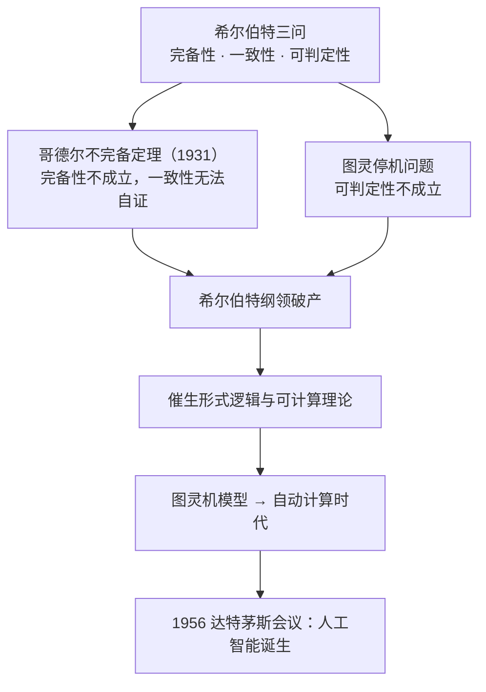

# 人工智能引论

> [!info] 本笔记范围
> - **第一章 可计算理论与图灵机**（课件 67 页）：技术梦想与科幻故事 → 可计算理论的起源（希尔伯特纲领 / 哥德尔 / 图灵机）→ 人工智能发展简史 → 三种主流方法 → 基本研究内容 → 趋势与发展
> - **第二章 知识表达与推理**（课件 72 页）：命题逻辑 → 谓词逻辑 → 知识图谱推理 → 概率图推理 → 因果推理
> - **来源**：第一、二章课件 + 课堂录音整理稿《知识表达课程讲义》（知识图谱 / 概率图模型 / 因果推理），交叉校对后并入对应小节
> - **课件表格与公式已按原样核对**：真值表、逻辑等价表、FOIL 信息增益、贝叶斯网络 CPT、辛普森悖论数据表均取自课件本体，未作改写
> - **已删去**：上课时间地点、MOOC 链接、考核比例、助教信息等课程事务；纯展示性图片与演示站链接（人形机器人、Sora、Genie 3 等）；幻灯片版式页
> - 课件基于教材《人工智能引论》（吴飞、潘云鹤，高等教育出版社）

> [!info] 课程信息
> - **教材**：吴飞、潘云鹤《人工智能引论》，高等教育出版社，2024 年 4 月（教育部计算机 101 计划核心课程教材）
> - **实训题目**：前沿课题调研 —— 大语言模型 / 多模态大模型 / 具身智能 / AI for Science / 自动驾驶 / 图像生成 / 世界模型 / 强化学习等任选一个，1–4 人组队，课堂 PPT 汇报 18–20 分钟，讲清领域意义、基本概念、经典方法与前沿方法、存在问题与趋势

---

## 第一章 可计算理论与图灵机

### 1.1 技术梦想与科幻故事

#### 西方：从「机器人偶」到「机器人」

- **机器人偶（automaton）**——该词由古希腊诗人**荷马**在《伊利亚特》中首次使用，描绘天后赫拉命令天庭开启自动之门。
- 400 年后，**亚里士多德**在《政治学》中引述「黄金女仆」的故事，并深入思考其社会影响：若黄金女仆真能实现，人类便可实现平等而不需要奴隶，从而**废除奴隶制**。
- **1920 年**，捷克作家卡雷尔·恰佩克发表科幻剧本《罗素姆万能机器人》，首次提出「**机器人（robot）**」一词，源自捷克语 **robota**（意为苦力）。剧中机器人最终觉醒并毁灭人类。

#### 中国：偃师造人、木牛流马、木鸢

- 《**列子·汤问**》**偃师造人**：偃师献给周穆王一个与常人无异的偶人，能歌能舞；周穆王疑其为真人而震怒，偃师当场拆解，发现只是皮革、木头、胶漆与颜料组成，拆心则不能言，拆肝则目盲，拆肾则无法行走。周穆王叹：「**人之巧，乃可与造化者同功乎**」。
- **三国**：**木牛流马**——「不因风水，施机自运，不劳人力」。
- **春秋**：鲁班的**木制飞鸢**——「成而飞之，三日不下」。

#### 古代哲人对智能的思考

- **孙武**（五德皆备，然后可以为大将）：智能发谋、信能赏罚、仁能服众、勇能果断、严能立威。
- **孔子**：知（通智）者不惑，仁者不忧，勇者不惧。
- **孟子**（四端）：恻隐之心，仁之端也；羞恶之心，义之端也；辞让之心，礼之端也；是非之心，智之端也。

#### 荀子的智能观：《荀子·正名》

从感知 → 理解 → 认知 → 决策与行动：

| 原文 | 释义 |
|------|------|
| 知之在人者谓之**知** | **知觉**：人所固有认识外界客观事物的本能，如视觉、听觉和触觉等能力 |
| 知有所合谓之**智** | **智慧**：知觉对外界事物的认知 |
| 所以能之在人者为之**能** | **本能**：人身上所具用来处置事物的能力 |
| 能有所合谓之**能** | **智能**：对外界所产生的认知和决策 |

---

### 1.2 可计算理论的起源



人工智能的实现依赖一个**可计算的载体**——需要能完成计算操作、从而达到某个功能的机器。人类由此从**手工计算时代**迈入**自动计算时代**。计算机产生的理论准备，就是「可计算思想」。

#### 希尔伯特纲领

> [!definition] 希尔伯特三问
> 1900 年，**大卫·希尔伯特（David Hilbert, 1862–1943）**在巴黎国际数学家大会提出 23 个数学问题，其中**第二问题**是「证明算术公理的相容性」，包含三件事：
> - **完备性**：算术里每一个真命题，都能用公理证明出来
> - **一致性**：系统内部绝不产生矛盾，不能一个命题既真又假
> - **可判定性**：存在一套机械算法，任意丢进来一个算术命题，有限步骤内就能输出「真」或「假」

- **算术公理**以**皮亚诺公理（Peano Axioms）**为核心，叠加逻辑公理。皮亚诺公理包含「0 是自然数」「每个自然数有唯一后继数」「数学归纳法有效」等 5 条核心假设。
- **时代背景**：19–20 世纪初数学界出现危机——**集合论悖论**（如罗素悖论：「所有不包含自身的集合构成的集合」）爆发，数学的根基遭到质疑。希尔伯特的目标是挽救数学基础、重建数学的可靠性。
- **希尔伯特的乐观设想**：只要完成这三件事，数学就彻底牢靠，所有数学问题理论上都可以靠机械推导解决。

**后续结果**：哥德尔不完备定理打碎完备性、并证明算术系统无法在内部证明自身相容性；图灵停机问题证明可判定性不可能实现。**希尔伯特纲领整体破产**，但这套研究催生了形式逻辑与可计算理论，为后来的计算机理论打下思想根基。

#### 哥德尔不完备定理（1931 年）

> [!important] 哥德尔两大定理
> **第一不完备定理（打击完备性）**：任何包含皮亚诺算术的一致形式系统，一定存在「真但是无法在系统内证明」的命题。
> **第二不完备定理（打击一致性）**：如果一个包含皮亚诺算术的形式系统是一致的，那么这个系统的一致性不能在该系统内部得到证明。

两个直观例子（课件）：

- **特殊命题 G**：「本句话，在当前公理系统中是无法被证明的。」
  反证：假设 G 为假 → 「G 不能被证明」是假话 → G 可以被证明。但系统是一致的，能被证明的命题必为真 → 推出 G 为真，矛盾。所以 G 只能是真命题——**G 为真，却无法在系统内证明**。
- **第二定理的类比**：一个人不能完全靠自己的逻辑证明自己精神没有错乱。若他精神错乱（系统矛盾），他可以编造说辞「证明」自己正常；若他精神正常（系统一致），单凭自身思维逻辑无法彻底自证，必须依靠**外部另一套评判体系**。

#### 图灵机与图灵测试

- **1937 年**，**阿兰·图灵（Alan Turing, 1912–1954）**发表《论数字计算在决断难题中的应用》，提出现代计算机的理论模型「**图灵机模型**」，从构建图灵机模型证明**可判定性不可能实现**（可计算与不可计算问题）。图灵被称为「计算机理论之父」。
- 图灵机的意义在于给出了「**可计算**」的严格定义，使人类得以迈入自动计算时代。图灵另外的贡献：二战中提前五年结束战争的 **Enigma 解码器**；图灵奖（计算机界最高奖，1966 年设立）以其命名；2021 年 6 月英国启用 50 英镑纸币纪念他。

> [!definition] 图灵测试
> 如果人对超过 **80%** 的回答都无法分辨其来自人还是机器，则认为该机器通过了图灵测试。

**图灵测试的局限**（课件强调）：人类很多智能活动不仅仅是问答，而图灵测试目前更多地只能测试问答问题，因此对智能的测试是有限的。

---

### 1.3 人工智能发展简史

#### 达特茅斯会议：AI 的诞生

- **1955 年**，四位学者撰写《达特茅斯夏季人工智能研究提案》，申请经费用于 1956 年开研讨会（申请 13000 美元，批了 6500 美元）：
  - **John McCarthy**（时任 Dartmouth 数学系助理教授，1971 年度图灵奖）
  - **Marvin Lee Minsky**（时任哈佛数学系和神经学系 Junior Fellow，1969 年度图灵奖）
  - **Claude Shannon**（Bell Lab，信息理论之父）
  - **Nathaniel Rochester**（IBM，第一代通用计算机 701 主设计师）
- 目标：**让机器能像人那样认知、思考和学习**，即用计算机模拟人的智能。
- **1956 年**达特茅斯会议正式召开（**人工智能元年**），报告列举了 Artificial Intelligence 值得关注的七个问题：Automatic Computers、How Can a Computer be Programmed to Use a Language、Neuron Nets、Theory of the Size of a Calculation、Self-improvement（自我学习与提高）、Abstractions（归纳与演绎）、Randomness and Creativity。

> [!definition] 人工智能
> **人工智能（Artificial Intelligence）**是以机器为载体所展示的人类智能，因此也被称为**机器智能（Machine Intelligence）**。

#### 两落三起

| 年份 | 事件 |
|------|------|
| **1956** | 达特茅斯会议标志 AI 诞生 |
| **1957** | 罗布森拉特发明**感知机（Perceptron）**，将人工智能推向第一个高峰 |
| **1970** | 计算能力无法支持大规模数据训练和复杂任务，AI 进入**第一个低谷** |
| **1982** | **霍普菲尔德神经网络**被提出 |
| **1986** | **BP 算法**使大规模神经网络的训练成为可能，将 AI 推向第二个黄金期 |
| **1990** | AI 计算机 DARPA 计划失败，政府缩减投入，AI 进入**第二次低谷** |
| **2006** | Hinton 提出「**深度学习**」神经网络，使人工智能获得突破性进展 |
| **2013** | 深度学习在语音和视觉识别上识别率显著提高，进入**智能感知时代** |
| **2016** | **AlphaGo** 战胜人类围棋冠军，AI 关注度空前提高 |
| **2022** | OpenAI 发布 **ChatGPT**，AI 智力水平实现飞跃，进入**大模型时代** |
| **2025** | **DeepSeek-R1** 发布 |

#### 三次浪潮

**第一波浪潮：控制论（Cybernetics，20 世纪 40–60 年代）**

深度学习在 40–60 年代被称为控制论，最初的模型受**生物大脑**启发，因此也称人工神经网络（Artificial Neural Networks, ANN）。许多概念都可以追溯到那个时候：神经元、隐藏层、随机梯度下降、激活函数……**核心局限**：只知道架构，但不知道如何学习——好比知道鸟用翅膀可以飞，造了一个翅膀，却不知道怎么飞。

**第二波浪潮：连接主义（Connectionism，20 世纪 80 年代）**

- 主要成就：成功使用**反向传播（back-propagation）**训练深度神经网络，由杰弗里·辛顿提出。直观理解：像小时候玩的传话游戏，最后给反馈、往前传递。
- 90 年代的重要进展：**RNN** 与 **LSTM**；**CNN 于 1998 年由杨立昆（Yann LeCun）提出**。
- 当时的连接主义只是一个 2 层神经网络。

**第二波的低谷（持续到 2007 年）**：人们普遍认为深度网络很难训练，计算成本太高、硬件不允许大量实验；同时**支持向量机（SVM）**等机器学习方法在许多重要任务上取得很好效果。

**第三波浪潮：深度学习（2006 年起）**

2006 年杰弗里·辛顿展示**深度置信网络（deep belief network, DBN）**可以被有效训练，「深度学习」一词被用来描述比以前更深层的神经网络训练。此后深度神经网络表现优于其他竞争方案。

里程碑：

| 年份 | 事件 |
|------|------|
| **2012** | **AlexNet** 参加 ImageNet 大规模视觉识别挑战赛，错误率 **15.3%**，第二名约 **26%** |
| **2015** | ImageNet 挑战赛宣布机器在图像识别任务上的表现**超过人类** |
| **2016** | **AlphaGo** 击败李世石 |
| **2019** | 杰弗里·辛顿、约书亚·本吉奥、杨立昆被授予**图灵奖** |
| **2023** | ChatGPT 开始影响整个世界，人工智能走向大模型新时代 |
| **2024** | 人工智能获得**诺贝尔物理奖与化学奖** |

#### 人工智能三种主流方法

| 维度 | 符号主义（Symbolism） | 联结主义（Connectionism） | 行为主义（Behaviorism） |
|------|----------------------|--------------------------|------------------------|
| **核心假设** | 智能源于「逻辑推理」，可通过符号（数学公式、规则）表示和操作 | 智能源于「大脑神经元连接」，可通过模拟神经网络的分布式学习实现 | 智能源于「环境交互中的行为强化」，无需内部复杂表示，只需优化输入–输出映射 |
| **研究方法** | 基于规则和逻辑，人工定义符号、知识图谱和推理规则 | 基于数据和统计，通过神经网络从数据中自动学习特征和模式 | 基于「试错–强化」，通过环境反馈（奖励/惩罚）优化行为策略 |
| **核心技术** | 专家系统、逻辑程序设计（如 Prolog）、知识图谱 | 人工神经网络（ANN）、深度学习（CNN/RNN/Transformer） | 强化学习（RL）、Q-learning、策略梯度 |
| **数据依赖** | 依赖「人工定义的知识」，对数据需求量低 | 依赖「大规模标注数据」，数据量直接影响性能 | 依赖「环境交互数据」，可通过试错生成数据（无需人工标注） |
| **典型案例** | 早期专家系统（医学诊断系统 MYCIN）、定理证明器 | 图像识别（ResNet）、自然语言处理（GPT）、语音识别 | 阿尔法狗（AlphaGo）、机器人避障、游戏 AI（如 Atari） |
| **优缺点** | ✅ 推理过程透明、可解释；❌ 难以处理模糊/不确定问题，知识获取成本高 | ✅ 擅长感知、模式识别；❌ 推理过程「黑箱」，依赖数据质量 | ✅ 擅长动态环境交互、决策优化；❌ 难以处理复杂逻辑推理，依赖环境建模 |

另一张课件表把它们归纳为三句话：**符号主义——用规则教**（固定规则）；**联结主义——用数据学**（通过喂数据学习隐式规则）；**行为主义——用问题引导**（通过交互自主探索最佳规则）。

| 学习模式 | 优势 | 不足 |
|----------|------|------|
| **符号主义**（用规则教） | 与人类逻辑推理相似，解释性强 | 难以构建完备的知识规则库 |
| **联结主义**（用数据学） | 直接从数据中学 | 以深度学习为例：依赖于数据、解释性不强 |
| **行为主义**（用问题引导） | 从经验中进行能力的持续学习 | 非穷举式搜索而需更好策略 |

课件点出的方向：**从数据到知识与能力，能力增强是最终目标，三种学习方法的综合利用值得关注。**

#### 从 AlphaGo 到 AlphaFold

- **第一代 AlphaGo**：强化学习——机器对弈产生数以万计棋局。
- **AlphaGo Zero**：**tabula rasa**（拉丁语，意为「一张白纸绘蓝图」）。**自对弈强化学习**，完全从随机落子开始，不用人类棋谱——40 天走完了人类 4000 年时间（「尧造围棋，丹朱善之」）。训练资源：**48 个 TPU**（约 1.2 万颗 GTX 1080 Ti 型号的 GPU）训练 40 天；若只用 1 颗 NVIDIA 1080 Ti GPU，训练时间为 **1294 年**。经过 40 天训练后，Zero 总计运行约 **2900 万次自我对弈**，以 **89 : 11** 击败 AlphaGo Master。
- **从 AlphaGo 到 AlphaFold**：技术交叉和学科交叉下的感知与决策，汇聚了
  深度学习（有效编码黑白相间围棋的棋面）、图神经网络（有效编码空间隐式结构）、强化学习（助力做出长时间序贯决策）、注意力模型（在输入和输出空间之间建立联系）、蒙特卡洛树搜索（支持从浩渺样本空间中采样）、物理建模（蛋白质物理结构模拟与仿真）。

---

### 1.4 人工智能的基本研究内容

> [!definition] 人工智能
> 人工智能是**以机器为载体实现的人类智能或生物智能**。课件将其概括为「**知其意，悟其理，守其则，践其行**」。

从模拟人类智能角度而言，人工智能应具备如下能力：

1. **具备视觉感知和语言交流的能力**——能够识别和理解外界信息（计算机视觉研究范畴）、能够与人通过语言交流（自然语言理解研究范畴）。
2. **具备推理与问题求解能力**——基于已有知识，对所见事物和现象进行演绎推理以解决问题。
3. **具备协同控制能力**——将视觉（看）、语言（说）、推理（悟）等能力统一协调加以控制，是常见的机器人研究领域内容。
4. **具备遵守伦理道德能力**——阿西莫夫在科幻小说中按优先级定义了机器人三原则：**不得伤人，或弃人于危难；需服从人；在不违反上述两条原则情况下，保护机器人自己**。
5. **具备从数据中进行归纳总结的能力**——需要从数据中进行知识、规律和模式学习的模型和方法，这是机器学习研究范畴。

**课程归纳的五种手段与方法**：

| 手段与方法 | 特点 |
|------------|------|
| 以**符号主义**为核心的逻辑推理 | 将概念（如命题等）符号化，从若干判断（前提）出发得到新判断（结论） |
| 以**问题求解**为核心的探寻搜索 | 依据已有信息来寻找满足约束条件的待求解问题的答案 |
| 以**数据驱动**为核心的机器学习 | 从数据中发现数据所承载语义（如概念）的内在模式 |
| 以**行为主义**为核心的强化学习 | 根据环境提供的奖罚反馈来学习所处状态可施加的最佳行动，在「探索（未知空间）–利用（已有经验）（exploration vs. exploitation）」之间寻找平衡，完成某个序列化任务，具备自我学习能力 |
| 以**博弈对抗**为核心的群体智能（两人及以上） | 从「数据拟合」优化解的求取向「均衡解」的求取迈进 |

---

### 1.5 趋势与发展

#### 迈向新一代人工智能

人工智能是引领未来的战略性技术，必须放眼全球，把人工智能发展放在国家战略层面系统布局、主动谋划，打造竞争新优势，开拓发展新空间，有效保障国家安全。

#### 超大规模：数据驱动的机器学习系统

以 OpenAI 的自然语言预训练模型 **GPT-3** 为例（「无他、但手熟尔」）：

- **数据量大**：训练数据高达 **570 GB**；**模型大**：参数量高达 **1750 亿**
- **开销大**：在包含 **1 万个 V100 GPU** 的分布式集群上训练，总开销**上千万美元**

2017 年 Transformer 的提出使深度学习模型参数首次突破 1 亿；随后国际上出现 BERT、DALL-E、GPT-3 和 Switch Transformer 等大模型，国内出现 M6、盘古、文心等大模型，模型参数从亿、到百亿和千亿，甚至突破万亿规模。大模型在「**黄氏定律**」算力推动下不断发展，被称为人工智能领域的「军备竞赛」。课件引用的两个判断：

- 「化繁为简、大巧不工」是机器学习初衷之一（四个参数画大象）
- **在人工智能模型上耗费的计算量，3.4 个月就会倍增**，远胜于摩尔定律

**计算机体系架构赋能（深度）机器学习革命的六点建议**（Jeff Dean, David Patterson, Cliff Young, *A New Golden Age in Computer Architecture*, IEEE Micro, 2018）：

| 建议 | 描述 |
|------|------|
| **Training** | 训练比推理更困难（训练中要将全部激活函数值存储以进行误差后向传播，训练所需存储远比推理高，如谷歌从模型推理的 TPU V1 到模型训练 TPU V2） |
| **batch size** | 数据并行是提高深度学习效率的主要方法。数据批次规模越大、并行度越高，但会**损害模型精度** |
| **Sparsity and Embeddings** | 保留大模型，但是分而治之、按需激活 |
| **Quantization and Distillation** | 保留小模型，但是一定程度损害模型精度 |
| **Networks with Soft Memory** | 如基于外在记忆体的神经图灵机（neural Turing machine, deep reasoning）或注意力机制（attention） |
| **Learning to Learn (L2L)** | 充分协调数据驱动下归纳、知识指导中演绎以及行为探索内顿悟等不同学习手段和方法 |

#### 端云协同进化

大小模型将在**云边端协同进化**：大模型向边、端的小模型输出模型能力，小模型负责实际的推理与执行，同时小模型再向大模型反馈算法与执行成效，让大模型的能力持续强化。

将大模型蒸馏压缩为终端可用的个性化小模型，同时把终端个性化小模型汇聚起来提升云端大模型的泛化能力，形成**端云协同机器学习计算范式**，体现「**须弥纳于芥子**」的哲学思想。

#### 从关联到推理：因果推理

| 层次 | 含义 |
|------|------|
| **关联（association）** | 直接可从数据中计算得到的统计相关 |
| **介入（intervention）** | 无法直接从观测数据得到的关系，如「某个商品涨价会产生什么结果」 |
| **反事实（counterfactual）** | 某个事情已经发生了，在相同环境中，这个事情不发生会带来怎样的新结果 |

#### 其他方向

- **人机物协同增效**：自主无人系统需具备**对未知的未知建模**能力；健壮人工智能呼唤**可解释性**；非完全信息下博弈对抗以应对高度综合；**人在回路**把握智能对抗的「总开关」。
- **科学计算：科学第三级**——在微观和宏观等世界，将刻画科学本质的物理定律模型嵌入人工智能学习和优化过程，建立「**数据驱动、物理建模和知识引导**」理论和方法，是人工智能解决复杂场景任务要突破的核心问题。

---

### 1.6 本课程内容概要

| 章 | 主题 | 核心内容 |
|----|------|----------|
| 一 | 可计算理论与图灵机 | 可计算思想起源与发展、人工智能发展简史、研究基本内容 |
| 二 | 知识表达与推理 | 命题逻辑、谓词逻辑、知识图谱推理、因果推理 |
| 三 | 搜索探寻与问题求解 | 启发式搜索、对抗搜索（Minimax 等）、蒙特卡洛树搜索 |
| 四 | 机器学习 | 基本概念、回归分析、决策树、线性判别分析、AdaBoost、支持向量机、生成学习模型 |
| 五 | 神经网络与深度学习 | 前馈神经网络（误差后向传播）、卷积神经网络、循环神经网络、深度生成学习、自然语言理解与视觉分析 |
| 六 | 强化学习 | 定义、基于价值的强化学习、基于策略的强化学习、深度强化学习应用 |
| 七 | 人工智能博弈 | 博弈相关概念（纳什均衡）、博弈策略求解、博弈规则设计、非完全信息博弈应用 |
| 八 | 人工智能伦理与安全 | 可信人工智能、可解释性、人工智能安全 |
| 九 | 人工智能架构与系统 | 人工智能计算架构、人工智能芯片、分布式训练算法与系统 |
| 十 | 人工智能应用 | 机器翻译、图像分类、科学计算、大模型 |

> [!summary] 第一章要点
> - **思想主线**：要造能思考的机器，先要有「可计算」的理论 → 希尔伯特三问（完备性 / 一致性 / 可判定性）→ 哥德尔打碎前两者、图灵打碎可判定性 → 图灵机模型定义「可计算」→ 自动计算时代 → 1956 达特茅斯会议提出人工智能。
> - **两次破产的启示**：希尔伯特纲领整体破产，却催生了形式逻辑与可计算理论——**失败的研究同样能立下学科的根基**。
> - **三次浪潮的教训**：第一波只知架构不知如何学习，第二波有了反向传播但算力与替代方法（SVM）压制，第三波靠数据 + 算力 + 深度网络三者齐备才爆发。算力是硬约束（AlphaGo Zero 用 1 张 1080 Ti 需要 1294 年）。
> - **三种主流方法不是互斥的**：符号主义用规则教、联结主义用数据学、行为主义用问题引导，AlphaGo 正是三者协调的典型；综合运用是趋势。

---

## 第二章 知识表达与推理

> [!info] 本章脉络
> 本章是**符号主义的基础内容**，按「逻辑」这条线层层递进：
> 命题逻辑（原子命题不可再分）→ 谓词逻辑（拆出个体、谓词、量词）→ 知识图谱推理（把谓词逻辑织成图，做归纳与演绎）→ 概率图推理（给确定的关系加上概率）→ 因果推理（分辨真关联与假关联）。
> 贯穿全章的一句话是**「推理即计算」**：把知识规范化（逻辑化）后，就可以用「计算」方式模拟人类思辨。

### 2.1 命题逻辑

#### 逻辑的起源

- **逻辑**是进行正确推理和充分论证的研究（the study of correct reasoning and good arguments），「逻辑」一词起源于希腊单词 **logos**（原因、话语和演讲）。逻辑关心的问题是：**从一个或若干前提出发，是否存在一个有效的论证或推理来支持所得的结论**，也就是在前提和结论之间架构逻辑结构的桥梁——**让推理像计算一样**。
- 三位代表性人物：

| 人物 | 贡献 |
|------|------|
| **亚里士多德** | **三段论**：若 A→B，B→C，则 A→C 也是正确的 |
| **布尔** | **数理逻辑**：全部用数学的方法来表达推理过程 |
| **墨翟** | **名、辞、说**：以名举实形成概念摹拟事物，以辞抒意构成全称/特称/假言等判断语句，以说出故建立基于故、理、类的推理论证 |

- 墨子《墨辨·经下》：「**擢虑不疑，说在有无**」。这里的「擢」即抽引，表示从一般性事例中抽象出一般命题（虑）；这种归纳推理方式不用怀疑，因为其理由或根据是「事物属性的客观存在性（有）或不存在性（无）」——强调推理依据须以事物固有属性为准。
- 认知（cognition）来源于拉丁语 cognitio（学习和知识）。13 世纪末，**雷蒙·卢尔（Ramon Llull）**提出对知识进行规范化描述的「**知识树（Tree of Knowledge）**」，这是目前最早的对知识进行规范化表示的努力；它深刻影响了**莱布尼兹（Leibnitz）**提出的「**人类思想字母表（alphabet of human thought）**」——对规范化表达的知识按规则进行组合等操作，就可构造**思想机器**，实现思维的计算。
- 目前代表性的知识表达方法：**命题逻辑、谓词逻辑、产生式规则（production rule）、框架（frame）表示法、知识图谱**。

#### 命题与联结词

> [!definition] 命题、原子命题、复合命题
> - **命题**：确定为真或为假的陈述句（把知识用命题来表示）。
> - **原子命题**：不包含其他命题作为其组成部分的命题，又称**简单命题**。
> - **复合命题**：包含其他命题作为其组成部分的命题。

> [!definition] 五种主要的命题联结词
> | 联结词 | 表示形式 | 意义 |
> |--------|----------|------|
> | 与（and） | $p\land q$ | 命题**合取**（conjunction），即「且」。例：图灵不仅是一名数学家，还是一名逻辑学家 |
> | 或（or） | $p\lor q$ | 命题**析取**（disjunction），即「或」。例：今天天气下雨或者今天天气多云 |
> | 非（not） | $\neg p$ | 命题**否定**（negation），即「非」。例：$p$：三角形三个角之和不是 180°；$\neg p$：三角形三个角之和是 180° |
> | 条件（conditional） | $p\to q$ | 命题**蕴含**（implication），$p$ 称为**前件**、$q$ 称为**后件**，即「如果……则……」。例：如果计算机机房停电，那么今天的实验将无法进行 |
> | 双向条件（bi-conditional） | $p\leftrightarrow q$ | 命题**双向蕴含**（bi-implication），即「当且仅当」，同时满足 $p\to q$ 和 $q\to p$ 的双向蕴含关系。例：三角形是等边的当且仅当它是等角的 |

**条件为什么又叫「蕴含」？**

$p\to q$ 的含义是：$p$ 这件事成立，蕴含着 $q$ 这件事成立；只要 $p$ 成立，$q$ 一定跟着成立，即 **$p$ 的集合包含于 $q$ 的集合**，所以叫蕴含。例如「如果 $a>0$，那么 $a>-1$」。

**易错点**：$p\to q$ **不是只关注 $q$ 是否成立**，而是关注「**一旦 $p$ 成立，$q$ 一定成立**」。

**双向条件命题的辨析**（课件三条）：

- 实际应用：法律条文（公民年满十八周岁**当且仅当**具有完全民事行为能力）；编程（门禁绿灯亮起**当且仅当**指纹验证通过且未触发警报）；手机视频通话（只有有电且网络正常才能通话）。
- 常见误区：容易把双条件关系与单向蕴含混淆，例如误认为「下雨则地面湿」是双命题——实际上地面湿可能有其他原因，**不能反向推导**。
- 思维训练（判断真伪）：① 动物是猫当且仅当会喵喵叫（**假**，存在其他会喵叫的动物）；② 水沸腾当且仅当温度达 100 ℃（**假**，未考虑气压）；③ 四边形是正方形当且仅当四边相等且四角直角（**真**）。

#### 真值表

五种主要联结词构成的复合命题的真值表：

| $p$ | $q$ | $\neg p$ | $p\land q$ | $p\lor q$ | $p\to q$ | $p\leftrightarrow q$ |
|-----|-----|---------|-----------|-----------|----------|---------------------|
| F | F | T | F | F | T | T |
| F | T | T | F | T | T | F |
| T | F | F | F | T | F | F |
| T | T | F | T | T | T | T |

（注意 $p\to q$ 只在 $p$ 真 $q$ 假时为假，这正是「$p$ 包含于 $q$」的真值表现。）

#### 逻辑等价

为了进行逻辑推导，引入**逻辑等价**规则。课件给出的 12 条：

| 名称 | 等价式 |
|------|--------|
| $\land$ 的交换律 | $\alpha\land\beta\equiv\beta\land\alpha$ |
| 蕴涵消除 | $(\alpha\to\beta)\equiv\neg\alpha\lor\beta$ |
| $\lor$ 的交换律 | $\alpha\lor\beta\equiv\beta\lor\alpha$ |
| 双向消除 | $(\alpha\leftrightarrow\beta)\equiv(\alpha\to\beta)\land(\beta\to\alpha)$ |
| $\land$ 的结合律 | $(\alpha\land\beta)\land\gamma\equiv\alpha\land(\beta\land\gamma)$ |
| **德摩根定律** | $\neg(\alpha\land\beta)\equiv\neg\alpha\lor\neg\beta$ |
| $\lor$ 的结合律 | $(\alpha\lor\beta)\lor\gamma\equiv\alpha\lor(\beta\lor\gamma)$ |
| **德摩根定律** | $\neg(\alpha\lor\beta)\equiv\neg\alpha\land\neg\beta$ |
| 双重否定 | $\neg\neg\alpha\equiv\alpha$ |
| $\land$ 对 $\lor$ 的分配律 | $\alpha\land(\beta\lor\gamma)\equiv(\alpha\land\beta)\lor(\alpha\land\gamma)$ |
| **逆否命题** | $(\alpha\to\beta)\equiv\neg\beta\to\neg\alpha$ |
| $\lor$ 对 $\land$ 的分配律 | $\alpha\lor(\beta\land\gamma)\equiv(\alpha\lor\beta)\land(\alpha\lor\gamma)$ |

其中四条的解释（课件表 2.4）：

- **逆否命题**：秋天天气变凉 → 大雁南飞越冬 ⟺ 大雁没有南飞越冬 → 秋天天气没有变凉。
- **蕴涵消除**：$\alpha$ 为假，则命题恒为真；$\alpha$ 为真，命题与 $\beta$ 真值相同。
- **德摩根定律**：可以用韦恩图理解——$\neg(\alpha\land\beta)$ 是「两个圆交集之外」的面积，$\neg(\alpha\lor\beta)$ 是「两个圆并集之外」的面积。

#### 推理规则与归结法

> [!important] 命题逻辑推理的手段
> | 规则 | 形式 |
> |------|------|
> | **假言推理** | $\alpha\to\beta,\ \alpha\ \Rightarrow\ \beta$ |
> | 合取消除 | $\alpha_1\land\alpha_2\land\cdots\land\alpha_n\ \Rightarrow\ \alpha_1,\alpha_2,\cdots,\alpha_n$ |
> | 合取引入 | $\alpha_1,\alpha_2,\cdots,\alpha_n\ \Rightarrow\ \alpha_1\land\alpha_2\land\cdots\land\alpha_n$ |
> | 双重否定 | $\neg\neg\alpha\ \Rightarrow\ \alpha$ |
> | **析取三段论** | $\alpha\lor\beta,\ \neg\beta\ \Rightarrow\ \alpha$ |
> | **归结（resolution）** | $\alpha\lor\beta,\ \neg\beta\lor\gamma\ \Rightarrow\ \alpha\lor\gamma$ |

**例（课件）**：已知 $\alpha\lor\beta$、$\alpha\to\gamma$、$\beta\to\gamma$，证明 $\gamma$。

推导过程：

1. $\alpha\to\gamma$ 等价于 $\neg\alpha\lor\gamma$（蕴涵消除）
2. $\beta\to\gamma$ 等价于 $\neg\beta\lor\gamma$
3. 两式合取：$(\neg\alpha\lor\gamma)\land(\neg\beta\lor\gamma)$
4. $\lor$ 对 $\land$ 的分配律逆用：$(\neg\alpha\land\neg\beta)\lor\gamma$
5. 德摩根定律：$\neg(\alpha\lor\beta)\lor\gamma$
6. 与已知 $\alpha\lor\beta$ 归结，得 $\gamma$。 $\blacksquare$

**归结法证明**（反证思路）：要证结论，就把结论的否定加入命题集，证明**命题集是不可满足的**。

---

### 2.2 谓词逻辑

#### 为什么需要谓词逻辑

在命题逻辑中，原子命题是最基本的单位，只能把复合命题分解为原子命题，**无法对原子命题所包含的丰富语义（如个体、部分或全体等）进行刻画**，因此**无法表达局部与整体、一般与个别的关系**。

最典型的例子是**苏格拉底三段论**——「所有的人都是要死的，苏格拉底是人，所以苏格拉底是要死的」，用命题逻辑无法表示，因为三个原子命题之间没有形式上的联系。

> [!definition] 谓词逻辑
> 谓词逻辑是刻画主体（个体和群体）之间逻辑关系的方法。它把原子命题进一步细化，分解出**个体、谓词和量词**，来表达个体与总体的内在联系和数量关系。
> - **个体**：所研究领域中可以独立存在的具体或抽象的概念。
> - **谓词**：用来刻画个体属性，或描述个体之间关系存在性的元素，其值为真或为假。
> - **量词**：全称量词 $\forall$（一切的、所有的、凡是、每一个）；存在量词 $\exists$（存在、有一个、某些）。

#### 从自然语言到谓词描述

| 自然语言 | 谓词描述 |
|----------|----------|
| Richard 是国王 | $King(Richard)$ |
| Lucy 和 Lily 是姐妹 | $Sister(Lucy, Lily)$ |
| 北京是中国的首都 | $Capital(Beijing, China)$ |
| 所有的国王都是人 | $(\forall x)(King(x)\to Person(x))$ |
| 所有的国王都头戴皇冠 | $(\forall x)(King(x)\to Head\_On(Crown, x))$ |

#### 量词的性质

**量词的分配（课件标出了两条不成立的「伪等价」）**：

- 成立：$(\forall x)(A(x)\land B(x))\equiv(\forall x)A(x)\land(\forall x)B(x)$
- 成立：$(\exists x)(A(x)\lor B(x))\equiv(\exists x)A(x)\lor(\exists x)B(x)$
- ✗ **不成立**：$(\forall x)(A(x)\lor B(x))\equiv(\forall x)A(x)\lor(\forall x)B(x)$——左边只能推出右边，反向不成立
- ✗ **不成立**：$(\exists x)(A(x)\land B(x))\equiv(\exists x)A(x)\land(\exists x)B(x)$——左边只能推出右边，反向不成立

**量词否定**：

> [!important] 量词否定的等价式
> $$\neg(\forall x)P(x)\equiv(\exists x)\neg P(x)$$
> $$\neg(\exists x)P(x)\equiv(\forall x)\neg P(x)$$

**直观**：「不是所有的飞机都在天上飞」等价于「存在某架飞机不在天上飞」。

#### 谓词逻辑推理的手段

| 规则 | 形式 | 说明 |
|------|------|------|
| **全称实例化** | $\forall x\,A(x)\ \Rightarrow\ A(y)$ | $y$ 是 $x$ 定义域中的某个值；由「所有」推到「某一个」 |
| **全称推广** | $A(y)\ \Rightarrow\ \forall x\,A(x)$ | 由任意个体成立推广到所有个体 |
| **存在实例化** | $\exists x\,A(x)\ \Rightarrow\ A(c)$ | $c$ 是常量符号 |
| **存在推广** | $A(c)\ \Rightarrow\ (\exists x)A(x)$ | 由某个个体成立推出「存在」 |

其中 $x,y$ 是变元，$c$ 是常量符号。

**例（苏格拉底三段论的形式证明）**：已知 $(\forall x)(P(x)\to Q(x))$、$(\forall x)(Q(x)\to R(x))$，证明 $(\forall x)(P(x)\to R(x))$。

1. $(\forall x)(P(x)\to Q(x))$ 实例化为 $P(x)\to Q(x)$，即 $\neg P(x)\lor Q(x)$
2. $(\forall x)(Q(x)\to R(x))$ 实例化为 $Q(x)\to R(x)$，即 $\neg Q(x)\lor R(x)$
3. 归结：$\neg P(x)\lor Q(x),\ \neg Q(x)\lor R(x)\ \Rightarrow\ \neg P(x)\lor R(x)$，即 $P(x)\to R(x)$
4. 全称推广：$(\forall x)(P(x)\to R(x))$ $\blacksquare$

**例（课件习题）**：已知每架飞机或者停在地面或者飞在天空，且并非每架飞机都飞在天空。请证明：有些飞机停在地面。

记 $plane(x)$、$on\_ground(x)$、$in\_sky(x)$，形式化为

$$(\forall x)\big(plane(x)\to on\_ground(x)\lor in\_sky(x)\big),\quad \neg(\forall x)\big(plane(x)\to in\_sky(x)\big)$$

证明思路：对第二个前提做量词否定得 $(\exists x)\neg(plane(x)\to in\_sky(x))$，再用蕴涵消除与德摩根定律化为 $(\exists x)(plane(x)\land\neg in\_sky(x))$；存在实例化得 $plane(a)\land\neg in\_sky(a)$。把它代回第一个前提的实例 $plane(a)\to on\_ground(a)\lor in\_sky(a)$，由析取三段论得 $on\_ground(a)$，与 $plane(a)$ 合取得 $plane(a)\land on\_ground(a)$，存在推广即 $(\exists x)(plane(x)\land on\_ground(x))$。 $\blacksquare$

---

### 2.3 知识图谱推理

#### 什么是知识图谱

> [!definition] 知识图谱（Knowledge Graph）
> 知识图谱由**有向图**构成，用来描述现实世界中**实体及实体之间的关系**，是人工智能中进行知识表达的重要方式。
> - 每个**节点**表示客观世界中的一个实体，两个节点之间的**连线**表示节点具有某一关系。
> - 存在连线的两个实体可表达为形如 $\langle left\_node,\ relation,\ right\_node\rangle$ 的**三元组**。
> - 这种三元组可以表示为一阶逻辑（first order logic, FOL）的形式，从而为基于知识图谱的推理创造条件。

**关系推理**是统计关系学习研究的基本问题，也是当前知识图谱领域研究的热点问题。它的目标是**从现有知识中发现新的知识**，在实体间建立新关联，从而扩充和丰富现有知识库。例如从 $\langle 奥巴马,出生地,夏威夷\rangle$ 和 $\langle 夏威夷,属于,美国\rangle$ 两个三元组，可推理得到 $\langle 奥巴马,国籍,美国\rangle$。

课件给出的**家庭关系知识图谱**例子：

```text
          James ←────────Couple────────→ David
         ╱     ╲                    ╱    ╲
    Mother     Father(推理)    Mother     Father
      ↓           ↘           ↓           ↓
     Ann ←────────—Sibling─────—───────→ Mike
```

- 已知事实（实线）：$Couple(James, David)$、$Couple(David, James)$、$Mother(James, Ann)$、$Mother(James, Mike)$、$Father(David, Mike)$、$Sibling(Ann, Mike)$
- 推理得到（红色虚线）：$Father(David, Ann)$——这正是后面 FOIL 算法要「学出来」的那条新知识。

**六度分隔理论（Six Degrees of Separation）**：地球上任意两个陌生人之间，最多通过 6 层熟人关系（5 个中间人）就可以建立联系。这是关系型知识图谱的典型应用场景，也是搜索引擎、推荐系统、教育（知识点串联）等领域的基础。

#### 归纳与演绎

知识图谱的逻辑推导是两个方向（「学以致用」）：

- **从数据到知识（推导规则）：归纳**——从具体实例中总结出一般性规则。
- **从知识到数据（实例）：演绎**——把规则中的变量赋予具体例子，得到新知识。

**归纳逻辑程序设计（inductive logic programming, ILP）**是机器学习和逻辑程序设计交叉领域的研究内容。Gordon Plotkin 和 Ehud Shapiro 推动了在形式逻辑框架下进行归纳机器学习，为 ILP 研究打下理论基础。ILP 使用**一阶谓词逻辑**进行知识表示，通过修改和扩充逻辑表达式对现有知识归纳，完成推理任务。作为 ILP 的代表性方法，**FOIL（First Order Inductive Learner）**通过**序贯覆盖**学习推理。

#### FOIL 算法

> [!definition] FOIL 的算法框架
> - **目标谓词**（已知）：需要推断规则的结论，也称为**规则头**。
> - **前提约束谓词**（学习得到）：FOIL 在给定推理结论后，学习得到使结论满足的前提条件。
>
> **输入**：目标谓词 $P$、目标谓词 $P$ 的训练样例（正例集合 $E^+$ 和反例集合 $E^-$）及其他背景知识样例。
> **输出**：可得到目标谓词 $P$ 这一结论的推理规则。
>
> 流程：
> 1. 将目标谓词作为所学推理规则的结论。
> 2. 将其他谓词逐一作为前提约束谓词加入推理规则，计算所得推理规则的 FOIL 信息增益值，选取可带来**最大信息增益值**的前提约束谓词加入，得到新的推理规则，并将训练样例集合中与该推理规则不符的样例去掉。
> 3. 重复步骤 2，直到所得的推理规则**不覆盖任何反例**。

**训练样例的构造**（这是 FOIL 的关键，也是易错点）：

- 训练样例包含**正例集合 $E^+$** 和**反例集合 $E^-$**。
- 当目标谓词 $P$ 为 $Father(x,y)$ 时，从图中知道目标谓词 $P$ **只有一个正例** $Father(David, Mike)$。
- **反例在知识图谱中一般不会显式给出，但可以从知识图谱中构造出来**。例如已知 $Couple(David, James)$ 成立，则 $Father(David, James)$ 可作为反例，记为 $\neg Father(David, James)$。

> [!warning] 构造反例的硬条件
> 只有在**已知两个实体之间存在某一关系、且确定这一关系与目标谓词相悖**时，才能用这两个实体构造目标谓词的反例。
> 而不能在不知两个实体是否满足目标谓词的前提下就用来构造反例——例如**不能用 David 和 Ann 构造目标谓词的反例**，因为从现有知识中不能确定这两个实体之间是否存在 $Father$ 关系，即 $Father(David, Ann)$ 有可能是正例（事实上本例中恰恰存在该关系，只是知识图谱中暂未显示刻画）。

课件表 2.6 给出的样例集合：

| 背景知识样例集合 | 目标谓词训练样例集合 |
|------------------|---------------------|
| $Sibling(Ann, Mike)$ | $Father(David, Mike)$（正例） |
| $Couple(David, James)$ | $\neg Father(David, James)$ |
| $Mother(James, Ann)$ | $\neg Father(James, Ann)$ |
| $Mother(James, Mike)$ | $\neg Father(James, Mike)$ |
| | $\neg Father(Ann, Mike)$ |

（本例仅考虑以上 4 项样例作为背景知识，忽略了其他可作背景知识的样例，如 $Couple(James, David)$ 等。）

**信息增益准则**

> [!important] FOIL 信息增益
> $$\text{FOIL\_Gain}=m^+\cdot\left(\log_2\frac{m^+}{m^++m^-}-\log_2\frac{m_0^+}{m_0^++m_0^-}\right)$$
> 其中 $m^+$、$m^-$ 是加入该前提约束谓词**之后**被规则覆盖的正例、反例数；$m_0^+$、$m_0^-$ 是加入**之前**的对应数量。
> 直观说：**既要把正例留下来，又要尽可能把反例剔出去**。

**逐步学习过程**（课件从目标谓词 $Father(x,y)$ 出发）：

1. 起初规则只有结论 $Father(x,y)$，训练样例覆盖 $m^+=1$、$m^-=4$。
2. 试加 $Mother(x,y)$：得 $Mother(x,y)\to Father(x,y)$，覆盖 $m^+=0$、$m^-=2$——正例全被排除，无用。
3. 试加 $Couple(x,z)$：得 $Couple(x,z)\to Father(x,y)$，覆盖 $m^+=1$、$m^-=1$，计算
   $$\text{FOIL\_Gain}=1\cdot\log_2\frac{1}{1+1}-\log_2\frac{1}{1+4}=1.32$$
   信息增益最大，故加入。
4. 继续试加 $Mother(z,y)$，得新规则 $( \forall x)(\forall y)(\forall z)\ Mother(z,y)\land Couple(x,z)\to Father(x,y)$，此时规则不再覆盖任何反例，**学习结束**。

**归纳 → 演绎**：把学到的规则用于新变量，代入 David 与 Ann（$Mother(James,Ann)$ 有，$Couple(David,James)$ 有），演绎得到 $\mathbf{Father(David, Ann)}$——正是知识图谱里那条原本缺失的红色虚线。

**与深度学习的区别**（老师强调）：FOIL 这类方法**直接学习「规则本身」，显式可得**，能读出模型究竟学到了什么；而大模型把规则**隐式存储在权重中**，无法直接读取。

#### 路径排序算法（PRA）

与 FOIL 不同，**路径排序算法（Path Ranking Algorithm, PRA）**的基本思想是**将实体之间的关联路径作为特征**，来学习目标关系的分类器（分类器可以是 SVM、逻辑斯蒂回归等）。

课件以**例 2.14** 给出完整流程：

1. **目标关系**：$Father$。
2. **生成训练样例**（1 正 3 负）：正例 $(David, Mike)$；负例 $(David, James)$、$(James, Ann)$、$(James, Mike)$。
3. **从知识图谱采样得到路径**，每条路径链接每个训练样例中的两个实体：
   - $(David, Mike)$ 对应路径：$Couple\to Mother$
   - $(David, James)$ 对应路径：$Father\to Mother^{-1}$（$Mother^{-1}$ 与 $Mother$ 为相反关系）
   - $(James, Ann)$ 对应路径：$Mother\to Sibling$
   - $(James, Mike)$ 对应路径：$Couple\to Father$
4. **构造特征向量**：对每个正例/负例，判断上述四条路径可否链接其包含的两个实体，可链接记为 1、不可链接记为 0，得到一个四维特征向量——
   - $(David, Mike)$：$\{[1,0,0,0],\ 1\}$
   - $(David, James)$：$\{[0,1,0,0],\ -1\}$
   - $(James, Ann)$：$\{[0,0,1,0],\ -1\}$
   - $(James, Mike)$：$\{[0,0,1,1],\ -1\}$
5. 依据上表的训练样本，**训练分类器 $M$**。
6. **预测**：对形如 $(David, Ann)$ 的样例得到特征值 $[1,0,0,0]$，输入分类器 $M$，若输出为 1，则 $Father(David, Ann)$ 成立。

PRA 的数学形式为 $P(s\to t;\pi_j)$，表示 s 与 t 之间通过路径 $\pi_j$ 连通的概率——课件用路径的**随机游走概率**作为特征值。

---

### 2.4 概率图推理

#### 为什么要概率图推理

在知识图谱中，关系是**确定的**（有就是有、没有就是没有，只有 True/False 两种）；但**现实中很多关系只以一定概率发生**。在工业生产、社会治理和在线经济等领域不断涌现的大数据因刻画各种关系而形成图式结构的数据，如果两个节点之间存在连边，可视为二者具有**概率依赖关系**而相互影响。在这类图中，可用**概率**描述两个相连节点之间的关联，而不假设节点之间的影响一定会百分之百发生。这种图被称为**概率图（probabilistic graph）**，基于概率图进行的推理称为**概率推理**，它反映了推理过程中存在的**不确定性**特点。

> [!definition] 概率图模型的两大类
> - **贝叶斯网络（Bayesian Network）**：用**有向无环图（directed acyclic graph, DAG）**表示，用**有向边**表示节点之间的**单向概率依赖**。
> - **马尔可夫网络（Markov Network）**：表示成一个**无向图**的网络结构，用**无向边**表示节点之间的**相互概率依赖**。
>
> 一般认为概率图模型还包括朴素贝叶斯模型、最大熵模型、隐马尔可夫模型、条件随机场、主题模型等，在机器学习的诸多场景中都有广泛应用。

#### 贝叶斯网络与局部马尔可夫性

> [!definition] 局部马尔可夫性（Local Markov Property）
> 在给定一个节点的**父节点**的情况下，该节点有条件地独立于它的**非后代节点（non-descendant）**——即**子节点仅受父节点影响**。

**马尔可夫性 vs 局部马尔可夫性**：

| 对比维度 | 马尔可夫性（Markov Property） | 局部马尔可夫性（Local Markov Property） |
|----------|------------------------------|----------------------------------------|
| 适用场景 | **序列模型**（如马尔可夫链、隐马尔可夫模型），描述「时间上的状态依赖」 | **图模型**（如马尔可夫随机场、贝叶斯网络），描述「空间/网络中节点的依赖」 |
| 核心逻辑 | 对任意时刻 $t$，未来状态 $X_{t+1}$ 的概率分布仅由当前状态 $X_t$ 决定，与更早的状态 $X_{t-1},X_{t-2},\dots$ 无关 | 对图中任意节点 $v$，其状态的概率分布在给定所有**邻居**节点状态的条件下，与图中「非邻居的其他节点」状态无关 |
| 通俗类比 | 「明天的天气只依赖今天的天气，与昨天无关」 | 「一个人的决策，与家人（邻居）的想法有关，与陌生人（非邻居）的想法无关」 |
| 数学表达 | $P(X_{t+1}\mid X_t,X_{t-1},\dots,X_1)=P(X_{t+1}\mid X_t)$ | 设 $N(v)$ 为节点 $v$ 的邻居、$\neg N(v)$ 为非邻居，则 $P(X_v\mid X_{N(v)},X_{\neg N(v)})=P(X_v\mid X_{N(v)})$ |

#### 联合概率计算：洒水车例子

课件用经典的**洒水车（sprinkler）**贝叶斯网络。结构为「是否多云」→｛是否洒水车，是否下雨｝→「是否路湿」，各节点的条件概率表（CPT）如下：

**是否多云**：

| 多云 | Yes | No |
|------|-----|----|
| $P$ | 0.4 | 0.6 |

**是否洒水车**（给定多云）：

| 有/无洒水车 | 有洒水车 | 无洒水车 |
|-------------|----------|----------|
| 多云 | 0.1 | 0.9 |
| 不多云 | 0.5 | 0.5 |

**是否下雨**（给定多云）：

| 下雨/不下雨 | 下雨 | 不下雨 |
|-------------|------|--------|
| 多云 | 0.8 | 0.2 |
| 不多云 | 0.2 | 0.8 |

**是否路湿**（给定洒水车、下雨）：

| 条件 | 路湿 | 路不湿 |
|------|------|--------|
| 有洒水车、下雨 | 0.99 | 0.01 |
| 有洒水车、不下雨 | 0.9 | 0.1 |
| 无洒水车、下雨 | 0.9 | 0.1 |
| 无洒水车、不下雨 | 0 | 1 |

> [!important] 联合概率 = 各节点「在其父节点条件下」的条件概率之积
> $$P(\text{多云},\text{下雨},\text{洒水车},\text{路湿})=P(\text{多云})\cdot P(\text{洒水车}\mid\text{多云})\cdot P(\text{下雨}\mid\text{多云})\cdot P(\text{路湿}\mid\text{洒水车},\text{下雨})$$
> 这就是贝叶斯网络最基本的用法：**任意变量的联合分布都可以按图结构分解成一个个局部的条件概率相乘**。

计算时基于概率表逐步「组装、凑出」目标表达式；对于无法直接获取的概率（如 $P(\text{路湿}\mid\text{不多云},\text{下雨})$），需引入**边际概率**等其他公式展开计算。

**后验概率（贝叶斯公式）**：例如要在已知「不多云」的条件下求 $P(\text{下雨},\text{洒水车},\text{路湿}\mid\text{多云})$，需要对**洒水车变量的每一个取值计算联合概率并求和**（即边际化），再由贝叶斯公式得到后验。

#### 马尔可夫逻辑网络

**马尔可夫逻辑网络（Markov Logic Network, MLN）**把一阶谓词逻辑与马尔可夫网络结合起来：

- 从**概率统计**角度看：它简洁明了地描述了马尔可夫网（Markov networks, MNs）中信息之间的关联，还因引入**谓词逻辑**而融入了结构化知识。
- 从**一阶谓词逻辑**角度看：它在一阶谓词逻辑中添加了**不确定性**，对严格推理进行了**松绑**，更好反映了客观世界的复杂性。

> [!important] MLN 的概率公式
> $$P(X=x)=\frac{1}{Z}\exp\Big(\sum_i w_i\,n_i(x)\Big)$$
> 其中 $n_i(x)$ 是第 $i$ 条规则在取值 $x$ 下**为真的次数**，$w_i$ 是**规则权重**（表示该规则的重要性），$Z$ 是归一化常数：
> $$Z=\sum_{x\in\mathcal{X}}\exp\Big(\sum_i w_i\,n_i(x)\Big)$$
> 直观：**每条规则成立一次，就往指数上加权重的分**。

**例子：新生开学典礼在室内还是室外举行**

| 规则（一阶谓词逻辑） | 内容描述 | 权重 |
|---------------------|----------|------|
| $r_1:\ indoor\lor outdoor$ | 或者室内举行、或者室外举行 | 1（不特别重要） |
| $r_2:\ \neg(indoor\land outdoor)$ | 不能既室内举行、又室外举行 | 9（特别重要，因为不能同时发生） |
| $r_3:\ rain\to indoor$（$\neg rain\lor indoor$） | 如果下雨，则室内举行 | 5（重要） |
| $r_4:\ lightshow\to outdoor$（$\neg lightshow\lor outdoor$） | 如果有灯光秀，则室外举行 | 7（很重要，因为同学们热切盼望） |

在 $rain=T,\ outdoor=T,\ indoor=F$ 与 $lightshow=T,\ indoor=F,\ outdoor=T$ 两种情形下：

$$P(outdoor\land\neg indoor)=\frac{1}{Z}\exp\big(1\cdot 1+9\cdot 1+5\cdot 0+7\cdot 1\big)=\frac{1}{Z}e^{17}$$

$$P(indoor\land\neg outdoor)=\frac{1}{Z}\exp\big(1\cdot 1+9\cdot 1+5\cdot 1+7\cdot 0\big)=\frac{1}{Z}e^{15}$$

前者的概率大于后者，这是因为**室外举行的重要性程度较高**。

课件附注（老师原话）：这类马尔可夫逻辑网络**实际应用较少，了解即可**。

---

### 2.5 因果推理

#### 从相关到因果

- **哲学意义上的因果**：把现象和现象之间那种「引起和被引起」的关系叫做**因果关系**，其中引起某种现象产生的现象叫做**原因**，被某种现象引起的现象叫做**结果**。如「力，形之所以奋也」。
- **为什么因果重要**：因果推理是一种重要的推理手段，是人类智能的重要组成。回答诸如「吸烟是否导致癌症」「某个广告发布是否导致了某个商品销量上涨」等问题时，往往需要因果推理的能力。
- **反例——公鸡打鸣与太阳升起**：非因非果，而只是具有**关联关系**。

#### 辛普森悖论

> [!definition] 辛普森悖论（Simpson's Paradox）
> **总体样本成立的某种关系，在分组样本中却不一定成立**（反之亦然）。

**例子：伯克利招生录取之谜**

按学院拆分统计时，每个学院**女生录取率均高于男生**，无性别歧视迹象：

| 学院 | 性别 | 申请人数 | 录取人数 | 录取率 |
|------|------|----------|----------|--------|
| 工程学院 | 男 | 400 | 320 | 80% |
| 工程学院 | 女 | 100 | 90 | 90% |
| 文学院 | 男 | 100 | 30 | 30% |
| 文学院 | 女 | 400 | 150 | 37.5% |

但把两个学院数据合并后，**趋势完全反转**：

| 性别 | 总申请人数 | 总录取人数 | 总录取率 |
|------|------------|------------|----------|
| 男 | 500 | 350 | **62%** |
| 女 | 500 | 240 | **48%** |

看似存在性别歧视。矛盾的核心是「**学院申请倾向**」这一**混杂变量**：

- 男生更倾向申请录取率高的工程学院（80%），申请人数占男生总数的 80%（400/500）；
- 女生更倾向申请录取率低的文学院（30%–37.5%），申请人数占女生总数的 80%（400/500）；
- 合并数据时，「学院录取率差异」这一变量被掩盖，导致误判「性别歧视」，实际矛盾源于「**申请方向差异**」。

**第二个例子：用药与恢复率**（课件表 2.9 / 2.10）

总体看，**不用药的恢复率反而更高**：

| 组别 | 不用药 | 用药 |
|------|--------|------|
| 恢复人数 | 289 | 273 |
| 总人数 | 350 | 350 |
| 恢复率 /% | **83** | **78** |

但按性别分组后，**用药的恢复率在每一组都更高**：

| 组别 | 不用药·男性 | 不用药·女性 | 用药·男性 | 用药·女性 |
|------|------------|------------|----------|----------|
| 恢复人数 | 234 | 55 | 81 | 192 |
| 总人数 | 270 | 80 | 87 | 263 |
| 恢复率 /% | **87** | **69** | **93** | **73** |

原因是：**男性和女性这个中间变量「用不用药」的差异较大，直接影响了总体样本关于用药与恢复率两个变量的结论**。

用不等式可以更清楚地看到它是纯粹的数据现象（课件给出的条件）：

$$\frac{b}{a}<\frac{d}{c},\quad \frac{b'}{a'}<\frac{d'}{c'},\quad \text{但}\quad \frac{b+b'}{a+a'}>\frac{d+d'}{c+c'}$$

**如何设计实验减少辛普森悖论**：在设计实验时，**使其他变量（男性女性）的数值较为均衡**。例如取男女各 100 人、用药不用药各 100 人：

| | 不用药 | | 用药 | |
|---|---|---|---|---|
| | 男性 | 女性 | 男性 | 女性 |
| 恢复人数 | 87 | 69 | 93 | 73 |
| 总人数 | 100 | 100 | 100 | 100 |
| 恢复率 | 87 | 69 | 93 | 73 |

| | 不用药 | 用药 |
|---|---|---|
| 恢复人数 | 156 | 166 |
| 总人数 | 200 | 200 |
| 恢复率 | **78** | **83** |

这样总体样本中用药比不用好、分组样本中用药也比不用好，**两者结论一致**。

#### 关联的三种来源

> [!important] 厘清真/假关联
> | 类型 | 结构（课件图 2.5） | 含义 |
> |------|-------------------|------|
> | **因果关联**（Causation） | $T\to Y$ | 一个变量是另一个变量的原因，两变量间存在因果关联。例：「下雨会导致地面湿」 |
> | **混淆偏差**（Confounding Bias） | $X\to T$，$X\to Y$ | 待研究的两个变量存在**共同的原因变量**。忽略 $X$ 时，$T$ 与 $Y$ 在数据中会出现**虚假关联** |
> | **选择偏差**（Selection Bias） | $T\to S$，$Y\to S$ | 待研究的两个变量存在**共同的结果变量**。基于特定 $S$ 取值选择一部分变量研究时，$T$ 与 $Y$ 会出现**虚假关联** |

**混淆关联的例子**：用 $X$ 表示下雨、$T$ 表示地面湿、$Y$ 表示行人撑伞，则数据中会发现「地面湿」与「行人撑伞」十分相关。但这种相关会随数据、环境、时间变化而变化——炎热的夏天也会有很多行人撑伞，而地面是干燥的。**前面的辛普森悖论例子其实也是混淆关联**：性别会影响患者吃药与否以及其恢复率；如果我们忽略性别，那么吃药与否和恢复率之间就存在混淆关联。

**选择关联的例子**：收集图片数据时，有意或无意选择了许多「狗在草地上」的图片（「草地」和「狗的特征」共同导致了「图片是狗在草地上」这一结果）。本来草地和狗之间不相关，但选了大量这类图片后，草地和狗就十分相关——这是**虚假关联**。同样，若改成选大量「狗在沙滩上」的图片，草地与狗之间可能是负相关或不相关。

#### 因果分析的两种理论框架

| 框架 | 提出者与发展 |
|------|-------------|
| **潜在结果框架**（Potential Outcome Framework），又称 Neyman–Rubin 因果模型 | 最早可追溯到 **Jerzy Neyman** 1923 年用波兰语所撰论文中提出的「潜在结果」（potential outcome）概念；之后 **Donald Rubin** 发展了这一概念，并将其和**缺失数据**的理论联系在一起 |
| **结构因果模型**（Structure Causal Model, SCM） | **因果图（causal diagram）**由 **Judea Pearl** 于 **1995 年**提出 |

**结构因果模型的要点**：

- 结构因果图一般为**有向无环图（DAG）**——从图中任意一个节点出发经过任意条边，均无法回到该节点，它刻画了图中所有节点之间的依赖关系。
- DAG 可用于描述数据的**生成机制**；这样描述变量联合分布或数据生成机制的模型被称为「**贝叶斯网络**」。
- 课件采用**因果图**这一结构来讲因果推理。

#### 因果图的优势：易于计算联合概率

与贝叶斯网络一样，因果图把联合分布分解为局部条件概率之积：

> [!important] 因果图的联合概率分解
> $$P(x_1,x_2,\dots,x_d)=\prod_{j=1}^{d}P\big(x_j\mid x_{pa(j)}\big)$$
> 其中 $x_{pa(j)}$ 是节点 $x_j$ 的父节点集合。
>
> 例如链式结构 $X\to Y\to Z$：
> $$P(X=x,Y=y,Z=z)=P(X=x)\cdot P(Y=y\mid X=x)\cdot P(Z=z\mid Y=y)$$

课件例：$X_2$、$X_3$ 是根节点，其他均是子节点，则

$$P(X_1,X_2,X_3,X_4,X_5,X_6,X_i,X_j)=P(X_2)\cdot P(X_3)\cdot P(X_1\mid X_2,X_3,X_i)\cdot P(X_4\mid X_2)\cdot P(X_5\mid X_3)\cdot P(X_6\mid X_i)\cdot P(X_i\mid X_4)\cdot P(X_j\mid X_1,X_5,X_6)$$

#### 干预与 do 算子

> [!definition] 干预（Intervention）与 do 算子
> **干预**：改变明确存在关联关系的某变量取值，研究变量取值改变对结果变量的影响。例如：已知商品价格和销售量存在关联，把商品价格提高一倍后研究销售量会怎样变化；已知吸烟频率和患癌症概率存在关联，研究人们放弃吸烟后患癌症概率会怎样变化。
> **do 算子**：为了从因果分析角度实现这一任务，图灵奖获得者**朱迪亚·珀尔（Judea Pearl）**提出了「do」算子，计算当系统中一个变量取值发生变化、其他变量保持不变时，系统输出结果是否变化，从而判断改变取值的变量是否是系统中起决定作用的「**原因要素**」。

对照理解：

- **观察**：$P(Y=y\mid X=x)$——看到 $X=x$ 时，$Y=y$ 的概率。
- **干预**：$P(Y=y\mid do(X=x))$——强制把 $X$ 设为 $x$ 后，$Y=y$ 的概率。

「do」算子起到了医学上「**双盲测试**」的作用：把患者分为两组，一组服用真正需要检测疗效的药品，另一组服用**安慰剂**，然后比较两组患者在病症上的恢复效果，从而判定药品的功效。

课件金句：**寻找事物之间关联关系改变了我们看世界的角度，而干预和反事实推理则改变了世界本身。**

#### 因果效应差（ACE）

**平均因果效应（Average Causal Effect）**：

$$\text{ACE}=P\big(Y=1\mid do(X=1)\big)-P\big(Y=1\mid do(X=0)\big)$$

以辛普森悖论的用药数据为例。因果图结构为「性别 $Z$ → 用药与否 $X$」与「性别 $Z$ → 恢复与否 $Y$」，同时「用药与否 $X$ → 恢复与否 $Y$」。为了消除混淆变量 $Z$ 的影响，需要对 $Z$ 的每一个取值计算联合概率的和（**后门调整**）：

$$P\big(Y=y\mid do(X=x)\big)=\sum_z P\big(Y=y\mid X=x,Z=z\big)\,P(Z=z)$$

代入数据（男性总数 $270+87=357$，女性总数 $80+263=343$，共 700）：

$$P(Y=1\mid do(X=1))=0.93\times\frac{87+270}{700}+0.73\times\frac{263+80}{700}=0.832$$

$$P(Y=1\mid do(X=0))=0.87\times\frac{87+270}{700}+0.69\times\frac{263+80}{700}=0.7818$$

$$\text{ACE}=0.832-0.7818=0.0502$$

**结论**：干预视角下**用药的恢复率更高**（ACE 为正），与表 2.9 观察到的「不用药 83% > 用药 78%」相反——这正是辛普森悖论在因果框架下被消解的过程。更一般地，当混淆变量是**父节点集合**时，调整公式为

$$P\big(Y=y\mid do(X=x)\big)=\sum_{z}P\big(Y=y\mid X=x,PA=z\big)\,P(PA=z)$$

#### 反事实推理

「**东风不与周郎便**」——反事实问题问的是「如果当初那样做会怎样」。

- **大卫·刘易斯（David Lewis）**等人在哲学领域对反事实条件进行了深入研究；Jerzy Neyman 和 Donald Rubin 进一步发展了「反事实」这一概念，将**反事实模型作为推断因果关系**的标准。
- **反事实的描述**：假设存在一个虚拟的平行世界，里面的所有因素与现实世界一模一样。两个相同的个体「他」和「他」，分别在现实世界和平行世界中同时同地做了不同的选择。现在我们知道了现实世界中他的结果，想知道平行世界中那个「他」的选择所带来的结果。然而现有科学手段无法判断平行世界的存在性、更无法对其进行观测。因此，通过**设计反事实**来推演另一个「他」的选择所带来的结果。

#### 因果模型的三个层次

| 层次 | 问题形式 | 对应概念 |
|------|----------|----------|
| **可观测问题** | What if we see A（what is?） | **关联（association）**：直接可从数据中计算得到的统计相关 |
| **决策行动问题** | What if we do A（what if?） | **干预（intervention）**：无法直接从观测数据得到的关系 |
| **反事实问题** | What if we did things differently（why?） | **反事实（counterfactual）**：某个事情已经发生了，在相同环境中，这个事情不发生会带来怎样的新结果 |

#### 延伸阅读：推理即计算

- **爱因斯坦**：「所有科学中最重大的目标就是从最少数量的假设和公理出发，用逻辑演绎推理的方法解释最大量的经验事实。」
- **霍布斯（Thomas Hobbes）**在《利维坦》中写道：哲学「是通过真正的推理而获得的关于事物原因和结果的知识」，而他所谓的「推理」是指**计算**。即「**reason is nothing but reckoning**」——推理和计算在逻辑上等价。
- **莱布尼兹**深信人类大量的推理可由一系列计算来实现；由于计算结果是唯一的，因此自然就消除了大家对问题所具有不同看法的差异。「矫正推理的唯一方式是使其同数学一样切实有形（tangible），这样我们就能一眼找出推理的错误所在。在人们有争议之时，我们可以简单地说，**让我们来计算（calculemus）一下**，而无须进一步的忙乱（ado），就可知孰对孰错」。
- **1975 年**，**西蒙（Herbert A. Simon）**和**纽厄尔（Allen Newell）**在获得图灵奖的颁奖仪式上联合发表题为《计算机科学是经验探索的科学：符号和搜索》的演讲（这是图灵奖**首次同时授予两位学者**，两人是师生关系，西蒙是纽厄尔的老师）。演讲认为：现实世界中所存在的客观对象和演变过程都可以用**符号**来描述和解释，从而使得各种各样「问题」都能通过**推理和搜索**去获得答案。

> [!summary] 第二章要点
> - **逻辑与推理有区别**：逻辑本身不承载推理的使命，而是研究什么是推理、并给出保证推理结果正确性的一般性原则（如归结法）。推理的方法有很多种（演绎推理、归纳推理、因果推理等），实际任务中一般是**多种推理方法叠加协同**。
> - **两条演进线**：① 表达能力——命题逻辑（原子命题不可分）→ 谓词逻辑（个体、谓词、量词）→ 知识图谱（三元组 / 一阶逻辑）；② 确定性——确定推理（FOIL / PRA）→ 概率推理（贝叶斯网络 / 马尔可夫逻辑网络）→ 因果推理（do 算子 / 反事实）。
> - **三个易错点**：① 真值表里 $p\to q$ 只在 $p$ 真 $q$ 假时为假；② 量词分配律只有「$\forall$ 对 $\land$」「$\exists$ 对 $\lor$」成立；③ FOIL 构造反例必须**已知两实体间的确定关系且与目标谓词相悖**，否则会把正例当反例。
> - **辛普森悖论的教训**：总体与分组结论相反时，先别急着下因果判断——去找**混杂变量**，或直接用 do 算子做后门调整。

---

## 相关链接

- [[计算机科学与技术导论]] · [[离散数学]] · [[数据结构]] · #人工智能导论 #知识表达 #课程笔记
- 教材：吴飞、潘云鹤《人工智能引论》，高等教育出版社，2024
- 下一章：[[人工智能引论 第三章 搜索探寻与问题求解]]（待建）
