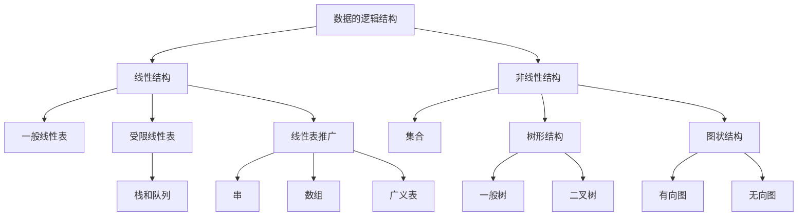

# 数据结构

> [!info] 本笔记范围
> - 依据课件《第1章 绪论》（35 页）、《第2章 线性表》（74 页）、《第3章 栈和队列》（51 页）、《第4章 串》（56 页）整理，主讲：黄绍辉
> - 覆盖：第 1 章 1.1–1.4 全部；第 2 章 2.1–2.4 全部；第 3 章 3.1–3.4 全部（顺序栈、链栈、栈的应用、栈与递归、链队列、循环队列）；第 4 章 4.1–4.3.2（串类型定义、三种存储、Brute-Force 模式匹配、KMP 算法与 next 数组）
> - 未收：第 4 章 4.3.2 的 nextval 数组、4.4 串操作应用举例 —— 课堂录音止于 next 的递推求法，留待后续整理
> - 已删：章节封面与致谢页、重复过渡页
> - 9/7 首版来自手写课堂笔记；9/14 按课件补全 2.2–2.4 并压缩 callout 用量；9/21 按课件补全第 3、4 章并配结构示意图、各章要点移至章末；9/22 按课件与录音稿新增 4.3.2 KMP，并补足 4.2 的课堂讲解与考点

## 目录

1. [[#课程信息]]
  1.1 [[#评分标准]]
2. [[#第1章 绪论]]
  2.1 [[#1.1 数据结构及其概念]]
  2.2 [[#1.2 基本概念和术语]]
  2.3 [[#1.3 抽象数据类型的表示与实现]]
  2.4 [[#1.4 算法和算法分析]]
  2.5 [[#第1章 要点]]
3. [[#第2章 线性表]]
  3.1 [[#2.1 线性表的类型定义]]
  3.2 [[#2.2 线性表的顺序表示和实现]]
  3.3 [[#2.3 线性表的链式表示和实现]]
  3.4 [[#静态链表]]
  3.5 [[#2.3.2 循环链表]]
  3.6 [[#2.3.3 双向链表]]
  3.7 [[#2.4 一元多项式的表示及相加]]
  3.8 [[#第2章 要点]]
4. [[#第3章 栈和队列]]
  4.1 [[#3.1 栈]]
  4.2 [[#3.2 栈的应用举例]]
  4.3 [[#3.3 栈与递归的实现]]
  4.4 [[#3.4 队列]]
  4.5 [[#第3章 要点]]
5. [[#第4章 串]]
  5.1 [[#4.1 串类型的定义]]
  5.2 [[#4.2 串的存储表示和实现]]

## 课程信息

- **课程名称**：数据结构
- **教学形式**：线上 + 线下
- **学时**：14 周
- **教材**：清华大学《数据结构》
- **平台**：PTA 网站注册并绑定
- **作业要求**：每周一次作业，实验课上交，纸质版（手写）
- **网课要求**：自学网课时长需 **≥ 视频总时长的 60%**

### 评分标准

| 项目 | 占比 |
| --- | --- |
| 期末考 | 40% |
| **平时成绩** | **60%** |
| ├ 出勤 | 5% |
| ├ 平时作业 & 实验 | 10% |
| ├ 实验考试 | 25% |
| └ 期中考试 | 20% |

---

## 第1章 绪论

### 1.1 数据结构及其概念

《数据结构》是介于数学、计算机硬件、计算机软件三者之间的一门**核心课程**，不仅是一般程序设计的基础，也是设计和实现编译程序、操作系统、数据库系统及其他系统程序和大型应用程序的重要基础。

随着应用问题不断复杂，信息量剧增、信息范围拓宽，必须先分析待处理问题中**对象的特征**及**各对象之间存在的关系**——这正是数据结构这门课研究的问题。

**编写解决实际问题的程序的一般过程**：

1. 如何用数据形式描述问题——由问题抽象出一个适当的**数学模型**
2. 问题所涉及的数据量大小及数据之间的关系
3. 如何在计算机中存储数据及体现数据之间的关系
4. 处理问题时需要对数据作何种运算
5. 所编写的程序的性能是否良好

#### 1.1.1 数据结构的例子

| 例子 | 数据间关系 | 结构类型 |
| --- | --- | --- |
| 电话号码查询系统：$(a_1, b_1), (a_2, b_2), \ldots, (a_n, b_n)$（$a_i$ 姓名，$b_i$ 号码） | 一对一 | 线性结构（表格问题） |
| 磁盘目录文件系统：每个子目录只有一个父目录，可包含多个子目录和文件 | 一对多 | 树型结构 |
| 交通网络图：从一个地方到另一个地方可以有多条路径 | 多对多 | 网状结构 |

### 1.2 基本概念和术语

| 术语 | 定义 |
| --- | --- |
| **数据**（Data） | 客观事物的符号表示；在计算机科学中指所有能输入到计算机中并被计算机程序处理的符号的总称 |
| **数据元素**（Data Element） | 数据的**基本单位**，在程序中通常作为一个整体来考虑和处理 |
| **数据项**（Data Item） | 数据的**不可分割的最小单位**，是对客观事物某一方面特性的数据描述。一个数据元素可由若干数据项组成 |
| **数据对象**（Data Object） | 性质相同的数据元素的**集合**，是数据的一个子集，如字符集合 $C = \{'A', 'B', 'C', \ldots\}$ |
| **数据结构**（Data Structure） | 相互之间存在一定联系（关系）的数据元素的集合 |

#### 逻辑结构

元素之间的相互联系（关系）称为**逻辑结构**，有四种基本类型：

| 类型 | 关系 |
| --- | --- |
| ① 集合 | 结构中的数据元素除了"同属于一个集合"外，没有其它关系 |
| ② 线性结构 | 一对一 |
| ③ 树型结构 | 一对多 |
| ④ 图状 / 网状结构 | 多对多 |

> [!definition] 数据结构的形式定义
> 数据结构是一个**二元组**：
> $$\text{Data\_Structure} = (D, S)$$
> 其中 $D$ 是数据元素的有限集，$S$ 是 $D$ 上关系的有限集。

数据元素之间的关系可以是元素之间代表某种含义的**自然关系**，也可以是为处理问题方便而**人为定义**的关系。

**例（课件）**：设数据逻辑结构 $B = (K, R)$

$$K = \{k_1, k_2, \ldots, k_9\}$$

$$R = \{\langle k_1, k_3\rangle, \langle k_1, k_8\rangle, \langle k_2, k_3\rangle, \langle k_2, k_4\rangle, \langle k_2, k_5\rangle, \langle k_3, k_9\rangle, \langle k_5, k_6\rangle, \langle k_8, k_9\rangle, \langle k_9, k_7\rangle, \langle k_4, k_7\rangle, \langle k_4, k_6\rangle\}$$

根据以上描述可以画出逻辑结构 $B$ 的图示，并确定哪些是起点、哪些是终点。

#### 存储结构（物理结构）

数据结构在计算机内存中的存储包括**数据元素的存储**和**元素之间关系的表示**。元素之间的关系有两种不同的表示方法（顺序表示 / 非顺序表示），由此得到两种不同的存储结构：

| 存储方式 | 特点 |
| --- | --- |
| **顺序存储结构** | 用数据元素在存储器中的**相对位置**表示数据元素之间的逻辑结构；地址连续 |
| **链式存储结构** | 在每个数据元素中增加一个存放另一个元素地址的**指针**（pointer），用该指针表示逻辑结构；地址是否连续没有要求 |

**例**：设有数据集合 $A = \{3.0, 2.3, 5.0, -8.5, 11.0\}$，可以设计两种不同的存储结构——顺序结构（存放地址连续）与链式结构（对地址连续性无要求）。

**数据结构的三个组成部分**：

1. **逻辑结构**：数据元素之间逻辑关系的描述，$D\_S = (D, S)$
2. **存储结构**：数据元素在计算机中的存储及其逻辑关系的表现，又称**物理结构**
3. **数据操作**：对数据要进行的运算

> [!important] 逻辑结构与存储结构的对应关系
> 二者是**多对多**的：线性表和树既可采用顺序存储，也可采用链式存储；图采用复合存储结构。
>
> ```mermaid
> flowchart LR
>     A1[线性表] --> B1[顺序存储结构]
>     A1 --> B2[链式存储结构]
>     A2[树] --> B1
>     A2 --> B2
>     A3[图] --> B3[复合存储结构]
> ```
>
> **算法的设计取决于所选定的逻辑结构，而算法的实现依赖于所采用的存储结构。**

**在 C 语言中**：用一维数组表示顺序存储结构；用结构体类型表示链式存储结构。

#### 数据逻辑结构层次关系



#### 数据类型

**数据类型**（Data Type）：一个值的集合和定义在该值集上的一组操作的总称。在 C 语言中有基本类型和构造类型。

数据结构不同于数据类型，也不同于数据对象：它不仅要描述数据类型的数据对象，而且要描述数据对象**各元素之间的相互关系**。

#### 数据结构的运算

数据结构的主要运算包括：

1. 建立（Create）一个数据结构
2. 消除（Destroy）一个数据结构
3. 从一个数据结构中删除（Delete）一个数据元素
4. 把一个数据元素插入（Insert）到一个数据结构中
5. 对一个数据结构进行访问（Access）
6. 对一个数据结构（中的数据元素）进行修改（Modify）
7. 对一个数据结构进行排序（Sort）
8. 对一个数据结构进行查找（Search）

### 1.3 抽象数据类型的表示与实现

**抽象数据类型**（Abstract Data Type，**ADT**）：一个数学模型以及定义在该模型上的一组操作。

ADT 的定义仅是一组**逻辑特性描述**，与其在计算机内的表示和实现无关。因此不论 ADT 的内部结构如何变化，只要其数学特性不变，都不影响其外部使用。

**ADT 的形式化定义是三元组**：

$$\text{ADT} = (D, S, P)$$

其中 $D$ 是数据对象，$S$ 是 $D$ 上的关系集，$P$ 是对 $D$ 的基本操作集。

**ADT 的一般定义形式**：

```text
ADT <抽象数据类型名> {
    数据对象：<数据对象的定义>
    数据关系：<数据关系的定义>
    基本操作：<基本操作的定义>
} ADT <抽象数据类型名>
```

其中数据对象和数据关系的定义用伪码描述。

**基本操作的定义格式**：

```text
<基本操作名>(<参数表>)
    初始条件：<初始条件描述>
    操作结果：<操作结果描述>
```

- **初始条件**：描述操作执行之前数据结构和参数应满足的条件；若不满足，则操作失败，返回相应的出错信息
- **操作结果**：描述操作正常完成之后，数据结构的变化状况和应返回的结果

### 1.4 算法和算法分析

#### 1.4.1 算法及其特性

**算法**（Algorithm）：对特定问题求解方法（步骤）的一种描述，是指令的有限序列，其中每一条指令表示一个或多个操作。

**算法的五个特性**：

1. **有穷性**：一个算法必须总是在执行有穷步之后结束，且每一步都在有穷时间内完成
2. **确定性**：算法中每一条指令必须有确切的含义，不存在二义性；且算法只有一个入口和一个出口
3. **可行性**：算法描述的操作都可以通过已经实现的基本运算执行有限次来实现
4. **输入**：有零个或多个输入，这些输入取自于某个特定的对象集合
5. **输出**：有一个或多个输出，这些输出是同输入有着某些特定关系的量

一个算法可以用自然语言、形式语言或计算机程序设计语言来描述。

**算法和程序是两个不同的概念**：一个计算机程序是对一个算法使用某种程序设计语言的具体实现。算法必须可终止，意味着**不是所有的计算机程序都是算法**。

本门课程的学习、作业练习、上机实践等环节，算法都用 **C 语言**来描述；上机实践时为了检查算法是否正确，应编写成完整的 **C++ 语言程序**（不是 C 语言）。

建议熟悉 **C++ 的标准模板库 STL**（包括 `vector`、`stack`、`queue`、`map` 等常用容器和 `sort` 等常用算法，会基本用法就行）。至于 C++ 输入输出和面向对象的部分，可以忽略。

#### 1.4.2 算法设计的要求

1. **正确性**（Correctness）：算法应满足具体问题的需求
2. **可读性**（Readability）：算法应容易供人阅读和交流，可读性好的算法有助于理解与修改
3. **健壮性**（Robustness）：算法应具有容错处理；当输入非法或错误数据时，应能适当地作出反应或进行处理，而不会产生莫名其妙的输出结果
4. **效率与存储量需求**：效率指算法执行的时间；存储量需求指算法执行过程中所需要的最大存储空间。一般地，这两者与问题的规模有关

#### 1.4.3 算法效率的度量

算法执行时间需通过依据该算法编制的程序在计算机上运行所消耗的时间来度量，通常有两种方法：

| 方法 | 说明 |
| --- | --- |
| **事后统计** | 计算机内部进行执行时间和实际占用空间的统计。缺陷：必须先运行依据算法编制的程序；依赖软硬件环境，容易掩盖算法本身的优劣；**没有实际价值** |
| **事前分析** | 求出该算法的一个时间界限函数（常用） |

与此相关的因素有：算法选用的策略、问题的规模、程序设计的语言、编译程序所产生的机器代码的质量、机器执行指令的速度。撇开软硬件等有关因素，可以认为一个特定算法"运行工作量"的大小只依赖于**问题的规模**（通常用 $n$ 表示），是问题规模的函数。

**时间复杂度**：算法中基本操作重复执行的次数是问题规模 $n$ 的某个函数，其时间量度记作

$$T(n) = O(f(n))$$

称作算法的**渐近时间复杂度**（Asymptotic Time Complexity），简称时间复杂度。一般地，常用**最深层循环内的语句**中的原操作的执行频度（重复执行的次数）来表示。

"$O$"的定义：若 $f(n)$ 是正整数 $n$ 的一个函数，则 $O(f(n))$ 表示存在 $M \geq 0$，使得当 $n \geq n_0$ 时，$|f(n)| \leq M|f(n_0)|$。

**表示时间复杂度的阶有**：

| 名称 | 复杂度 |
| --- | --- |
| 常量时间阶 | $O(1)$ |
| 对数时间阶 | $O(\log_2 n)$ |
| 线性时间阶 | $O(n)$ |
| 线性对数时间阶 | $O(n \log n)$ |
| k 次方时间阶（$k \geq 2$） | $O(n^k)$ |

**六种常用多项式的大小关系**：

$$O(1) < O(\log n) < O(n) < O(n \log n) < O(n^2) < O(n^3)$$

**指数时间的关系为**：

$$O(2^n) < O(n!) < O(n^n)$$

当 $n$ 取得很大时，指数时间算法和多项式时间算法在所需时间上非常悬殊。

> [!important] 定理：多项式的时间复杂度
> 若
> $$A(n) = a_m n^m + a_{m-1} n^{m-1} + \cdots + a_1 n + a_0$$
> 是一个 $m$ 次多项式，则
> $$A(n) = O(n^m)$$

##### 例 1：两个 n 阶方阵的乘法

```c
for (i = 1; i <= n; ++i)
    for (j = 1; j <= n; ++j)
    { c[i][j] = 0;
      for (k = 1; k <= n; ++k)
          c[i][j] += a[i][k] * b[k][j];
    }
```

三重循环，每个循环从 1 到 $n$，总次数为 $n \times n \times n = n^3$，时间复杂度 $T(n) = O(n^3)$。

##### 例 2：`{ ++x; s = 0; }`

将 `x` 自增看成基本操作，语句频度为 1，时间复杂度为 $O(1)$；如果将 `s = 0` 也看成基本操作，语句频度为 2，时间复杂度仍为 $O(1)$，即**常量阶**。

##### 例 3：`for (i = 1; i <= n; ++i) { ++x; s += x; }`

语句频度为 $2n$，时间复杂度为 $O(n)$，即**线性阶**。

##### 例 4：二重循环

```c
for (i = 1; i <= n; ++i)
    for (j = 1; j <= n; ++j)
    { ++x; s += x; }
```

语句频度为 $2n^2$，时间复杂度为 $O(n^2)$，即**平方阶**。

##### 例 5：嵌套循环

```c
for (i = 2; i <= n; ++i)
    for (j = 2; j <= i - 1; ++j)
        { ++x; a[i][j] = x; }
```

语句频度为：

$$1 + 2 + 3 + \cdots + (n-2) = \frac{(1 + n - 2)(n - 2)}{2} = \frac{(n-1)(n-2)}{2} = n^2 - 3n + 2$$

时间复杂度为 $O(n^2)$，即**平方阶**。

一个算法时间为 $O(1)$ 的算法，它的基本运算执行的次数是固定的，因此总的时间由一个常数（即零次多项式）来限界；而一个时间为 $O(n^2)$ 的算法则由一个二次多项式来限界。

##### 例 6：素数的判断算法

```c
void prime(int n)          /* n 是一个正整数 */
{   int i = 2;
    while ((n % i) != 0 && i * 1.0 < sqrt(n))  i++ ;
    if (i * 1.0 > sqrt(n))
        printf("%d 是一个素数\n", n);
    else
        printf("%d 不是一个素数\n", n);
}
```

嵌套的最深层语句是 `i++`；其频度由条件 `(n % i) != 0 && i * 1.0 < sqrt(n)` 决定，时间复杂度 $O(n^{1/2})$。

##### 例 7：冒泡排序法

```c
void bubble_sort(int a[], int n)
{
    for (i = n - 1; change = TURE; i > 1 && change; --i)
        change = FALSE;
        for (j = 0; j < i; ++j)
            if (a[j] > a[j + 1])
            { a[j] <-> a[j + 1]; change = TURE; }
}
```

- 最好情况：0 次
- 最坏情况：$1 + 2 + 3 + \cdots + (n-1) = \dfrac{n(n-1)}{2}$
- 平均时间复杂度为：$O(n^2)$

有的情况下，算法中基本操作重复执行的次数还随问题的**输入数据集**不同而不同。平均时间复杂度按各输入情况等概率加权平均求得，具体算法见 2.2 节顺序表插入 / 删除的分析（$E = \sum p_i \times \text{移动次数}$）。

#### 1.4.4 算法的存储空间需求

**空间复杂度**（Space Complexity）：算法编写成程序后，在计算机中运行时所需存储空间大小的度量，记作

$$S(n) = O(f(n))$$

其中 $n$ 为问题的规模（或大小）。

该存储空间一般包括三个方面：

1. 指令、常数、变量所占用的存储空间
2. 输入数据所占用的存储空间
3. **辅助（存储）空间**

一般地，算法的空间复杂度指的是**辅助空间**。

- 一维数组 `a[n]`：空间复杂度 $O(n)$
- 二维数组 `a[n][m]`：空间复杂度 $O(n \times m)$

### 第1章 要点

> [!summary] 本章要点
> - 数据结构研究**信息的表示与组织**，形式定义是二元组 $(D, S)$；逻辑结构分四类：集合、线性、树型、图状
> - 存储结构分**顺序**与**链式**两类，与逻辑结构是多对多对应；算法设计取决于逻辑结构，实现依赖于存储结构
> - ADT 是三元组 $(D, S, P)$，只描述逻辑特性，与实现无关
> - 时间复杂度 $T(n) = O(f(n))$，取**最深层循环内语句的频度**；$m$ 次多项式 $A(n) = O(n^m)$
> - 空间复杂度 $S(n) = O(f(n))$，一般指**辅助空间**

---

## 第2章 线性表

线性结构是最常用、最简单的一种数据结构，而线性表是一种典型的线性结构。其基本特点是线性表中的数据元素是**有序且有限**的。

### 2.1 线性表的类型定义

> [!definition] 线性表（Linear List）
> 由 $n$（$n \geq 0$）个数据元素（结点）$a_1, a_2, \ldots, a_n$ 组成的**有限序列**，序列中的所有结点具有相同的数据类型。数据元素的个数 $n$ 称为线性表的**长度**。

- $n = 0$ 时称为**空表**
- $n > 0$ 时，将非空的线性表记作 $(a_1, a_2, \ldots, a_n)$
- $a_1$ 称为线性表的第一个（首）结点，$a_n$ 称为最后一个（尾）结点
- $a_1, a_2, \ldots, a_{i-1}$ 都是 $a_i$（$2 \leq i \leq n$）的前驱，其中 $a_{i-1}$ 是**直接前驱**
- $a_{i+1}, a_{i+2}, \ldots, a_n$ 都是 $a_i$（$1 \leq i \leq n-1$）的后继，其中 $a_{i+1}$ 是**直接后继**

#### 线性表的特点

在这种结构中：

1. 存在一个唯一的被称为"**第一个**"的数据元素
2. 存在一个唯一的被称为"**最后一个**"的数据元素
3. 除第一个元素外，每个元素均有唯一一个**直接前驱**
4. 除最后一个元素外，每个元素均有唯一一个**直接后继**

#### 线性表的逻辑结构

线性表中的数据元素 $a_i$ 所代表的具体含义随具体应用的不同而不同，在线性表的定义中只不过是一个抽象的表示符号。

结点可以是**单值元素**（每个元素只有一个数据项）：

- 26 个英文字母组成的字母表：$(A, B, C, \ldots, Z)$
- 某校从 1978 年到 1983 年各种型号的计算机拥有量的变化情况：$(6, 17, 28, 50, 92, 188)$
- 一副扑克的点数：$(2, 3, 4, \ldots, J, Q, K, A)$

结点也可以是**记录型元素**——每个元素含有多个数据项，每个项称为结点的一个**域**；每个元素有一个可以唯一标识每个结点的数据项组，称为**关键字**：

- 某校 2001 级同学的基本情况：$\{('2001414101', '张三', '男', 06/24/1983), \ldots, ('2001414102', '李四', '女', 08/12/1984)\}$

若线性表中的结点是按值（或按关键字值）由小到大（或由大到小）排列的，称线性表是**有序的**。线性表长度可根据需要增长或缩短，对线性表的数据元素可以访问、插入和删除。

#### 线性表的抽象数据类型定义

```text
ADT List {
    数据对象：D = { a_i | a_i ∈ ElemSet, i = 1, 2, …, n, n ≥ 0 }
    数据关系：R = { <a_{i-1}, a_i> | a_{i-1}, a_i ∈ D, i = 2, 3, …, n }
    基本操作：
        InitList(&L)          // & 表示 C++ 的引用，见下节
            操作结果：构造一个空的线性表 L；
        ListLength(L)
            初始条件：线性表 L 已存在；
            操作结果：返回 L 中数据元素个数；
        GetElem(L, i, &e)
            初始条件：线性表 L 已存在，1 ≤ i ≤ ListLength(L)；
            操作结果：用 e 返回 L 中第 i 个数据元素的值；
        ListInsert(&L, i, e)
            初始条件：线性表 L 已存在，1 ≤ i ≤ ListLength(L)；
            操作结果：在 L 中第 i 个位置插入元素 e；
        …
} ADT List
```

#### C++ 的引用

C++ 的引用相当于**形参实参内存共享**，很适合用来改变实参的值。

```cpp
#include <stdio.h>

void f1(int i, int *q)
{   // 修改形参，实参不影响
    i++; q++;
}

void f2(int &i, int *&q)
{   // 修改形参，实参同时改变
    i++; q++;
}

int main()
{
    int a = 10, b[] = {20, 30};
    int *p = b;
    f1(a, p);
    printf("a = %d, *p = %d\n", a, *p);
    f2(a, p);
    printf("a = %d, *p = %d\n", a, *p);
    return 0;
}
```

运行结果：

```text
a=10, *p=20
a=11, *p=30
```

引用比 `return` 更方便传出结果。

#### 例 2-1：求集合并集 $A = A \cup B$

假设利用两个线性表 LA 和 LB 分别表示两个集合 A 和 B，求一个新集合 $A = A \cup B$。

```c
void union(List &La, List Lb) {          // La 变，Lb 不变
    // 将所有在 Lb 中但不在 La 中的元素插入 La
    La_len = ListLength(La);  Lb_len = ListLength(Lb);
    for (i = 1; i <= Lb_len; i++) {
        GetElem(Lb, i, e);               // 取 Lb 中第 i 个元素赋给 e
        if (!LocateElem(La, e, equal))   // La 中不存在和 e 相同的元素
            ListInsert(La, ++La_len, e); // 插入
    }
} // union
```

#### 例 2-2：归并两个有序线性表

线性表 LA 和 LB 的元素按值**非递减**有序排列，现要求将 La 和 Lb 归并为一个新的线性表 Lc，且 Lc 按值非递减有序排列。

```c
void MergeList(List La, List Lb, List &Lc) {
    InitList(Lc);  i = j = 1;  k = 0;
    La_len = ListLength(La);  Lb_len = ListLength(Lb);
    while ((i <= La_len) && (j <= Lb_len)) {      // La 和 Lb 均非空
        GetElem(La, i, ai);  GetElem(Lb, j, bj);
        if (ai <= bj) { ListInsert(Lc, ++k, ai); ++i; }
        else          { ListInsert(Lc, ++k, bj); ++j; }
    }
    while (i <= La_len) { GetElem(La, i++, ai); ListInsert(Lc, ++k, ai); }
    while (j <= Lb_len) { GetElem(Lb, j++, bj); ListInsert(Lc, ++k, bj); }
} // MergeList
```

### 2.2 线性表的顺序表示和实现

**顺序存储**：把线性表的结点按逻辑顺序依次存放在一组**地址连续**的存储单元里。用这种方法存储的线性表简称**顺序表**。

顺序存储的线性表的特点：

- 线性表的**逻辑顺序与物理顺序一致**
- 数据元素之间的关系是以元素在计算机内"**物理位置相邻**"来体现

#### 地址计算公式

设线性表的每个元素需占用 $L$ 个存储单元，以所占的第一个单元的存储地址作为数据元素的存储位置，则线性表中第 $i+1$ 个数据元素的存储位置 $\text{LOC}(a_{i+1})$ 和第 $i$ 个数据元素的存储位置 $\text{LOC}(a_i)$ 之间满足：

$$\text{LOC}(a_{i+1}) = \text{LOC}(a_i) + L$$

线性表的第 $i$ 个数据元素 $a_i$ 的存储位置为：

$$\text{LOC}(a_i) = \text{LOC}(a_1) + (i-1) \times L$$

在高级语言（如 C 语言）环境下，数组具有**随机存取**的特性，因此可以借助数组来描述顺序表。除了用数组来存储线性表的元素之外，顺序表还应该有表示线性表**长度**的属性。

#### 顺序表类型定义

```c
#define LIST_INIT_SIZE 100    // 空间初始分配量
#define LISTINCREMENT   10    // 空间分配增量

typedef struct
{   ElemType *elem;      // 存储空间基址
    int      length;     // 当前长度
    int      listsize;   // 当前分配容量
} SqList;
```

顺序存储结构中，很容易实现线性表的初始化、赋值、查找、修改、插入、删除、求长度等操作。

#### 顺序线性表初始化

```c
Status InitList_Sq(SqList &L)
{   L.elem = (ElemType *)malloc(LIST_INIT_SIZE * sizeof(ElemType));
    if (!L.elem)  exit(OVERFLOW);       // 存储分配失败
    L.length   = 0;                     // 空表长度为 0
    L.listsize = LIST_INIT_SIZE;        // 初始存储容量
    return OK;
}
```

#### 顺序线性表的插入

在线性表 $L = (a_1, \ldots, a_{i-1}, a_i, a_{i+1}, \ldots, a_n)$ 中的第 $i$（$1 \leq i \leq n$）个位置上插入一个新结点 $e$，使其成为：

$$L = (a_1, \ldots, a_{i-1}, e, a_i, a_{i+1}, \ldots, a_n)$$

**实现步骤**：

1. 将线性表 $L$ 中的第 $i$ 个至第 $n$ 个结点**后移一个位置**
2. 将结点 $e$ 插入到结点 $a_{i-1}$ 之后
3. 线性表长度加 1

```c
Status ListInsert_Sq(Sqlist &L, int i, ElemType e) {
    if (i < 1 || i > L.length + 1)  return ERROR;    // i 值不合法
    if (L.length >= L.listsize) {                    // 空间已满
        // 重新分配内存，代码参考课本
    }
    q = &(L.elem[i - 1]);                            // q 指示插入位置
    for (p = &(L.elem[L.length - 1]); p >= q; --p)
        *(p + 1) = *p;                               // 插入位置之后的元素右移
    *q = e;                                          // 插入 e
    ++L.length;                                      // 表长加 1
    return OK;
}
```

##### 插入的时间复杂度分析

时间主要耗费在**表中结点的移动**上，因此可用结点的移动次数来估计算法的时间复杂度。设在线性表 $L$ 中的第 $i$ 个元素之前插入结点的概率为 $p_i$，不失一般性，设各个位置插入是等概率，则 $p_i = \dfrac{1}{n+1}$，而插入时移动结点的次数为 $n - i + 1$。

总的平均移动次数：

$$E_{insert} = \sum_{i=1}^{n} p_i (n - i + 1) = \frac{1}{n+1}\bigl(n + (n-1) + \cdots + 1\bigr) = \frac{n}{2}$$

即在顺序表上做插入运算，平均要移动表上一半结点，算法的平均时间复杂度为 $O(n)$。

#### 顺序线性表的删除

在线性表 $L = (a_1, \ldots, a_{i-1}, a_i, a_{i+1}, \ldots, a_n)$ 中删除结点 $a_i$（$1 \leq i \leq n$），使其成为：

$$L = (a_1, \ldots, a_{i-1}, a_{i+1}, \ldots, a_n)$$

**实现步骤**：

1. 将线性表 $L$ 中的第 $i+1$ 个至第 $n$ 个结点**依次向前移动一个位置**
2. 线性表长度减 1

```c
Status ListDelete_Sq(Sqlist &L, int i, ElemType &e) {
    if (i < 1 || i > L.length)  return ERROR;   // i 值不合法
    p = &(L.elem[i - 1]);                       // p 为被删除元素的位置
    e = *p;                                     // 被删除元素的值赋给 e
    q = L.elem + L.length - 1;                  // 表尾元素的位置
    for (++p; p <= q; ++p)  *(p - 1) = *p;      // 被删元素之后的元素左移
    --L.length;                                 // 表长减 1
    return OK;
}
```

##### 删除的时间复杂度分析

设删除第 $i$ 个元素的概率为 $p_i$，不失一般性，设删除各个位置是等概率，则 $p_i = \dfrac{1}{n}$，删除时移动结点的次数为 $n - i$。

总的平均移动次数：

$$E_{delete} = \sum_{i=1}^{n} p_i (n - i) = \frac{1}{n}\bigl((n-1) + (n-2) + \cdots + 1\bigr) = \frac{n-1}{2}$$

即在顺序表上做删除运算，平均要移动表上一半结点，算法的平均时间复杂度为 $O(n)$。

> [!important] 顺序表插入 / 删除的代价
> 平均移动次数分别为 $E_{insert} = \dfrac{n}{2}$、$E_{delete} = \dfrac{n-1}{2}$，**时间复杂度均为 $O(n)$**。
> 当表长 $n$ 较大时效率相当低——这是链式存储要解决的问题。

#### 顺序线性表的查找定位

查找元素最简单的办法，就是让 $e$ 和 $L$ 中的数据元素逐个比较。`compare` 是**函数指针**，需传入用于比较两个元素的函数名。

```c
int LocateElem_Sq(Sqlist L, ElemType e,
                  Status (*compare)(ElemType, ElemType)) {
    i = 1;                  // i 的初值为第 1 个元素的位序
    p = L.elem;             // p 的初值为第 1 个元素的存储位置
    while (i <= L.length && !(*compare)(*p++, e))  ++i;
    if (i <= L.length)  return i;
    else                return 0;
}
```

#### 有序顺序表的合并

将顺序表 La 和 Lb 合并为一个新的顺序表 Lc：

```c
void MergeList_Sq(SqList La, SqList Lb, SqList &Lc) {
    pa = La.elem;  pb = Lb.elem;
    Lc.listsize = Lc.length = La.length + Lb.length;
    pc = Lc.elem = (ElemType *)malloc(Lc.listsize * sizeof(ElemType));
    if (!Lc.elem)  exit(OVERFLOW);
    pa_last = La.elem + La.length - 1;
    pb_last = Lb.elem + Lb.length - 1;
    while ((pa <= pa_last) && (pb <= pb_last)) {    // La 和 Lb 均非空
        if (*pa <= *pb)  *pc++ = *pa++;
        else             *pc++ = *pb++;
    }
    while (pa <= pa_last)  *pc++ = *pa++;           // 插入 La 的剩余元素
    while (pb <= pb_last)  *pc++ = *pb++;           // 插入 Lb 的剩余元素
} // MergeList_Sq
```

时间复杂度为 $O(\text{La.length} + \text{Lb.length})$。

以线性表表示集合并进行集合的各种运算，应**先对表中元素进行排序**。

### 2.3 线性表的链式表示和实现

**链式存储**：用一组**任意**的存储单元存储线性表中的数据元素。用这种方法存储的线性表简称**线性链表**。

存储链表中结点的一组任意的存储单元可以是连续的，也可以是不连续的，甚至是零散分布在内存中的任意位置上的。链表中结点的**逻辑顺序和物理顺序不一定相同**。

#### 2.3.1 单链表

为了正确表示结点间的逻辑关系，在存储每个结点值的同时，还必须存储指示其**直接后继结点的地址（或位置）**，称为**指针**（pointer）或**链**（link）。这两部分组成了链表中的结点结构：

```text
┌──────┬──────┐
│ data │ next │
└──────┴──────┘
  数据域   指针域
```

- `data`：数据域，存放结点的值
- `next`：指针域，存放结点的直接后继的地址
- 每一个结点只包含一个指针域的链表，称为**单链表**
- 为操作方便，总是在链表的第一个结点之前附设一个**头结点**（头指针 `head` 指向第一个结点）。头结点的数据域可以不存储任何信息（单纯占个位置），也可以存储链表长度等信息
- 单链表是由**表头**唯一确定的，因此可以用头指针的名字来命名

##### 结点的描述与实现

C 语言中用带指针的结构体类型来描述：

```c
typedef struct LNode
{   ElemType       data;    /* 数据域，保存结点的值 */
    struct LNode  *next;    /* 指针域 */
} LNode, *LinkList;         /* 结点和结点指针类型 */
```

结点是通过**动态分配和释放**来实现的：需要时分配，不需要时释放，分别使用 C 语言提供的标准函数 `malloc()`、`realloc()`、`sizeof()`、`free()`。

```c
p = (LNode *)malloc(sizeof(LNode));   // 动态分配：分配一个 LNode 结点，首地址放入 p
free(p);                              // 动态释放：系统回收 p 所指向的内存区
```

`free(p)` 中的 `p` 必须是最近一次调用 `malloc` 函数时的返回值。

##### 结点赋值与常见指针操作

**结点赋值**：

```c
LNode *p;
p = (LNode *)malloc(sizeof(LNode));
p->data = 20;  p->next = NULL;
```

**常见指针操作**：

| 操作 | 含义 | 示意图 |
| --- | --- | --- |
| `q = p` | q 指向 p 所指结点 | `p ⟶ a` ⇒ `p ⟶ a ⟵ q` |
| `q = p->next` | q 指向 p 的后继 | `p ⟶ a ⟶ b` ⇒ q 指向 b |
| `p = p->next` | p 后移一个结点 | `p ⟶ a ⟶ b` ⇒ p 指向 b |
| `q->next = p` | 把 p 所指结点接到 q 之后 | a ⟶ b 后接 p 链 |
| `q->next = p->next` | 把 p 的后继接到 q 之后 | 跳过中间结点 |

##### 建立单链表

假设线性表中结点的数据类型是整型，现在要创建有 $n$ 个结点的链表。动态地建立单链表的常用方法有两种：**头插法**与**尾插法**。

**头插法**：从一个空表开始，重复读入数据，生成新结点，将读入数据存放到新结点的数据域中，然后将新结点插入到当前链表的**表头**上，即每次插入的结点都作为链表的第一个结点。

```c
void CreateList_L(LinkList &L, int n) {      // 算法 2.11，逆序
    L = (LinkList)malloc(sizeof(LNode));
    L->next = NULL;                          // 先建立一个带头结点的单链表
    for (i = n; i > 0; i--) {
        p = (LinkList)malloc(sizeof(LNode)); // 生成新结点
        scanf(&p->data);                     // 输入元素值
        p->next = L->next;  // 注意不是 L，L 是头结点，不算链表
        L->next = p;                         // 插入到表头
    }
} // CreateList_L
```

**尾插法**：头插法生成的链表中结点的次序和输入的顺序**相反**，若希望二者次序一致，可采用尾插法——将新结点插入到当前链表的**表尾**，使其成为当前链表的尾结点。

```c
void CreateList2_L(LinkList &L, int n) {     // 顺序
    L = q = (LinkList)malloc(sizeof(LNode));
    L->next = NULL;
    for (i = n; i > 0; i--) {
        p = (LinkList)malloc(sizeof(LNode));
        scanf(&p->data);
        p->next = NULL;                      // p 是尾结点，后继始终是 NULL
        q->next = p;
        q = p;                               // q 始终在尾结点处
    }
} // CreateList2_L
```

无论哪种插入方法，如果要插入建立的单链表的结点是 $n$ 个，算法的时间复杂度均为 $O(n)$。

> [!warning] 钩链次序：先右后左
> 对于单链表，无论是哪种操作，只要涉及到**钩链（或重新钩链）**，如果没有明确给出直接后继，钩链的次序必须是"**先右后左**"——即先处理新结点右侧（后继方向）的指针，再改左侧。

##### 单链表的查找

**(1) 按序号查找**：取单链表中的第 $i$ 个元素。对于单链表，不能像顺序表中那样直接按序号 $i$ 访问结点，而只能从链表的头结点出发，沿链域 `next` 逐个结点往下搜索，直到搜索到第 $i$ 个结点为止。因此，**链表不是随机存取结构**。

```c
Status GetElem_L(LinkList L, int i, ElemType &e) {    // 算法 2.8
    p = L->next;  j = 1;                  // 初始化，p 指向第一个结点，j 为计数器
    while (p && j < i)                    // 顺指针向后查找，直到 p 指向第 i 个元素或 p 为空
    {   p = p->next;  ++j; }
    if (!p || j > i)  return ERROR;       // 第 i 个元素不存在
    e = p->data;                          // 取第 i 个元素
    return OK;
} // GetElem_L
```

移动指针 `p` 的频度：$i < 1$ 时为 0 次；$i \in [1, n]$ 时为 $i - 1$ 次；$i > n$ 时为 $n$ 次。时间复杂度为 $O(n)$。

**(2) 按值查找**：在链表中查找是否有结点值等于给定值 `key` 的结点，若有则返回首次找到的值为 `key` 的结点的存储位置，否则返回 `NULL`。查找时从开始结点出发，沿链表逐个将结点的值和给定值 `key` 作比较。

```c
Status LocateNode_L(LinkList L, ElemType key, LinkList &node) {
    p = L->next;
    while (p && p->data != key)  p = p->next;
    if (p && p->data == key)  { node = p;  return OK; }
    else                      return ERROR;
}
```

算法的执行与形参 `key` 有关，平均时间复杂度为 $O(n)$。

##### 单链表的插入

插入运算是将值为 $e$ 的新结点插入到表的第 $i$ 个结点的位置上，即插入到 $a_{i-1}$ 与 $a_i$ 之间。因此必须首先找到 $a_{i-1}$ 所在的结点 `p`，然后生成一个数据域为 $e$ 的新结点 `q`，`q` 结点作为 `p` 的直接后继结点。

```c
Status ListInsert_L(LinkList &L, int i, ElemType e) {   // 算法 2.9
    p = L;  j = 0;
    while (p && j < i - 1)  { p = p->next;  ++j; }      // 寻找第 i-1 个结点
    if (!p || j > i - 1)  return ERROR;                 // i 小于 1 或大于表长
    s = (LinkList)malloc(sizeof(LNode));                // 生成新结点
    s->data = e;  s->next = p->next;                    // 先右
    p->next = s;                                        // 后左
    return OK;
}
```

设链表的长度为 $n$，合法的插入位置是 $1 \leq i \leq n$。算法的时间主要耗费在移动指针 `p` 上，时间复杂度亦为 $O(n)$。

##### 单链表的删除

**(1) 按序号删除**：删除单链表中的第 $i$ 个结点。为了删除第 $i$ 个结点 $a_i$，必须找到结点的存储地址，该存储地址是在其直接前趋结点 $a_{i-1}$ 的 `next` 域中，因此必须首先找到 $a_{i-1}$ 的存储位置 `p`，然后令 `p->next` 指向 $a_i$ 的直接后继结点，即把 $a_i$ 从链上摘下，最后释放结点 $a_i$ 的空间，将其归还给"存储池"。

设单链表长度为 $n$，删去第 $i$ 个结点仅当 $1 \leq i \leq n$ 时是合法的。当 $i = n+1$ 时，虽然被删结点不存在，但其前趋结点却存在（终端结点），故判断条件之一是 `p->next != NULL`。

```c
Status ListDelete_L(LinkList &L, int i, ElemType &e) {  // 算法 2.10
    p = L;  j = 0;
    while (p->next && j < i - 1)                        // 寻找第 i 个结点，并令 p 指向其前趋
    {   p = p->next;  ++j; }
    if (!(p->next) || j > i - 1)  return ERROR;         // 删除位置不合理
    q = p->next;  p->next = q->next;                    // 删除并释放结点
    e = q->data;  free(q);
    return OK;
} // ListDelete_L
```

时间复杂度为 $O(n)$。

**(2) 按值删除**：删除单链表中值为 `key` 的第一个结点。与按值查找相类似，首先要查找值为 `key` 的结点是否存在？若存在，则删除；否则返回 `NULL`。

```c
Status ListDelete2_L(LinkList &L, ElemType key) {
    p = L;
    while (p->next && p->next->data != key)  { p = p->next; }
    if (!(p->next) || (p->next->data != key))  return ERROR;
    q = p->next;  p->next = q->next;
    free(q);
    return OK;
} // ListDelete2_L
```

**(3) 删除所有值为 `key` 的结点**：从单链表的第一个结点开始，对每个结点进行检查，若结点的值为 `key`，则删除之，然后检查下一个结点，直到所有的结点都检查完。

```c
void ListDelete3_L(LinkList &L, ElemType key) {
    LinkList p = L, q = L->next;
    while (q) {
        if (q->data == key)
        {   p->next = q->next;  free(q);  q = p->next; }
        else
        {   p = q;  q = q->next; }
    }
} // ListDelete3_L
```

> [!important] 链表插入 / 删除的代价
> 在链表上实现插入和删除运算，**无需移动结点，仅需修改指针**，解决了顺序表插入或删除需要移动大量元素的问题。
> 但查找第 $i$ 个结点仍需从头沿链搜索，时间复杂度 $O(n)$。

##### 单链表的合并

设有两个**有序**的单链表，它们的头指针分别是 La、Lb，将它们合并为以 Lc 为头指针的有序链表。算法中 `pa`、`pb` 分别是待考察的两个链表的当前结点，`pc` 是合并过程中合并链表的最后一个结点。

```c
void MergeList_L(LinkList &La, LinkList &Lb, LinkList &Lc) {   // 算法 2.12
    pa = La->next;  pb = Lb->next;
    Lc = pc = La;                        // 用 La 的头结点作为 Lc 的头结点
    while (pa && pb) {
        if (pa->data <= pb->data)
        {   pc->next = pa;  pc = pa;  pa = pa->next; }
        else
        {   pc->next = pb;  pc = pb;  pb = pb->next; }
    }
    pc->next = pa ? pa : pb;             // 插入剩余段
    free(Lb);                            // 释放 Lb 的头结点
} // MergeList_L
```

若 La、Lb 两个链表的长度分别是 $m$、$n$，则链表合并的时间复杂度为 $O(m + n)$。

### 静态链表

有些编程语言没有类似指针的类型，此时可以用**一维数组**来描述线性链表，这种链表叫**静态链表**。

```c
#define MAXSIZE 1000
typedef struct {
    ElemType data;
    int      cur;      // 指示下一元素的索引，相当于动态链表的 next
} component, SLinkList[MAXSIZE];
```

数组的一个分量相当于一个结点，`cur` 为 0 的结点表示尾结点。

**改进方案**：索引为 0 的结点改为**备用（空闲）链表的头结点**，而实际存储数据的链表头结点另设一个变量 `S` 来存储。初始时 `space[0].cur` 指向第一个空闲结点下标。

```c
void InitSpace_SL(SLinkList &space) {        // 算法 2.14，初始化
    for (i = 0; i < MAXSIZE - 1; ++i)  space[i].cur = i + 1;
    space[MAXSIZE - 1].cur = 0;              // 全部结点都是空闲结点
} // InitSpace_SL

int Malloc_SL(SLinkList &space) {            // 算法 2.15，返回第一个可用下标
    i = space[0].cur;                        // 第一个可用结点下标
    if (space[0].cur)  space[0].cur = space[i].cur;   // 指向下个可用下标
    return i;
} // Malloc_SL

void Free_SL(SLinkList &space) {             // 算法 2.16，回收索引为 k 的结点
    space[k].cur = space[0].cur;
    space[0].cur = k;                        // 设为可用的第一个结点
} // Free_SL
```

**例 2-3**：求集合运算 $(A - B) \cup (B - A)$。先输入集合 A（$m$ 个元素），再输入集合 B（$n$ 个元素）：对每个 B 中元素，若 A 中不存在则插入，若已存在则删除。

```c
void difference(SLinkList &space, int S) {   // 算法 2.17
    InitSpace_SL(space);
    S = Malloc_SL(space);                    // 生成 S 的头结点
    r = S;  scanf(m, n);
    for (j = 1; j <= m; ++j) {               // 建链表 A
        i = Malloc_SL(space);
        scanf(space[i].data);
        space[r].cur = i;  r = i;
    }
    space[r].cur = 0;                        // r 是链表 A 尾结点
    for (j = 1; j <= n; ++j) {
        scanf(b);  p = S;  k = space[S].cur;
        while (k != space[r].cur && space[k].data != b) {
            p = k;  k = space[k].cur;        // 元素查找，p 为 k 的前驱
        }
        if (k == space[r].cur) {             // 元素不存在，插入新元素
            i = Malloc_SL(space);
            space[i].data = b;
            space[i].cur = space[r].cur;
            space[r].cur = i;
        } else {                             // 元素已存在，需删除
            space[p].cur = space[k].cur;
            Free_SL(space, k);
            if (r == k)  r = p;
        }
    }
} // difference
```

### 2.3.2 循环链表

**循环链表**（Circular Linked List）：一种**头尾相接**的链表。其特点是最后一个结点的指针域指向链表的**头结点**，整个链表的指针域链接成一个环。

从循环链表的任意一个结点出发都可以找到链表中的其它结点，使得表处理更加方便灵活。

对于单循环链表，除链表的合并外，其它的操作和单线性链表基本上一致，仅仅需要在单线性链表操作算法基础上作以下简单修改：

1. 判断是否为空链表：`head->next == head`
2. 判断是否为表尾结点：`p->next == head`

### 2.3.3 双向链表

**双向链表**（Double Linked List）：构成链表的每个结点中设立两个指针域——一个指向其直接前趋的指针域 `prior`，一个指向其直接后继的指针域 `next`。这样形成的链表中有两个方向不同的链，故称为双向链表。

双向链表是为了**克服单链表的单向性的缺陷**而引入的。和单链表类似，双向链表一般增加**头指针**也能使双链表上的某些运算变得方便；将头结点和尾结点链接起来也能构成循环链表，称之为**双向循环链表**。

#### 结点及其类型定义

```c
typedef struct DuLNode
{   ElemType          data;
    struct DuLNode   *prior, *next;
} DuLNode, *DuLinkList;
```

```text
┌───────┬──────┬──────┐
│ prior │ data │ next │
└───────┴──────┴──────┘
```

> [!important] 双向链表的对称性
> 设 `p` 指向双向链表中的某一结点，则：
> $$(p \to prior) \to next = p = (p \to next) \to prior$$
> 即结点 `p` 的存储位置既存放在其直接前趋结点 `p->prior` 的直接后继指针域中，也存放在其直接后继结点 `p->next` 的直接前趋指针域中。

#### 双向链表的插入

将值为 $e$ 的结点插入双向链表中（插入到 `p` 所指结点之前）：

```c
Status ListInsert_DuL(DuLinkList &L, int i, ElemType e) {   // 算法 2.18
    if (!(p = GetElemP_DuL(L, i)))  return ERROR;   // 定位位置 i
    if (!(s = (DuLinkList)malloc(sizeof(DuLNode))))  return ERROR;
    s->data = e;
    // 修改指针的原则：先改新结点，后改原链表
    s->prior = p->prior;   p->prior->next = s;
    s->next  = p;          p->prior = s;
    return OK;
} // ListInsert_DuL
```

#### 双向链表的删除

```c
Status ListDelete_DuL(DuLinkList &L, int i, ElemType e) {   // 算法 2.19
    if (!(p = GetElemP_DuL(L, i)))  return ERROR;   // 定位位置 i
    e = p->data;
    p->prior->next = p->next;      // 删除结点的语句顺序随意
    p->next->prior = p->prior;
    free(p);
    return OK;
} // ListDelete_DuL
```

### 2.4 一元多项式的表示及相加

#### 一元多项式的表示

一元多项式

$$P_n(x) = p_0 + p_1 x + p_2 x^2 + \cdots + p_n x^n$$

由 $n+1$ 个系数唯一确定，在计算机中可用线性表 $(p_0, p_1, p_2, \ldots, p_n)$ 表示。

既然是线性表，就可以用**顺序表和链表**来实现；两种实现方式各有优缺点，实际应用中**以链式居多**。

多项式的项定义如下：

```c
typedef struct {
    float coef;      // 系数
    int   expn;      // 指数
} term, ElemType;

typedef LinkList polynomial;    // 用带表头结点的有序链表表示多项式
```

#### 一元多项式的相加

设有两个一元多项式：

$$P(x) = p_0 + p_1 x + p_2 x^2 + \cdots + p_n x^n$$

$$Q(x) = q_0 + q_1 x + q_2 x^2 + \cdots + q_m x^m \quad (m < n)$$

$$R(x) = P(x) + Q(x)$$

$R(x)$ 由线性表 $R\bigl((p_0 + q_0), (p_1 + q_1), (p_2 + q_2), \ldots, (p_m + q_m), \ldots, p_n\bigr)$ 唯一表示。

一元多项式相加的实质是：

- **指数不同**：是链表的合并
- **指数相同**：系数相加。和为 0，去掉结点；和不为 0，修改结点的系数域

```c
void CreatePolyn(polynomial &P, int n) {     // 算法 2.22，输入 n 项建立多项式
    InitList(P);  h = GetHead(P);
    e.coef = 0.0;  e.expn = -1;  SetCurElem(h, e);   // 设置头结点的数据元素
    for (i = 1; i <= n; ++i) {
        scanf(e.coef, e.expn);
        if (!LocateElem(P, e, q, (*cmp)()))          // 当前链表中不存在该指数项
            if (MakeNode(s, e))  InsFirst(q, s);      // 生成结点并插入链表
    }
} // CreatePolyn
```

```c
void AddPolyn(polynomial &Pa, polynomial &Pb) {      // 算法 2.23，Pa = Pa + Pb
    ha = GetHead(Pa);  hb = GetHead(Pb);
    qa = NextPos(Pa, ha);  qb = NextPos(Pb, hb);
    while (qa && qb) {
        a = GetCurElem(qa);  b = GetCurElem(qb);
        switch (*cmp(a, b)) {
            case -1:                                  // Pa 的当前结点指数小
                ha = qa;  qa = NextPos(Pa, qa);  break;
            case 0:                                   // 指数相等
                sum = a.coef + b.coef;
                if (sum != 0.0) { SetCurElem(qa, sum);  ha = qa; }
                else { DelFirst(ha, qa);  FreeNode(qa); }
                DelFirst(hb, qb);  FreeNode(qb);
                qb = NextPos(Pb, hb);  qa = NextPos(Pa, ha);
                break;
            case 1:                                   // Pb 的当前结点指数小
                DelFirst(hb, qb);  InsFirst(ha, qb);
                qb = NextPos(Pb, hb);  ha = NextPos(Pa, ha);
                break;
        }
    }
    if (!ListEmpty(Pb))  Append(Pa, qb);              // 链接 Pb 中剩余结点
    FreeNode(hb);                                     // 释放 Pb 的头结点
} // AddPolyn
```

### 第2章 要点

> [!summary] 本章要点
> - 线性表是 $n$ 个相同类型数据元素的有限序列，除首尾外每个元素有唯一直接前驱与直接后继
> - **顺序表**：随机存取，$\text{LOC}(a_i) = \text{LOC}(a_1) + (i-1)L$；插入 / 删除平均移动 $\dfrac{n}{2}$ / $\dfrac{n-1}{2}$ 个结点，均为 $O(n)$
> - **单链表**：非随机存取，插入 / 删除只需改指针，但查找第 $i$ 个结点为 $O(n)$；钩链次序**先右后左**
> - **静态链表**用数组 + `cur` 游标模拟指针；**循环链表**判空 `head->next == head`；**双向链表**满足 $(p \to prior) \to next = p = (p \to next) \to prior$
> - 一元多项式用有序链表表示，相加时指数不同则合并、指数相同则系数相加（和为 0 删结点）

---

## 第3章 栈和队列

栈和队列都是**操作受限的线性表**，都来自线性表。栈在计算机中有两种实现方式：**硬堆栈**利用 CPU 中的寄存器组或内存的特殊区域实现，容量有限但速度很快；**软堆栈**在内存中实现，容量可以很大，又分动态与静态两种。

### 3.1 栈

#### 栈的概念

- **栈（Stack）**：限制在表的一端进行插入和删除操作的线性表，又称**后进先出**（LIFO，Last In First Out）或**先进后出**（FILO）线性表
- **栈顶（Top）**：允许进行插入、删除操作的一端，又称表尾，用栈顶指针 `top` 指示
- **栈底（Bottom）**：固定端，又称表头
- **空栈**：表中没有元素

设栈 $S = (a_1, a_2, \ldots, a_n)$，则 $a_1$ 为栈底元素、$a_n$ 为栈顶元素。元素按 $a_1, a_2, \ldots, a_n$ 的次序进栈，退栈的第一个元素必是栈顶元素 $a_n$ —— 栈的修改按后进先出的原则进行。


> [!warning] top 到底指向哪？
> 课本约定 **top 指向栈顶元素的下一个位置**（即 top 所指单元是空的），所以是 `*S.top++ = e` 先写入再上移、`e = *--S.top` 先下移再取出。若换用"top 指向栈顶元素"的约定，这两条语句都要改写，两种约定混用必错。

#### 栈的抽象数据类型定义

```text
ADT Stack {
数据对象：D = { ai | ai ∈ ElemSet, i = 1, 2, …, n, n ≥ 0 }
数据关系：R = { <ai-1, ai> | ai-1, ai ∈ D, i = 2, 3, …, n }
基本操作：初始化、进栈、出栈、取栈顶元素等
} ADT Stack
```

#### 栈的顺序存储表示

栈的顺序存储结构简称**顺序栈**，用一维数组存储栈。按数组能否根据需要增大，又分为：

- **静态顺序栈**：实现简单，但不能根据需要增大栈的存储空间
- **动态顺序栈**：可以根据需要增大存储空间，但实现稍为复杂

动态顺序栈用 `base` 表示栈底指针（固定不变），`top` 指示当前栈顶位置（随进栈退栈变化），以 `top = base` 作为栈空的标记，每次 `top` 指向栈顶数组中的下一个存储位置。

- **结点进栈**：先把数据元素保存到 `top` 所指的当前位置，然后执行 `top` 加 1，使其指向栈顶的下一个存储位置
- **结点出栈**：先执行 `top` 减 1，使其指向栈顶元素的存储位置，然后将栈顶元素取出


栈的类型定义：

```c
#define STACK_INIT_SIZE 100    /* 栈初始向量大小 */
#define STACKINCREMENT   10    /* 存储空间分配增量 */

typedef struct {
    SElemType *base;    /* 栈底指针，栈不存在时值为 NULL */
    SElemType *top;     /* 栈顶指针 */
    int stacksize;      /* 当前可使用的最大空间 */
} SqStack;
```

`stacksize` 的作用有二：限制下标的使用范围（容量为 100 时下标最多用到 99），以及判断是否需要执行二次空间分配。用数组实现栈时通常建议增加一个容量字段，而链栈一般不需要这个参数。

**初始化**：

```c
Status InitStack(SqStack &S) {
    S.base = (SElemType *)malloc(STACK_INIT_SIZE * sizeof(SElemType));
    if (!S.base) return ERROR;
    S.top = S.base;                        /* 栈空时栈顶和栈底指针相同 */
    S.stacksize = STACK_INIT_SIZE;
    return OK;
}
```

**压栈**：

```c
Status push(SqStack &S, SElemType e) {
    if (S.top - S.base >= S.stacksize) {          /* 栈满，追加存储空间 */
        S.base = (SElemType *)realloc(S.base,
                    (S.stacksize + STACKINCREMENT) * sizeof(SElemType));
        if (!S.base) return ERROR;
        S.top = S.base + S.stacksize;
        S.stacksize += STACKINCREMENT;
    }
    *S.top++ = e;                                 /* 先写入，再让 top 上移 */
    return OK;
}
```

**弹栈**：

```c
Status pop(SqStack &S, SElemType &e) {
    if (S.top == S.base) return ERROR;   /* 栈空，返回失败标志 */
    e = *--S.top;                        /* 先下移 top，再取出元素 */
    return OK;
}
```

参数 `S` 与 `e` 都必须使用**引用**，否则函数内的修改带不出去。压栈函数看起来较长，是在处理栈满与二次分配，真正核心的压栈操作只有 `*S.top++ = e` 一行。

栈常用数组而非链表实现，原因是 `top` 指针频繁移动，若用链表则每次进栈出栈都可能要分配/释放内存，严重影响效率；因此通常**一次性开辟一块连续的大空间**，在这块空间里来回移动 `top`。代价是容量有上限，解决办法有两种：把数组开得足够大，或空间不足时进行二次分配。

出栈时元素其实并没有被真正删除：通常只是把 `top` 下移，原来那个元素在物理上可能仍然存在，但由于 `top` 已经改变，下一次写入时会把它覆盖，所以在**逻辑上它已经不属于栈了**。

C 语言中常见的"栈溢出"也是同一个道理：程序运行时有一个固定的栈区，用来保存函数的返回地址等信息，函数每调用一次就要入栈一次；递归太深或调用层级太多就容易溢出。根源在于**运行栈的大小通常是不可动态改变的**，可以在启动时把默认的 1 MB 指定得更大，但依然存在上限。

#### 栈的链式存储表示

栈的链式存储结构称为**链栈**，是运算受限的单链表，其插入和删除操作只能在表头位置上进行。因此链栈没有必要像单链表那样附加头结点，**栈顶指针 `top` 就是链表的头指针**。


```c
typedef struct Stack_Node {
    ElemType data;
    struct Stack_Node *next;
} Stack_Node;
```

空栈时 `top = NULL`。链栈每次进栈、出栈都可能需要分配或释放一块内存，效率不如数组栈高，因此实际使用相对较少。

### 3.2 栈的应用举例

由于栈具有后进先出的固有特性，它成为程序设计中常用的工具和数据结构。

#### 3.2.1 数制转换

十进制整数 $n$ 向其它进制数 $d$（二、八、十六）的转换是计算机实现计算的基本问题，转换法则对应一个简单的算法原理：

$$n = (n \ \mathrm{div}\ d) \times d + n \ \mathrm{mod}\ d$$

其中 div 为整除运算、mod 为求余运算。注意到余数是**倒序输出**的 —— 最后得到的余数反而要放在最前面，这正是一个后进先出过程。

例如 $(1348)_{10} = (2504)_8$，运算过程如下：

| $n$ | $n \ \mathrm{div}\ 8$ | $n \ \mathrm{mod}\ 8$ |
| --- | --- | --- |
| 1348 | 168 | 4 |
| 168 | 21 | 0 |
| 21 | 2 | 5 |
| 2 | 0 | 2 |

```c
void conversion() {
    Init_Stack(S);
    scanf("%d", &n);
    while (n) { push(S, n % 8); n = n / 8; }        /* 余数依次入栈 */
    while (!StackEmpty(S)) { pop(S, e); printf("%d", e); }   /* 出栈即倒序 */
} //conversion
```

#### 3.2.2 括号匹配问题

在文字处理软件或编译程序设计中，常常需要检查一个字符串或表达式中的括号是否相匹配。**仅仅统计左右括号数量是否相等是不够的**：左右括号可能写反，也可能数量相同却不匹配。

匹配思想：从左至右扫描字符串（或表达式），将每个右括号与**最近遇到的那个左括号**相匹配。越早出现的左括号离得越远，越晚出现的左括号离得越近，这正是后进先出。

算法思想：设置一个栈，读到左括号时左括号进栈；读到右括号时，从栈中弹出一个左括号与读到的右括号进行匹配，若匹配成功则继续读入，否则匹配失败，返回 `FALSE`。

#### 3.2.3 行编辑程序

行编辑程序能接收用户的一行输入，由于光标不能回退，因此需要支持特殊字符 `#` 和 `@`，统一处理后再存入用户数据区：`#` 表示删除前一个字符（连续输入多个就连续删除前面的字符），`@` 表示删除之前的所有字符。

算法思想：逐行处理，从左至右扫描。设置一个栈，读到普通字符时直接进栈；读到 `#` 时从栈中弹出一个元素；读到 `@` 时清空栈。字符读取完毕后，将整个栈的内容传送到用户数据区。例如：

| 用户输入 | 处理后的结果 |
| --- | --- |
| `whli##ilr#e(s#*s)` | `while(*s)` |
| `outcha@putchar(*s=#++);` | `putchar(*s++);` |

如果完全使用数组，需要自己管理下标和边界；用栈则可以把思维集中在更高层次，不必过分关注下标移动。

#### 3.2.4 迷宫求解

迷宫通常包含可以通行的路径、不能通过的墙，以及入口坐标和出口坐标，目标是从入口出发找到一条通往出口的路径。走迷宫的关键特性是：**当某一步走不通时，总是退回到"最近的一步"**，这非常符合栈的后进先出特点。

思路：设当前探索位置 `curpos`（最开始是起点）。

1. 判断 `curpos` 是否可通：是则前进一步，并生成下一个探索位置；否则回退一步，尝试生成下一个探索方向
2. 回退后如果该位置 `di = 4`，说明四个方向都已探索完毕，标记该位置"没前途"（防止后续再次进入同一位置），然后继续回退，直到 `di < 4` 或者栈空
3. 如果 `di < 4`，就生成下一个探索位置，转回第 1 步继续判断；如果栈空则无解

**前进一步就是入栈，回退一步就是出栈。** `di` 取值 1~4 分别表示东、南、西、北四个方向（方向的顺序无所谓），探索顺序从 1 到 4；某个位置的 `di` 为 4 表示四个方向都已探索完毕。

```c
Status MazePath(MazeType maze, PosType start, PosType end) {
    InitStack(S); curpos = start; curstep = 1;
    do {
        if (Pass(curpos)) {                    /* 即将走入的位置可以通过 */
            FootPrint(curpos);
            e = (curstep, curpos, 1);
            Push(S, e);                        /* 保存最近一步的位置和方向，方便回退 */
            if (curpos == end) return TRUE;
            curpos = NextPos(curpos, 1);       /* 下一探索位置，注意还没走过去 */
            curstep++;
        } //if
        else {                                 /* 当前位置不可通过 */
            if (!StackEmpty(S)) {
                Pop(S, e);                     /* 出栈，尝试换方向 */
                while (e.di == 4 && !StackEmpty(S)) {   /* 无方向可换，必须回退 */
                    MarkPrint(e.seat); Pop(S, e); curstep--;
                } //while
                if (e.di < 4) {                /* 如果还有方向可以尝试，入栈 */
                    e.di++; Push(S, e); curpos = NextPos(e.seat, e.di);
                } //if
            } //if
        } //else
    } while (!StackEmpty(S));
    return FALSE;
} //MazePath
```

栈元素需要同时保存序号、位置和方向，回退以后才能在原方向上再加一、换一个新方向继续探索：

```c
typedef struct {
    int ord;        /* 序号 */
    PosType seat;   /* 位置 */
    int di;         /* 方向 */
} SElemType;
```

从迷宫的前几步可以理解这个算法：

1. 尝试走入初始位置 $(1,1)$，可通过，于是 $((1,1),1)$ 入栈，下一位置 $(1,2)$
2. 尝试走入位置 $(1,2)$，可通过，于是 $((1,2),1)$ 入栈，下一位置 $(1,3)$
3. 尝试走入位置 $(1,3)$，不可通过，于是 $((1,2),1)$ 出栈、下一方向 $((1,2),2)$ 入栈，下一位置 $(2,2)$
4. 尝试走入位置 $(2,2)$，可通过，于是 $((2,2),1)$ 入栈，下一位置 $(2,3)$
5. 尝试走入位置 $(2,3)$，不可通过，于是 $((2,2),1)$ 出栈、下一方向 $((2,2),2)$ 入栈，下一位置 $(3,2)$……

> [!warning] 回退时别忘了把步数减一
> 课件在此处特别标注：回退分支里的 `curstep--` 不能省。课本漏了这一句，会让最终输出的步数把走过的无效步也算进去。如果不标记"不可行位置"，还可能出现死循环 —— 从方向 A 进入某格子失败，之后又从方向 B 进入同一格子，反复打转。

> [!important] 用栈求解迷宫属于深度优先搜索
> 该算法本质上是一种**深度优先搜索（DFS）**，它能够找到一条路径，但**不一定是最短路径**。如果想找最短路径，通常应该使用队列实现**广度优先搜索（BFS）**。

#### 3.2.5 表达式求值

算法基本思想：使用两个工作栈，一个是 `OPTR`，用以存放运算符；另一个是 `OPND`，用于存数。

1. 首先置 `OPND` 为空栈，`OPTR` 存放 `#` 作为栈底元素
2. 依次读入表达式的每个字符：若是操作数，入栈 `OPND`；若是运算符，与 `OPTR` 的栈顶运算符比较优先级大小，然后根据比较结果执行相应操作，直到整个表达式求值完毕（`OPTR` 的栈顶和栈底元素都是 `#`）

```c
OperandType EvaluateExpression() {
    InitStack(OPTR); Push(OPTR, '#');       /* 运算符栈先压一个 # */
    InitStack(OPND); c = getchar();
    while (c != '#' || GetTop(OPTR) != '#') {
        if (!In(c, OP)) { Push(OPND, c); c = getchar(); }   /* 操作数直接入栈 */
        else {
            switch (Precede(GetTop(OPTR), c)) {
                case '<':                   /* 栈顶元素优先级低 */
                    Push(OPTR, c); c = getchar();
                    break;
                case '=':                   /* 脱括号并接收下一字符 */
                    Pop(OPTR, x); c = getchar();
                    break;
                case '>':                   /* 退栈并将运算结果入栈 */
                    Pop(OPTR, theta);
                    Pop(OPND, b); Pop(OPND, a);
                    Push(OPND, Operate(b, theta, a));
                    break;
            } //switch
        } //else
    } //while
    return GetTop(OPND);
} //EvaluateExpression
```

运算符之间的优先关系可以通过查表实现。以 $3 \times (7 - 2)$ 为例，两个栈的变化过程为：

| 步骤 | OPTR 栈 | OPND 栈 | 输入字符 | 主要操作 |
| --- | --- | --- | --- | --- |
| 1 | `#` | | `3*(7-2)#` | Push(OPND, '3') |
| 2 | `#` | 3 | `*(7-2)#` | Push(OPTR, '\*') |
| 3 | `# *` | 3 | `(7-2)#` | Push(OPTR, '(') |
| 4 | `# * (` | 3 | `7-2)#` | Push(OPND, '7') |
| 5 | `# * (` | 3 7 | `-2)#` | Push(OPTR, '-') |
| 6 | `# * ( -` | 3 7 | `2)#` | Push(OPND, '2') |
| 7 | `# * ( -` | 3 7 2 | `)#` | operate('7', '-', '2') → Push(OPND, '5') |
| 8 | `# * (` | 3 5 | `)#` | Pop(OPTR)，消去一对括号 |
| 9 | `# *` | 3 5 | `#` | operate('5', '\*', '3') → Push(OPND, '15') |
| 10 | `#` | 15 | `#` | return GetTop(OPND) |

#### 数组转置（课堂补充）

借助栈可以反转一个数组：准备一个空栈，把数组元素从头到尾依次压栈，再把元素依次弹出并填回原数组，后进先出自然完成反转。这种方法一般会浪费空间，因为需要额外开辟一个和原数组等大的辅助空间，虽然时间复杂度不错，但**空间利用率不高**。

#### 算法代码的学习建议

数据结构课程中会出现大量非常接近 C/C++ 的伪代码。对于重要或有趣的算法，建议自己用 C++ 把代码完整复现一遍：课本已经给出的核心逻辑尽量保留，辅助函数自己补全（判断栈是否为空、生成下一个探索位置、判断某个位置是否可通行、输出结果、栈的初始化/入栈/出栈等），也可以直接调用 C++ 标准库的栈。这样做的好处是核心算法逻辑基本不用修改，只需要替换语言相关的辅助实现。

### 3.3 栈与递归的实现

**递归调用**：一个函数（或过程）直接或间接地调用自己本身，简称递归。递归函数结构清晰、程序易读，正确性很容易得到证明。

为了使递归调用不至于无终止地进行下去，有效的递归调用函数应包括两部分：**递推规则（方法）**与**终止条件**。例如求 $n!$：

$$\mathrm{fact}(n) = \begin{cases} 1 & \text{当 } n = 0 \text{ 时（终止条件）} \\ n \times \mathrm{fact}(n-1) & \text{当 } n > 0 \text{ 时（递推规则）} \end{cases}$$

为保证递归调用正确执行，系统设立一个**递归工作栈**，作为整个递归调用过程期间使用的数据存储区。每一层递归包含的信息（参数、局部变量、上一层的返回地址）构成一个**工作记录**：每进入一层递归，就产生一条新的工作记录压入栈顶；每退出一层递归，就从栈顶弹出一条工作记录。

从被调函数返回调用函数的一般步骤：

1. 若栈为空，则执行正常返回
2. 从栈顶弹出一个工作记录
3. 将工作记录中的参数值、局部变量值赋给相应的变量，读取返回地址
4. 将函数值赋给相应的变量
5. 转移到返回地址

函数调用和递归调用的最大区别，就是后者的**入口地址始终是自己**。如果编程语言不支持递归，那就需要仿照上述步骤，自行维护一个递归工作栈来模拟递归。用栈模拟递归的核心是三件事：用**大循环**代替递归函数（循环条件通常是栈非空）、用**出栈**模拟函数返回、用**入栈**模拟函数调用。

```c
int fact1(int n) {          /* 直接递归 */
    if (n == 0) return 1;
    else return n * fact1(n - 1);
}

int fact2(int n) {          /* 用栈模拟递归 */
    stack<int> S;
    int f = 1;
    S.push(n);
    while (!S.empty()) {
        int curr = S.top();
        S.pop();
        if (curr == 0) f *= 1;
        else {              /* 递归调用模拟 */
            f *= curr;
            S.push(curr - 1);
        }
    }
    return f;
}
```

### 3.4 队列

#### 队列的基本概念

**队列（Queue）**：也是运算受限的线性表，是一种**先进先出**（FIFO，First In First Out）的线性表，只允许在表的一端进行插入，而在另一端进行删除。

- **队首（front）**：允许进行删除的一端
- **队尾（rear）**：允许进行插入的一端

例如排队购物、操作系统中的作业排队：先进入队列的成员总是先离开队列。在空队列中依次加入 $a_1, a_2, \ldots, a_n$ 之后，$a_1$ 是队首元素、$a_n$ 是队尾元素，退出队列的次序也只能是 $a_1, a_2, \ldots, a_n$。

与栈的一个重要区别在指针：栈的 `base` 基本不动，而队列的 `front` 和 `rear` 都会移动，并且**二者移动方向相同**（通常都是加一），这样才能体现先进先出的特点。

#### 队列的抽象数据类型定义

```text
ADT Queue {
数据对象：D = { ai | ai ∈ ElemSet, i = 1, 2, …, n, n ≥ 0 }
数据关系：R = { <ai-1, ai> | ai-1, ai ∈ D, i = 2, 3, …, n }
          约定 a1 端为队首，an 端为队尾。
基本操作：
    InitQueue(&Q)       创建一个空队列 Q
    DestroyQueue(&Q)    销毁队列 Q
    EnQueue(&Q, e)      向 Q 的队尾插入元素 e
    DeQueue(&Q, &e)     删除 Q 的队头元素 e
} ADT Queue
```

#### 3.4.1 队列的链式表示和实现

队列的链式存储结构简称为**链队列**，它是限制仅在表头进行删除操作和表尾进行插入操作的单链表。

需要两类不同的结点：数据元素结点，以及存放队头指针和队尾指针的指针结点。

```c
typedef struct QNode {          /* 数据元素结点 */
    QElemType data;
    struct QNode *next;
} QNode, *QueuePtr;

typedef struct {                /* 指针结点 */
    QueuePtr front;
    QueuePtr rear;
} LinkQueue;
```

链队列**使用带头结点的链表**，其操作实际上是单链表的操作，只不过是删除在表头进行、插入在表尾进行，插入和删除时分别修改不同的指针。

```c
Status InitQueue(LinkQueue &Q) {
    Q.front = Q.rear = (QueuePtr)malloc(sizeof(QNode));
    if (!Q.front) exit(OVERFLOW);
    Q.front->next = NULL;
    return OK;
}

Status EnQueue(LinkQueue &Q, QElemType e) {
    p = (QueuePtr)malloc(sizeof(QNode));
    if (!p) exit(OVERFLOW);
    p->data = e; p->next = NULL;
    Q.rear->next = p;
    Q.rear = p;
    return OK;
}

Status DeQueue(LinkQueue &Q, QElemType &e) {
    if (Q.front == Q.rear) return ERROR;
    p = Q.front->next;
    e = p->data;
    Q.front->next = p->next;
    if (Q.rear == p) Q.rear = Q.front;   /* 删的是最后一个结点，rear 要指回 front */
    free(p);
    return OK;
}

Status DestroyQueue(LinkQueue &Q) {
    while (Q.front) {
        Q.rear = Q.front->next;
        free(Q.front);
        Q.front = Q.rear;
    }
    return OK;
}
```

#### 3.4.2 队列的顺序表示和实现

利用一组连续的存储单元（一维数组）依次存放从队头到队尾的各个元素，称为**顺序队列**。

```c
#define MAXQSIZE 100
typedef struct {
    QElemType *base;
    int front;      /* 队首指针 */
    int rear;       /* 队尾指针 */
} SqQueue;
```

- **初始化**：`front = rear = 0`
- **入队**：将新元素插入 `rear` 所指的位置，然后 `rear` 加 1
- **出队**：删去 `front` 所指的元素，然后 `front` 加 1
- **队列为空**：`front == rear`

在非空队列里，队首指针始终指向队头元素，而队尾指针始终指向队尾元素的下一位置。这里的删除一般是**逻辑删除**：元素可能还存在于数组中，但已经不能被正常访问。

顺序队列中存在**假溢出**现象：在入队和出队操作中，头、尾指针只增加不减小，致使被删除元素的空间永远无法重新利用。尽管队列中实际元素个数可能远远小于数组大小，但可能由于尾指针已超出向量空间的上界而不能做入队操作。


#### 3.4.3 循环队列

为充分利用向量空间、克服假溢出，把为队列分配的向量空间看成为一个首尾相接的圆环，这种队列称为**循环队列（Circular Queue）**。

在循环队列中进行出队、入队操作时，队首、队尾指针仍要加 1 朝前移动，只不过加 1 之后要对空间大小**取模**，避免下标溢出：

```c
Q.front = (Q.front + 1) % MAXQSIZE;
Q.rear  = (Q.rear + 1) % MAXQSIZE;
```

循环队列所分配的空间可以被充分利用，除非向量空间真的被队列元素全部占用，否则不会上溢，因此真正实用的顺序队列是循环队列。

但入队时尾指针向前追赶头指针、出队时头指针向前追赶尾指针，故**队空和队满时头尾指针均相等**，无法通过 `front == rear` 判断队列是"空"还是"满"。解决办法有两个：

1. 另设一个标志位，以区别队列是空还是满
2. 约定入队前测试尾指针在循环意义下加 1 后是否等于头指针，若相等则认为队满，即 `rear` 所指的单元始终为空（**特意空出该位置不存储数据**）


> [!important] 循环队列的空与满
> 队空：`front == rear`；队满：`(rear + 1) % MAXQSIZE == front`。
> 这套判断的前提是**牺牲一个存储单元**，因此容量为 `MAXQSIZE` 的循环队列最多只能存放 `MAXQSIZE - 1` 个元素。相比另设一个独立计数变量，用一个空位充当标志更为方便。

循环队列的几个关键函数：

```c
Status InitQueue(SqQueue &Q) {
    Q.base = (QElemType *)malloc(MAXQSIZE * sizeof(QElemType));
    if (!Q.base) exit(OVERFLOW);
    Q.front = Q.rear = 0;
    return OK;
}

Status EnQueue(SqQueue &Q, QElemType e) {
    if ((Q.rear + 1) % MAXQSIZE == Q.front)
        return ERROR;                       /* 队满，返回错误标志 */
    Q.base[Q.rear] = e;
    Q.rear = (Q.rear + 1) % MAXQSIZE;
    return OK;
}

Status DeQueue(SqQueue &Q, QElemType &e) {
    if (Q.front == Q.rear)
        return ERROR;                       /* 队空，返回错误标志 */
    e = Q.base[Q.front];
    Q.front = (Q.front + 1) % MAXQSIZE;
    return OK;
}
```

队列最典型的应用之一是实现**广度优先搜索（BFS）**：利用队列先进先出的特点逐层探索，可以找到最短路径。

### 第3章 要点

> [!summary] 本章要点
> - 栈与队列都是**操作受限的线性表**：栈后进先出（LIFO），只在栈顶插入 / 删除；队列先进先出（FIFO），队尾插入、队首删除
> - 顺序栈约定 **top 指向栈顶元素的下一个位置**，故 `*S.top++ = e` 先写后移、`e = *--S.top` 先移后取；空栈判据 `top == base`
> - 出栈只是下移 top，元素并未真正删除，下次入栈时即被覆盖
> - 链栈固定表头插入删除，**不必带头结点**；链队列删除在表头、插入在表尾，**需要头结点**，删到最后一个结点时要把 rear 指回 front
> - 顺序队列有**假溢出**；循环队列用取模解决，并以**牺牲一个单元**区分空满：空 `front == rear`，满 `(rear + 1) % MAXQSIZE == front`
> - 栈用于数制转换、括号匹配、行编辑、迷宫求解（DFS）、表达式求值；队列用于 BFS 求最短路径

---

## 第4章 串

在非数值处理、事务处理等问题中常涉及到一系列的字符操作。计算机的硬件结构主要是反映数值计算的要求，因此字符串的处理比具体数值处理复杂。本章讨论串的存储结构及几种基本的处理。

### 4.1 串类型的定义

- **串（字符串）**：零个或多个字符组成的有限序列，记作 $S = \text{"}a_1a_2a_3\ldots\text{"}$，其中 $S$ 是串名，$a_i$（$1 \le i \le n$）可以是字母、数字或其它字符
- **串值**：双引号括起来的字符序列是串值
- **串长**：串中所包含的字符个数
- **空串**：长度为零的串，它不包含任何字符
- **空格串（空白串）**：构成串的所有字符都是空格的串
- **子串**：串中任意个连续字符组成的子序列称为该串的子串，包含子串的串相应地称为**主串**。特别地，空串是任意串的子串，任意串是其自身的子串
- **子串的序号（位置）**：将子串在主串中首次出现时的该子串的首字符对应在主串中的序号，称为子串在主串中的序号
- **串相等**：如果两个串的串值相等，称这两个串相等；换言之，只有当两个串的长度相等、且各个对应位置的字符都相同时才相等

> [!warning] 空串 ≠ 空格串
> `""` 是长度为 0 的空串，`" "` 是长度为 1 的空白串（内容是一个空格）。两者都不含"可见字符"，判断时要分清。

例如设有串 $A = \text{"BEIJING"}$、$B = \text{"BEI"}$、$C = \text{"I"}$，则 $B$ 和 $C$ 都是 $A$ 的子串，$A$ 为主串。$B$ 在 $A$ 的序号为 1；$C$ 在 $A$ 中出现了两次，其中首次出现所对应的主串位置是 3，因此 $C$ 在 $A$ 中的序号为 3。

通常在程序中使用的串可分为两种：串常量和串变量。**串常量**和整常数、实常数一样，在程序中只能被引用但不能改变其值，即只能读不能写，通常由直接量来表示（例如语句 `("溢出")` 中 `"溢出"` 是直接量）；**串变量**和其它类型的变量一样，其值是可以改变的。判断两个串是否相等，比较的是内容而不是它们的存储位置，因此通常不能直接使用简单的等号比较，而要使用语言提供的专门比较函数。

串的抽象数据类型定义：

```text
ADT String {
数据对象：D = { ai | ai ∈ CharacterSet, i = 1, 2, …, n, n ≥ 0 }
数据关系：R = { <ai-1, ai> | ai-1, ai ∈ D, i = 2, 3, …, n }
基本操作：
    StrAssign(&T, chars)          生成一个值为 chars 的串 T
    Concat(&T, S1, S2)            用 T 返回由 S1 和 S2 联接而成的新串
    StrLength(S)                  返回串 S 中的元素个数，称为串长
    SubString(&Sub, S, pos, len)  用 Sub 返回串 S 的第 pos 个字符起长度为 len 的子串
    ……
} ADT String
```

由串的最小操作子集可以实现定位函数：

```c
int Index(String S, String T, int pos) {
    if (pos > 0) {
        n = StrLength(S); m = StrLength(T); i = pos;
        while (i <= n - m + 1) {
            SubString(sub, S, i, m);
            if (StrCompare(sub, T) != 0) ++i;
            else return i;
        } //while
    } //if
    return 0;
} //Index
```

### 4.2 串的存储表示和实现

串是一种特殊的线性表，其存储表示和线性表类似，但又不完全相同。**串的存储方式取决于将要对串所进行的操作**，串在计算机中有 3 种表示方式：

- **定长顺序存储表示**：将串定义成字符数组，利用串名可以直接访问串值；串的存储空间在编译时确定，其大小不能改变
- **堆分配存储方式**：用一组地址连续的存储单元来依次存储串中的字符序列，但串的存储空间是在程序运行时根据串的实际长度动态分配的
- **块链存储方式**：是一种链式存储结构表示


#### 4.2.1 定长顺序存储表示

这种存储结构又称为串的顺序存储结构，是用一组连续的存储单元来存放串中的字符序列。所谓定长顺序存储结构，是直接使用定长的字符数组来定义，数组的上界预先确定：

```c
#define MAXSTRLEN 255
typedef unsigned char SString[MAXSTRLEN + 1];
```

此时 **0 下标的值表示串长**，即 `SString[0]` 等于 `StrLength(SString)`。

为什么上限取 **255**？因为存储一个字符需要一个字节，而一个字节是 8 位；再留出一个字节来存串长，256 个值正好覆盖 0–255，所以 255 是这套表示法下串长的天然上界。相应地，用来存字符的空间要多留一个位置 —— **第一个字节留给串长**。

> [!warning] 内容从下标 1 开始，下标 0 是串长
> 在这种定义下，串的**真实内容是从下标 1 开始存**的，下标 0 不是第一个字符。**这与 C 语言的用法不一样** —— C 语言的串从下标 0 开始存字符。

所谓"定长"指的是长度**上界**固定，下界无所谓，因此它适合存放不太长的字符串（比如同学的名字、考卷上的姓名）。它的好处是长度固定，不存在"空间不够"引起的二次分配问题 —— 空间真不够时，它干脆不处理。

串的联结操作需要处理截断：

```c
Status Concat(SString &T, SString S1, SString S2) {
    if (S1[0] + S2[0] <= MAXSTRLEN) {               /* 未截断 */
        T[1..S1[0]] = S1[1..S1[0]];
        T[S1[0]+1 .. S1[0]+S2[0]] = S2[1..S2[0]];
        T[0] = S1[0] + S2[0]; uncut = TRUE;
    }
    else if (S1[0] < MAXSTRLEN) {                   /* S2 截断 */
        T[1..S1[0]] = S1[1..S1[0]];
        T[S1[0]+1 .. MAXSTRLEN] = S2[1..MAXSTRLEN-S1[0]];
        T[0] = MAXSTRLEN; uncut = FALSE;
    }
    else {                                          /* S1 正好填满数组，无法拼接 S2 */
        T[0..MAXSTRLEN] = S1[0..MAXSTRLEN];
        uncut = FALSE;
    }
    return uncut;
} //Concat
```

联结的三种情况正好对应代码里的三个分支：

1. **装得下**：$S_1[0] + S_2[0] \le \text{MAXSTRLEN}$，两个串原样拼入 T，`uncut = TRUE`
2. **S2 被截断**：$S_1$ 装得下，但拼上 $S_2$ 就超了。此时让操作"尽可能多地完成" —— 只把 $S_2$ 的一个前缀拼进去，T 取满 MAXSTRLEN，`uncut = FALSE`
3. **S1 已占满**：$S_2$ 一个字符也进不来，T 就只剩 $S_1$，`uncut = FALSE`

把下标 0 设计成串长，确实给代码书写带来了方便 —— 至少不用先调一次函数去算串有多长，这正是这个设计的本意。

求子串操作：

```c
Status SubString(SString &Sub, SString S, int pos, int len) {
    if (pos < 1 || pos > S[0] || len < 0 || len > S[0] - pos + 1)
        return ERROR;
    Sub[1..len] = S[pos .. pos+len-1];
    Sub[0] = len;
    return OK;
} //SubString
```

求子串是从一个串里截一段出来。截出来的一段**肯定不超过原串总长**，原串都存得下，截出来的一段自然也存得下 —— 所以这里**不需要判断空间够不够**，只需检查边界条件（`pos`、`len` 的取值是否合理）。这个判断与匹配逻辑无关，主要是**容错**；真正做事的只有 `Sub[1..len] = S[pos..pos+len-1]` 和 `Sub[0] = len` 两行。

#### 4.2.2 堆分配存储表示

实现方法：系统提供一个空间足够大且地址连续的存储空间（称为**堆**）供串使用，可使用 C 语言的动态存储分配函数 `malloc()` 和 `free()` 来管理。其特点是：仍然以一组地址连续的存储空间来存储字符串值，但所需的存储空间是在程序执行过程中动态分配的。

```c
typedef struct {
    char *ch;       /* 若非空，按长度分配，否则为 NULL */
    int length;     /* 串的长度 */
} HString;
```

`ch` 是 `malloc` 返回的内存起点，只表示"从哪里开始"；究竟存了多长，交给 `length` 记录。**`ch[0]` 只是第一个字符，取它没有特殊含义** —— 长度要去问 `length`，这一点与 SString 正好相反。

> [!warning] 先看用的是哪种存储，再动手
> 考试里一般只会出现 `SString` 和 `HString` 两种。拿到题目**先判断它用的是哪一种**：SString 的 `[0]` 是串长，HString 的长度存在 `length` 里。把 SString 的代码抄到 HString 上，必然出错。

几个基本（辅助）函数：

```c
Status StrInsert(HString &S, int pos, HString T) {     /* 字符串插入 */
    if (pos < 1 || pos > S.length + 1) return ERROR;
    if (T.length) {
        if (!(S.ch = (char *)realloc(S.ch, (S.length + T.length) * sizeof(char))))
            exit(OVERFLOW);
        for (i = S.length - 1; i >= pos - 1; --i)
            S.ch[i + T.length] = S.ch[i];              /* 从后往前腾出空位 */
        S.ch[pos-1 .. pos+T.length-2] = T.ch[0..T.length-1];
        S.length += T.length;
    }
    return OK;
}

Status StrAssign(HString &T, char *chars) {            /* 字符串赋值 */
    if (T.ch) free(T.ch);
    for (i = 0, c = chars; *c; ++i, ++c) ;
    if (!i) { T.ch = NULL; T.length = 0; }
    else {
        if (!(T.ch = (char *)malloc(i * sizeof(char)))) exit(OVERFLOW);
        T.ch[0..i-1] = chars[0..i-1]; T.length = i;
    }
    return OK;
} //StrAssign

Status Concat(HString &T, HString S1, HString S2) {    /* 字符串联接 */
    if (T.ch) free(T.ch);
    if (!(T.ch = (char *)malloc((S1.length + S2.length) * sizeof(char))))
        exit(OVERFLOW);
    T.ch[0..S1.length-1] = S1.ch[0..S1.length-1];
    T.length = S1.length + S2.length;
    T.ch[S1.length .. T.length-1] = S2.ch[0..S2.length-1];
    return OK;
} //Concat

Status SubString(HString &Sub, HString S, int pos, int len) {   /* 取子串 */
    if (pos < 1 || pos > S.length || len < 0 || len > S.length - pos + 1)
        return ERROR;
    if (Sub.ch) free(Sub.ch);
    if (!len) { Sub.ch = NULL; Sub.length = 0; }
    else {
        Sub.ch = (char *)malloc(len * sizeof(char));
        Sub.ch[0..len-1] = S.ch[pos-1 .. pos+len-2];
        Sub.length = len;
    }
    return OK;
} //SubString
```

这组操作的要点：

- **StrInsert**：因为空间可能不够，要先判断是否需要重新分配（`realloc`），再把 pos 之后的元素整体后移腾出空位 —— 本质就是线性表的插入
- **StrAssign**：同样先判断是否要重新分配；开头的 `if (T.ch) free(T.ch)` 是先把 T 原有的内容清空，再存入新值
- **Concat**：**不再区分三种情况** —— 只要分配得出来就行，按 `S1.length + S2.length` 重新分配，再把两个串一起复制过来
- **SubString**：不需要考虑长度够不够，但参数的合法性仍要检查

参数合法性的判断（`pos < 1 || pos > S.length` 之类）老师明确说过**一般不给分**，机考和期末考都不要求写 —— 它属于细节问题，不属于数据结构本身；平时写程序可以写一写，培养严谨的习惯。

#### 4.2.3 块链存储表示

串的链式存储结构和线性表的链式存储结构类似，采用单链表来存储串。结点由两部分构成：**data 域**存放字符，其可存放的字符个数称为**结点的大小**；**next 域**存放指向下一结点的指针。若每个结点仅存放一个字符，则结点的指针域就非常多，造成系统空间浪费；为节省存储空间，考虑串结构的特殊性，使**每个结点存放若干个字符**，这种结构称为**块链结构**。

```c
#define CHUNKSIZE 80
typedef struct Chunk {          /* 块结点的类型定义 */
    char data[CHUNKSIZE];
    struct Chunk *next;
} Chunk;

typedef struct {                /* 块链串的类型定义 */
    Chunk *head, *tail;
    int curlen;
} LString;
```

在这种存储结构下，结点的分配总是以完整的结点为单位，因此为使一个串能存放在整数个结点中，要在串的末尾填上**不属于串值的特殊字符**，以表示串的终结。当一个块（结点）内存放多个字符时，往往会使操作过程变得较为复杂，如在串中插入或删除字符时通常需要在块间移动字符。

块链存储的出现，是想把前两种方式做个结合：定长存储的长度上限卡死、长串搞不定；而堆分配虽然能存长串，但在大数组里插入删除很要命，要大量移动元素。块链的做法是先用一个小数组存小串，存不下再分配一个块……它像链表又不全是链表。好处是**插入删除时每次移动不会超过一个块的大小**，其他块可以不动；代价是处理起来比较麻烦，用得也不多，**了解即可**。

从串的三种存储方式可以看出一个普遍规律：**时间效率和空间效率往往是矛盾的** —— 想占用更少空间，可能需要更多运行时间；想提高运行速度，可能要适当牺牲空间。

### 4.3 串的模式匹配算法

**模式匹配**（串匹配）：子串在主串中的定位称为模式匹配。模式匹配成功是指在主串 $S$ 中能够找到模式串 $T$，否则称模式串 $T$ 在主串 $S$ 中不存在。

设 $S$ 为目标串、$T$ 为模式串，且不妨设：

$$S = \text{"}s_1s_2s_3\ldots s_n\text{"}, \qquad T = \text{"}t_1t_2t_3\ldots t_m\text{"}$$

串的匹配实际上是对合法的位置 $1 \le i \le n-m+1$，依次将目标串中的子串 $S[i..i+m-1]$ 和模式串 $T[1..m]$ 进行比较：

- 若 $S[i..i+m-1] = T[1..m]$，则称从位置 $i$ 开始的匹配成功，亦称模式 $T$ 在目标 $S$ 中出现
- 若 $S[i..i+m-1] \ne T[1..m]$，则从 $i$ 开始的匹配失败。位置 $i$ 称为**位移**：当匹配成功时 $i$ 称为**有效位移**，当匹配失败时 $i$ 称为**无效位移**

模式匹配的应用非常广泛。例如在文本编辑程序中，经常要查找某一特定单词在文本中出现的位置，解此问题的有效算法能极大地提高文本编辑程序的响应性能。

#### 4.3.1 Brute-Force 模式匹配算法

最直观的方法就是**暴力匹配**：在主串中取一段与子串等长的字符，比较这段字符是否与子串相等；如果不相等就换一个位置重新截取，重复这个过程直到找到匹配或遍历结束。

```c
int Index(SString S, SString T, int pos) {
    i = pos; j = 1;
    while (i <= S[0] && j <= T[0]) {
        if (S[i] == T[j]) { ++i; ++j; }        /* 继续比较后续字符 */
        else { i = i - j + 2; j = 1; }         /* i 回退到前一次比较起点的后一个位置 */
    }                                          /* j 回退到第一个字符处 */
    if (j > T[0]) return i - T[0];
    else return 0;
}
```

这个算法中，每次匹配失败时**两个下标都需要回退**，所以效率比较低。该算法简单、易于理解，在一些场合的应用里（如文字处理中的文本编辑）效率反而较高；其时间复杂度为 $O(n \times m)$，其中 $n$、$m$ 分别是主串和模式串的长度。通常情况下，实际运行过程中该算法的执行时间近似于 $O(n + m)$。

> [!important] 改进该算法的关键点
> 注意到当第一次 $s_i \ne t_j$ 时，其实已经有结论：$s_{i-1} = t_{j-1}, \ldots, s_{i-j+1} = t_2, s_{i-j} = t_1$。换句话说，**除了当前位置，之前的子串 $t_1t_2\ldots t_{j-1}$ 全部匹配成功**。如何利用这个"部分匹配"的结论（让主串指示器 $i$ 不再回溯、只把模式串指示器 $j$ 向右滑动），就是 KMP 算法的改进思路。

#### 4.3.2 KMP 算法

这种改进算法由 D. E. Knuth、J. H. Morris 和 V. R. Pratt 三人提出，取三人姓氏首字母简称 **KMP 算法**。它的改进在于：**每当一趟匹配出现字符不相等时，主串指示器 $i$ 不用回溯**，而是利用已经得到的"部分匹配"结果，把模式串的指示器 $j$ 向右"滑动"尽可能远的一段距离，然后继续比较。

##### 改进的思路

设主串 $s = \text{"abcbc"}$、模式串 $t = \text{"aba"}$，第一趟匹配如下：

```text
s =  a  b  c  b  c
t =  a  b  a
           ↑  i=3, j=3 处失配
```

在 $i=3$、$j=3$ 时失配。按暴力匹配，下一步要把 $i$ 退到 2、$j$ 回到 1 重新开始。但我们其实已经握着两条结论：

- **部分匹配的结果**：$s_1s_2 = t_1t_2 = \text{"ab"}$，也就是 $s_2 = t_2$
- **模式串自身的特性**：$t_2 \ne t_1$ —— 这是**先验**的，$t$ 是小串，它内部各字符的关系在匹配之前就能算好

由这两条推出 $s_2 \ne t_1$，也就是说 **$i=2$ 这一轮根本不用比**。而 $i=1$ 在第一轮就失败了，于是直接从 $i=3$ 继续 —— **失配时 $i$ 可以不动**。

那么 $j$ 怎么动？$i$ 不动，$j$ 就必须变，否则匹配就卡死了。暴力的做法是每次让 $j$ 回到 1（相当于把 $t$ 整体右移一位）；利用 $t$ 自身的信息，$j$ 可以退回一个**更大的值**，移动得更快，匹配也就更快。

不失一般性，设主串 $s=\text{"}s_1s_2\ldots s_n\text{"}$、模式串 $t=\text{"}t_1t_2\ldots t_m\text{"}$。当 $s_i \ne t_j$（$1 \le i \le n-m$，$1 \le j < m$，$m < n$）时，$i$ 不必回溯，$j$ 回溯到第 $k$（$k<j$）个字符继续比较，则 $t$ 的前 $k-1$ 个字符必须满足

$$t_1t_2\ldots t_{k-1} = s_{i-(k-1)}s_{i-(k-2)}\ldots s_{i-2}s_{i-1} \tag{4-2}$$

而且不存在 $k' > k$ 也满足此式，即 $k$ 取满足条件的**最大值**。另一方面，已经得到的"部分匹配"结果为

$$t_{j-(k-1)}t_{j-k}\ldots t_{j-1} = s_{i-(k-1)}s_{i-(k-2)}\ldots s_{i-2}s_{i-1} \tag{4-3}$$

由式 (4-2) 和式 (4-3) 得

$$t_1t_2\ldots t_{k-1} = t_{j-(k-1)}t_{j-k}\ldots t_{j-1} \tag{4-4}$$

式 (4-4) 说明：**$j$ 该取什么值只与模式串 $t$ 自身的构成有关，与主串 $s$ 无关** —— 它描述的正是模式串中存在相互重叠的子串的情形。

##### next 数组

既然失配后 $j$ 的取值与主串无关，就可以**预先**为模式串的每个位置算好一个值。用一个数组 $next$ 记录：一旦在位置 $j$ 失配，下一次 $j$ 就取 $next[j]$（以前固定取 1，现在改成取 $next[j]$）。

$next[j]$ 求的是：在 $j$ 前面的子串 $t_1t_2\ldots t_{j-1}$ 里找一个**前缀等于后缀**的子串，满足

1. 一个串必须从**串首**（$j=1$）开始
2. 另一个串必须以 **$j-1$ 的位置为串尾**
3. 两个串不能**完全**重叠

取满足这三条的**最长**子串，其长度就是 $k$，于是 $next[j] = k$。


$next$ 函数的严格定义（下标从 1 开始）：

> [!definition] next 函数
> $$next[j] = \begin{cases} 0 & j = 1 \\[2pt] \max\{\,k \mid 1 < k < j,\ t_1t_2\ldots t_{k-1} = t_{j-(k-1)}t_{j-k}\ldots t_{j-1}\,\} & \text{该集合非空} \\[2pt] 1 & \text{其它情况} \end{cases} \tag{4-5}$$

它的直观含义是：**在位置 $j$ 失配时，把模式串向右滑动，让 $j$ 退到 $next[j]$，此时 $next[j]$ 之前的那些字符一定是已经配好的，无需再比。**


例如模式串 `"abaabcac"` 的 $next$ 数组中 $next[6] = 3$：在 $j=6$ 处失配时把模式串右滑，让 $j=3$ 去对齐失配位置，前面部分必然是相同的，于是不必重新比较。

**手工求 next**。以 $T = \text{"abaabcac"}$ 为例，逐个位置列表：

| $j$ | 前 $j-1$ 个字符 | 最长相等子串 | $k$ 值（0 起点） | $next[j]$（1 起点） |
| --- | --- | --- | --- | --- |
| 1 | 无定义 | 无定义 | $-1$（固定值） | 0 |
| 2 | a | 空串 | 0 | 1 |
| 3 | ab | 空串 | 0 | 1 |
| 4 | aba | a | 1 | 2 |
| 5 | abaa | a | 1 | 2 |
| 6 | abaab | ab | 2 | 3 |
| 7 | abaabc | 空串 | 0 | 1 |
| 8 | abaabca | a | 1 | 2 |

再以 $T = \text{"aaaab"}$ 为例体会**重叠**：

| $j$ | 前 $j-1$ 个字符 | 最长相等子串 | $k$ 值（0 起点） | $next[j]$（1 起点） |
| --- | --- | --- | --- | --- |
| 1 | 无定义 | 无定义 | $-1$ | 0 |
| 2 | a | 空串 | 0 | 1 |
| 3 | aa | a（取 `"aa"` 就完全重叠了） | 1 | 2 |
| 4 | aaa | aa（取 `"aaa"` 就完全重叠了） | 2 | 3 |
| 5 | aaaa | aaa | 3 | 4 |

这个例子专门用来体会"不能完全重叠"：不是"有几个相同字符就取几"，而要留出不完全重叠的部分。规律是：**第一个 $next$ 值不用求（固定），第二个也基本固定 —— 前两个可以直接写死，从第三个开始算。**

> [!warning] 先看清下标是 0 起点还是 1 起点
> 上表的 $k$ 值按 **0 起点**（内容从下标 0 开始存，如 C 语言）算；课本用的是 **1 起点**（SString，下标 0 存串长），两者正好**相差 1**。以 `"abaabcac"` 为例：
> - 0 起点：$-1,\ 0,\ 0,\ 1,\ 1,\ 2,\ 0,\ 1$
> - 1 起点：$0,\ 1,\ 1,\ 2,\ 2,\ 3,\ 1,\ 2$
>
> 做题、考试时**一定要先看清起点**，再决定要不要整体加 1。

##### KMP 匹配过程

有了 $next$ 数组，匹配过程是这样的：若 $s_i = t_j$，则 $i$、$j$ 各自加 1；否则 $i$ 不变，$j$ 退回到 $j = next[j]$ 的位置再比较；若相等则指针各自加 1，否则 $j$ 再退……如此反复，直到下列两种可能之一：

1. $j$ 退到某个值时 $s_i = t_j$ 成立，则指针各自加 1，继续匹配
2. $j$ 退到 0，此时把 $i$、$j$ 各自加 1，即从主串的下一个字符 $s_{i+1}$ 与模式串的 $t_1$ 重新开始比较

以模式串 $T = \text{"abcac"}$（$next$ 数组为 $0,1,1,1,2$）为例：前三位依次对上，到某处**第一次失配**时 $i$ 不动、查 $next[3]=1$、$j$ 回到 1（相当于把 T 整体右滑两位）；继续比又对上，直到 $i=7$、$j=5$ 时再次失配，$i$ 仍不动、查 $next[5]=2$、$j$ 回到 2。注意 $j=1$ 对应的那个字符是**天然配上**的、并没有参与比较 —— 这个结论由 next 数组的求解方式保证。

算法与暴力匹配只有一处本质差别：

```c
int Index_KMP(SString S, SString T, int pos) {
    i = pos; j = 1;
    while (i <= S[0] && j <= T[0]) {
        if (j == 0 || S[i] == T[j]) { ++i; ++j; }   /* 继续比较后续字符 */
        else { j = next[j]; }                       /* i 不动，j 回退到 next[j] */
    }
    if (j > T[0]) return i - T[0];
    else return 0;
} //Index_KMP
```

`else` 分支由 `i = i - j + 2; j = 1;` 换成了 `j = next[j];`，并在 `if` 条件里多了 `j == 0 ||` —— 因为 $j$ 一直回退最终会退到 0，此时转入 `if` 分支执行（$i$、$j$ 各自加 1）。

**KMP 为什么快**：

- **$i$ 一路向右，从不回退**。如果主串存在磁带这类只能单向卷的外设上，$i$ 不回溯就非常有价值 —— 暂停磁带、把模式串拿过来再比就行
- **模式串是跳跃式前进的**。暴力匹配每失败一次只前进一格，KMP 可能一次跳过好几格，串越长跳得越远，优势越明显

##### next 数组的递推求法

求 $next[j]$ 只与模式串 $t$ 本身的构成有关、与主串 $s$ 无关，因此可以把这件事看成**模式串自己跟自己匹配** —— 主串和模式串都是 $t$。

起点是 $next[1] = 0$，固定值。设已经求出 $next[j] = k$，即在模式串中存在

$$t_1t_2\ldots t_{k-1} = t_{j-(k-1)}t_{j-k}\ldots t_{j-1}$$

（$k$ 是满足 $1 < k < j$ 的某个最大值），现在求 $next[j+1]$，有两种可能：

**(1) 若 $t_k = t_j$**：说明相等子串还能再拼一位，模式串中有 $t_1t_2\ldots t_{k-1}t_k = t_{j-(k-1)}t_{j-k}\ldots t_{j-1}t_j$，且不存在更大的 $k'$，于是

$$next[j+1] = next[j] + 1 = k + 1$$

**(2) 若 $t_k \ne t_j$**：说明 $next[j+1]$ 取不到 $k+1$ 这么大，只能**改小**。怎么改？把模式串向右滑动，滑到 $next[k]$ 处再和 $t_j$ 比 —— 因为求 next 的本质是在模式串自己的范围内找自己的相等串，所以可以直接套用 next 的概念。改完继续判断：相等就按 (1) 处理；还不等就再改小……最坏情况一路退到 0，此时不再退，直接 `++i; ++j; next[i] = j;`。

举个例：$T = \text{"abaabcac"}$ 已求出 $next[6]=3$，说明 $t_1t_2 = t_4t_5 = \text{"ab"}$。求 $next[7]$ 时发现 $t_3 \ne t_6$，无法直接取 $next[6]+1$，只能先尝试 $j = next[3] = 1$；若仍不等就继续改小：

```text
j    1 2 3 4 5 6
t    a b a a b c
k=3    a b a a b c      t[3] != t[6]，尝试 3 失败
k=1      a b a a b c    t[1] != t[6]，尝试 1 失败
k=0                  不再右滑，执行 ++i; ++j; next[i] = j;
```

**代码写法**（书上那个不太直观的写法是怎么来的）：

第 1 步，写死起点：`next[1] = 0`。

第 2 步，处理 $i \ge 1$，分两种情况：
- **相等**：`++i; ++j; next[i] = j;` —— 本质就是长度加一，$i$ 后移准备下一次
- **不等**：`j = next[j];` —— 把 $j$ 改小，然后回头再比一次

第 3 步，合并重复代码。两条路径里 `++i; ++j; next[i] = j;` 都要执行，只是 $j$ 的值不同；既然一样，就可以把这句提出来，判断里只剩下"要不要先把 $j$ 改小"：

```c
while (T[i] != T[j] && j != 0) { j = next[j]; }   /* 反复改小，直到相等或退到 0 */
++i; ++j; next[i] = j;
```

第 4 步，套循环。上面只能求出一个 $next[i+1]$，而 $i$ 是要递增的，整个逻辑得包进 while；再把两个分支的条件对调，就得到与书上完全一样的写法：

```c
void get_next(SString T, int next[]) {
    i = 1; next[1] = 0; j = 0;
    while (i < T[0]) {
        if (j == 0 || T[i] == T[j]) {
            ++i; ++j; next[i] = j;      /* 无法滑动或无需滑动，可以赋值 */
        }
        else j = next[j];               /* 向右滑动 next[j] */
    }
} //get_next
```

核心就一句：**字符相等就长度加一；不等就把 $j$ 改小，反复改到相等或退到 0。**

### 第4章 要点

> [!summary] 本章要点
> - 串是零个或多个字符组成的有限序列；注意**空串 `""`（长 0）与空格串 `" "`（长 1）不同**，比较串必须比内容而非存储位置
> - 三种存储：**定长顺序存储**（`SString[0]` 存串长，空间编译时定死）、**堆分配存储**（`HString`，运行时按实际长度动态分配）、**块链存储**（每结点放若干字符，末块填特殊字符表示终结）
> - 时间效率与空间效率往往相互矛盾，存储方式要按将要对串进行的操作来选
> - Brute-Force 匹配每次失配两个下标都要回退，$O(n \times m)$；其"部分匹配"的结论正是 KMP 改进的出发点
> - **KMP**：失配时主串指针 $i$ 不回溯，模式串指针 $j$ 退到 $next[j]$；$next[j]$ 只与模式串自身有关，是"前缀 = 后缀"的最长不重叠子串长度
> - $next[1]=0$ 固定；递推时**字符相等则 $next[j+1] = next[j]+1$，不等则把 $j$ 改小为 $next[j]$ 再比**。注意 0 起点与 1 起点**相差 1**，做题先看起点

---

## 相关链接

- [[数据结构实验题]] · #数据结构 · #线性表 · #课程笔记
- [[数据结构与算法]]（专题笔记）
- [[链表相关]]（链表专题）
