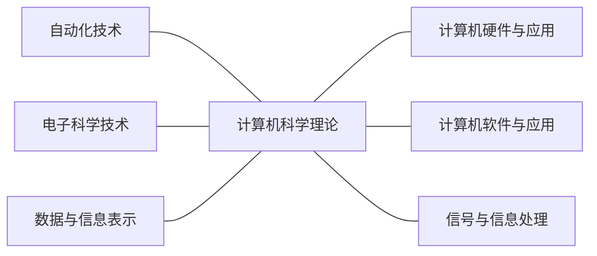
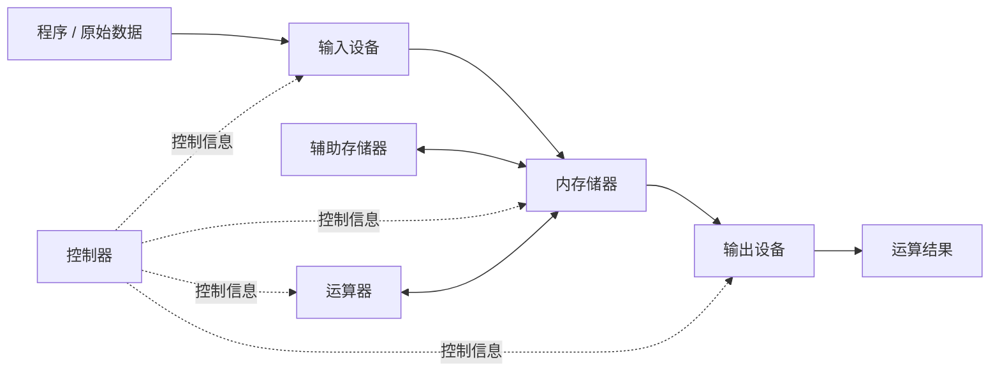
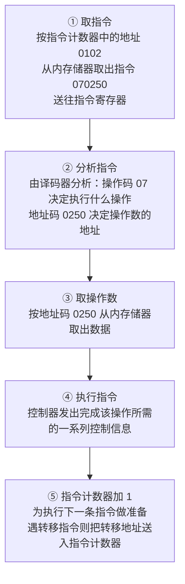
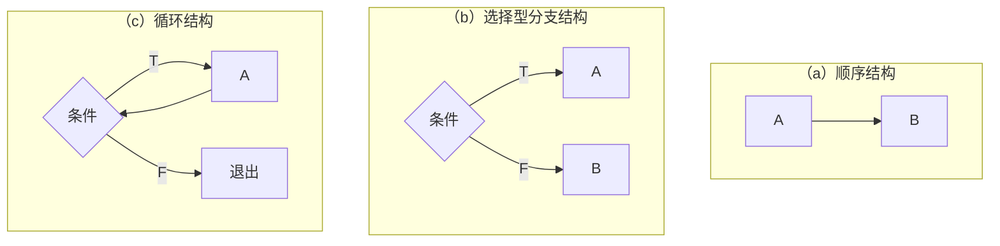
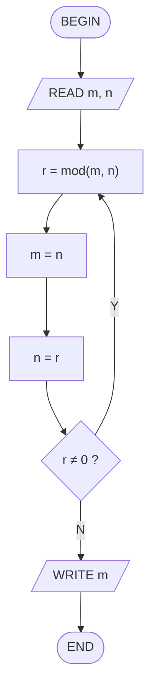

# 第一讲：绪论（第 1 章）

> [!info] 本讲范围
> - 对应课件：**Talk1《第一章 绪论》**
> - 对应教材：第 1 章 绪论（pp.1–31）
> - 知识地图：什么是计算机 → 分类 / 特点 / 应用 → 发展史 → 学科定义 → 学科教育 → 毕业生要求 → 信息化社会 → 学科知识体系
> - 依据课件与教材交叉校对整理，已删去过时内容（早期计算工具流水账、老旧机型罗列、逐条学时表、旧版统计数据等）

> [!note] 课程信息
> - **教材**：黄国兴、陶树平、丁岳伟《计算机导论（第 4 版）》，清华大学出版社，2019
> - **成绩构成**：平时 50%（作业 25% + 出勤 10% + 中期实验考核 15%，第 8 / 10 周）+ 期末闭卷 50%
> - **拓展资源**：哈佛 CS50 公开课；MIT《计算机科学及编程导论》

---

## 1 计算机的基本概念

### 1.1 什么是计算机

> [!definition] 定义：计算机  
> 计算机是一种能够按照**事先存储的程序**，自动、高速地对数据进行**输入、处理、输出和存储**的系统。  
> 另一种表述：一种能够接收和存储信息，并按程序对输入信息加工处理、输出结果的**高度自动化设备**。

**四个基本功能**

1. **输入**：接收输入设备（键盘、鼠标、扫描仪等）提供的数据；
2. **处理**：对数值、逻辑、字符、图像等数据进行操作与转换；
3. **输出**：将处理结果送到输出设备（显示器、打印机、绘图仪等）；
4. **存储**：存放程序与数据。

```
        ┌─────────────┐
输入 →  │  处理/存储   │ → 输出
        └─────────────┘
```

> [!definition] 硬件与软件
> - **硬件**：计算机的物理装置，由**存储器、运算器、控制器、输入设备、输出设备**五大部分构成（外存储器属于五大部件中的存储器）；
> - **软件**：程序和有关文档的总称，分为
>   - **系统软件**：操作系统、语言翻译系统、连接程序、诊断程序等；
>   - **应用软件**：字处理、表处理、数据库管理系统等。

### 1.2 计算机的分类

> [!note] 三种分类维度
> - **按处理对象**：数字计算机（离散量）／模拟计算机（连续量，如电压、电流）／数字模拟混合计算机；
> - **按用途**：通用计算机（科学计算、数据处理、过程控制）／专用计算机（智能仪表、过程控制、军事装备等）；
> - **按规模**：巨型机、大中型机、小型机、微型机、工作站、服务器、网络计算机。

| 类型 | 要点 |
| --- | --- |
| 巨型计算机 | 面向复杂科学计算与军事领域，如我国「天河」「银河」「曙光」系列 |
| 大中型计算机 | 运算快、存储大，常用于银行、铁路等大型系统的主机 |
| 小型计算机 | 适合作为联机系统的主机或工业过程自动控制 |
| 微型计算机 | 微处理器 + 存储器 + 接口构成，推动了计算机普及；单片机为单块印制线路板，芯片级为一块芯片含微处理器、存储器和接口 |
| 工作站 | 面向专业用途（如图形处理）的高性能微机系统 |
| 服务器 | 网络环境下为多用户提供服务（文件、通信、打印、数据库服务器） |
| 网络计算机 | 网络环境下的终端设备，程序和数据存储在服务器中 |

### 1.3 计算机的特点

1. **运算速度快**——巨型机已达每秒几千万亿甚至几亿亿次；
2. **运算精度高**——采用浮点表示，字长从 8 / 16 位增加到 32 / 64 位；
3. **有记忆能力和大的存储容量**——内存存放运行中的程序与数据，外存长期保存；
4. **有逻辑判断能力**——能根据判断结果自动决定下一步执行的指令；
5. **存储程序、自动工作**——程序存于机内，在程序控制下自动运行，无需人工干预。

### 1.4 计算机的用途

| 应用领域 | 说明 |
| --- | --- |
| 科学计算（数值计算） | 天气预报、航天与火箭发射、原子能研究等 |
| 数据处理 | 对数据进行输入、分类、加工、统计、检索、存储，是**最大的应用领域**（大数据、云计算均属此范畴） |
| 实时控制 | 及时采集检测数据并自动控制被控对象，用于钢铁、石油、化工、制造业 |
| 人工智能 | 模拟或部分模拟人类智能：专家系统、自然语言理解、智能制造、物联网、机器人、自动定理证明等（AlphaGo 战胜人类顶尖棋手为标志性事件） |
| 计算机辅助教育（CAI） | 校园网、CAI 课件、远程教学 |
| 娱乐与游戏 | 影视、音乐、多媒体娱乐 |

> [!question] 思考：为什么计算机能够做许多种不同的事？是不是计算机什么事都能做？  
> 关键在于**程序**——改变程序就改变了机器的行为；但计算机只能处理可被**形式化、机械化**描述的问题（见 [[#3.2 学科的根本问题]]）。

---

## 2 计算机的发展

### 2.1 早期计算工具（了解即可）

> [!note] 脉络  
> 手指计算、结绳记事 → **算筹**（祖冲之据此算出 π 介于 3.1415926 与 3.1415927 之间，早于西方近千年）→ **算盘**（由算筹演变而来，计算工具史上第一次重大改革）→ 耐普尔骨条 → 1621 年圆形计算尺（最早的模拟计算工具）→ 1642 年 **Pascal 加法器**（钟表元件，十进制加减）→ 1822 年 **Babbage 差分机**、1833 年 **分析机**（程序控制思想的雏形）。

### 2.2 图灵：计算理论的奠基人

> [!important] 图灵（Alan Turing，1912–1954）
> - 1936 年发表《论可计算数及其在判定问题中的应用》，提出**图灵机**，奠定计算机的理论基础；
> - **图灵测验**：若提问者根据回答无法判断对象是人还是机器，则认为该机器具有与人相当的智能；
> - 二战中领导小组研制出破译德军 Enigma 密码的计算机；
> - ACM 于 1966 年设立**图灵奖**（「计算机界的诺贝尔奖」）；**姚期智**是唯一获此殊荣的华人科学家（2000 年）。

### 2.3 第一台电子计算机与冯·诺依曼体系结构

> [!important] ENIAC（1946）  
> 宾夕法尼亚大学 Moore 学院，Eckert 与 Mauchly 为弹道计算研制。使用 18000 多个电子管、1500 多个继电器，占地 167 m²，加减法每秒 5000 次。是世界上第一台**电子数字计算机**。

> [!important] 冯·诺依曼（von Neumann）  
> 1946 年发表第一篇关于**程序存储**的论文，提出用数字表示逻辑操作（程序），并可被存储、读出和执行。  
> **至今几乎所有计算机都采用冯·诺依曼体系结构，未突破其基本结构 —— 存储程序。**  
> 补充：1949 年 EDSAC（Wilkes 研制）是世上第一台**存储程序式**计算机；1953 年 IBM701 是第一台商业化计算机。

### 2.4 计算机的更新换代（按所用元器件划分）

| 代 | 年代 | 核心器件 | 主要特征 |
| --- | --- | --- | --- |
| 第一代 | 1946–1957 | 电子管 | 穿孔卡片输入，机器语言编程，体积大、耗能高 |
| 第二代 | 1958–1964 | 晶体管 | 磁芯存储器；出现 FORTRAN / COBOL / ALGOL 等高级语言与批处理管理程序 |
| 第三代 | 1965–1971 | 小 / 中规模集成电路（IC） | 半导体存储器；多道程序、并行处理、虚拟存储、功能完备的操作系统（DEC PDP-8、IBM-360/370） |
| 第四代 | 1972–至今 | 大规模 / 超大规模集成电路（LSI / VLSI） | 以**微处理器**为标志；数据库系统、分布式、软件工程标准；1975 Altair、1976 APPLE、1981 IBM-PC |
| 第五代 | （在研） | 新体系结构 | 主要特征是**人工智能**：自然语言人机对话、知识库、自学习与推理 |

> [!warning] 易错  
> **目前使用的计算机都属于第四代**；第五代计算机仍在研制中，进展较为缓慢。

### 2.5 中国计算机发展（重要里程碑）

> [!tip] 关键节点
> - **1956 年**：华罗庚起草发展电子计算机的措施，中科院计算技术研究所筹建——我国计算机事业起步；
> - **1983 年**：「银河 Ⅰ」巨型机研制成功（每秒向量运算 1 亿次），填补国内空白；
> - **2010 年**：天河-1A 成为当时世界最快的超级计算机；
> - **2016 年**：「神威·太湖之光」首次登顶全球超算 TOP500，运行速度超 10 亿亿次 / 秒。

### 2.6 发展趋势

> [!success] 四大趋势  
> **巨型化 · 微型化 · 网络化 · 智能化**

---

## 3 计算机科学与技术学科的定义

### 3.1 学科定义

> [!definition] 计算机科学与技术  
> 研究**计算机的设计与制造**，并利用计算机进行**信息获取、表示、存储、处理、控制**等的理论、原则、方法和技术的学科。

> [!note] 科学与技术、科学与工程
> - **科学**侧重研究现象、揭示规律；**技术**侧重研制计算机和利用计算机进行信息处理的方法与手段；
> - 科学是技术的依据，技术是科学的体现，二者相辅相成、高度融合——这是本学科的突出特点；
> - 本学科**科学性与工程性并重**，理论性和实践性紧密结合。

### 3.2 学科的根本问题

> [!important] 根本问题：什么能被有效地自动化  
> 问题的**符号表示**及其处理过程的**机械化、严格化**这一固有特性，决定了**数学是本学科的重要基础**；建立**物理符号系统**并对其实施变换，是本学科问题描述与求解的重要手段。

### 3.3 研究范畴

研究范畴包括**计算机理论、硬件、软件、网络、应用**，可划分为基础理论、专业基础、应用三个层面：

> [!note] 五个方向
> 1. **计算机理论**：离散数学、算法分析理论、形式语言与自动机理论、程序设计语言理论、程序设计方法学；
> 2. **计算机硬件**：元器件与存储介质、微电子技术、计算机组成原理、微型计算机技术、计算机体系结构；
> 3. **计算机软件**：程序设计语言设计、数据结构与算法、程序设计语言翻译系统、操作系统、数据库系统、算法设计与分析、软件工程学、可视化技术；
> 4. **计算机网络**：网络结构、数据通信与网络协议、网络服务、网络安全；
> 5. **计算机应用与人-机工程**：软件开发工具、完善既有应用系统、开拓新应用领域；人机交互与协同技术。

---

## 4 计算机科学与技术学科的教育

> [!important] 摩尔定律  
> Intel 创始人戈登·摩尔 1965 年预测：**微处理器芯片的密度每 18 个月翻一番**——至今继续成立，是推动本学科快速更新的根本原因之一。

> [!tip] 近期变化较大的技术方向  
> 网络技术（TCP/IP、万维网）、图形学与多媒体、嵌入式系统、数据库、互操作性、面向对象程序设计、复杂应用程序接口（API）、人机交互、软件安全、保密与密码学。

> [!note] 文化与教育观念的变化
> - 网络使远程在线交互教育成为现实，带来**教学法的改变**；
> - 计算机数量与用户可直接使用的计算功能大幅增加，经济影响加深，学科不断拓宽；
> - 教育观念从「实用技能训练」转向**终身教育**，培养学生自主性与可持续发展的能力。

---

## 5 对学科毕业生的基本要求

> [!abstract] 知识 · 能力 · 素质
> - **知识**是基础、载体和表现形式；能力与素质的培养必须部分地通过具体知识的传授来实施；
> - **能力**是技能化的知识、知识的综合体现，强调运用知识发现、分析、解决问题的能力；
> - **素质**是知识和能力的升华，使知识与能力更好地发挥作用并不断扩展。
> - 三者融会贯通于教育全过程，是高科技创新的基础。

> [!success] 毕业生基本检验标准
> 1. 掌握本学科的**主要知识体系**；
> 2. 在确定环境中能**理解并应用**基本概念、原理、准则；
> 3. 能完成一个项目的**设计与实现**，并撰写适当文档；
> 4. 具备**独立工作与团队合作**的能力；
> 5. 能**综合运用**所学知识；
> 6. 保证开发活动**合法且合乎道德**。

---

## 6 信息化社会的挑战

### 6.1 信息化社会的特征

> [!note] 五个特征
> 1. 建立完善的**信息基础设施**（信息传输网络 + 存储 + 处理设备构成的统一整体，「网中网」）；
> 2. 采用**先进的信息技术**（微电子、并行处理、数字化通信、计算机网络、海量存储、高速传输、可视化、多媒体等）；
> 3. 建立广泛的**信息产业**（硬件制造业、软件业、信息服务业，含对传统行业的改造）；
> 4. 拥有**高素质的信息人才**（研究型、设计型、应用型、开发型、维护型、服务型、操作型）；
> 5. 构建**良好的信息环境**（政策法规、道德规范、知识产权、信息安全、标准化等）。

### 6.2 Internet 与信息化社会

> [!definition] Internet 的由来  
> 前身是美国国防部 **ARPA 网**（广域网实验）；互联网计划的重要成果是 **TCP/IP 协议**，使网络通信有了统一规范；NSF 网后来逐步取代 ARPA 网主干。如今 Internet 已成为「信息高速公路」最重要的基础设施。

> [!warning] Internet 的五个特点
> 1. 系统的**广域性和开放性**；
> 2. 信息资源的**共享性和时效性**；
> 3. 入网方式的**灵活性和多样性**（TCP/IP 解决异构互联）；
> 4. **强大的服务功能**（远程登录、文件传输、电子邮件、信息检索、新闻组等）；
> 5. 网络安全的**脆弱性和复杂性**。

> [!tip] 我国的互联网络  
> 四大骨干网：中国科技网 **CSTNET**、中国公用互联网 **ChinaNET**、中国教育和科研计算机网 **CERNET**、中国金桥信息网 **ChinaGBN**；「金字工程」（金关、金卡、金税、金企等）推动国民经济信息化。

### 6.3 信息化社会对计算机人才的需求

> [!question] 挑战  
> 信息技术发展日新月异，要求计算机人才具有较高的**综合素质和创新能力**，并对新技术的发展具备良好的**适应性**。

---

## 7 学科知识体系（CS2013）

> [!info] 背景与结构  
> 我国本科计算机教育参考 IEEE-CS / ACM 约每 10 年更新一次的 *Computing Curricula*（最新为 **CS2013**）。  
> 知识体系分**三个层次**：
> 1. **知识领域（area）**——最高层，用两个英文字母缩写表示；
> 2. **知识单元（unit）**——领域中独立的主题模块，如 `OS/并发`；
> 3. **知识点（topic）**——最底层，分核心一级（高核心）、核心二级（低核心）与选修。

**18 个知识领域**

| 缩写 | 领域 | 缩写 | 领域 |
| --- | --- | --- | --- |
| AL | 算法与复杂度 | NC | 网络与通信 |
| AR | 体系结构与组织 | OS | 操作系统 |
| CN | 计算科学 | PBD | 基于平台的开发 |
| DS | 离散结构 | PD | 并行与分布式计算 |
| GV | 图形学与可视化 | PL | 程序设计语言 |
| HCI | 人机交互 | SDF | 软件开发基础 |
| IAS | 信息保障与安全 | SE | 软件工程 |
| IM | 信息管理 | SF | 系统基础 |
| IS | 智能系统 | SP | 社会问题与专业实践 |

> [!warning] 易错  
> 知识体系**不等于 18 门课程**。各校可在此基础上组织有本校特色的课程体系，但设计时应包含核心知识，注重理论与实践结合、终身学习能力与职业道德的培养。

---

## 第一讲小结

> [!summary] 本讲要点
> - 计算机是按照**存储程序**自动、高速处理数据的系统，由硬件与软件共同构成；
> - 经历了电子管 → 晶体管 → 集成电路 → 大规模/超大规模集成电路**四代**，至今未突破**冯·诺依曼体系结构**；
> - 计算机科学技术研究**「什么能被有效地自动化」**这一根本问题，涵盖理论、硬件、软件、网络、应用五大范畴，是**科学性与工程性并重**的学科；
> - 信息化社会对计算机人才提出了素质与创新能力的更高要求；学科知识体系以 **CS2013** 的 18 个知识领域为框架。

---

## 第一讲习题与作业

> [!warning] 课件布置（本次作业）
> - 简答题：第 **2–5** 题（存储程序概念、计算机特点、用途、各发展阶段特点）；
> - 选择题：第 **4、7、8** 题。

- [ ] 完成简答 2–5 题
- [ ] 完成选择 4、7、8 题

---

# 第二讲：信息化社会与学科知识体系（第 1 章 续）

> [!info] 本讲范围
> - 对应课件：**Talk2**（第 1 章的剩余部分 + 学习方法）
> - 承接第一讲的 [[#6 信息化社会的挑战]]、[[#7 学科知识体系（CS2013）]]，**本讲只记这两节的新增内容**，不重复已整理过的部分
> - 已删去：开场「上次内容总结」复习页、成功学口号

---

## 1.5 信息化社会（补充）

### CERNET 简介

> [!note] 中国教育和科研计算机网（CERNET）
> 由国家投资建设、教育部负责管理、清华大学等高等院校承担建设和运行管理的**全国性学术计算机互联网络**。
> - **四级管理**：全国网络中心、地区网络中心和地区主结点、省教育科研网、校园网；
> - **全国网络中心**设在清华大学，负责全国主干网的运行管理；
> - **地区网络中心和地区主结点**分别设在清华大学、北京大学、北京邮电大学、上海交通大学、西安交通大学、华中科技大学、华南理工大学、电子科技大学、东南大学等十所高校；
> - 省级结点设在 36 个城市的 38 所大学，覆盖全国除台湾省外的所有省、市、自治区。

信息化社会不仅是**科学技术进步的产物**，也是**社会管理体制和政策激励的结果** —— 如果没有现代化的市场体制和相关的政策、法规，信息化社会将无法正常运作。

---

## 1.6 学科知识体系（补充）

### 计算机学科的知识地图

课件用一张图给出计算机学科的知识体系：以**计算机科学理论**为核心，与下面六个方向相互支撑。



### 大学计算机专业的四层课程基础

| 层次 | 主要课程 |
| --- | --- |
| **数学基础理论** | 高等数学、高等代数、解析几何、集合论、常微分方程、函数论、概率论与数理统计、数理逻辑 |
| **物理电子科学** | 大学物理、电路理论、电子线路基础、模拟电子技术、数字电子技术 |
| **计算机科学基础** | 离散数学、数字系统、信息论基础、计算算法、数据结构、算法分析与设计、汇编语言、高级语言、程序设计方法学、软件工程技术、计算机原理与组织、计算机接口与通信、数据库系统、网络与数据通信、操作系统、编译技术等 |
| **计算机科学应用** | 计算机控制技术、计算机辅助设计与制造、计算机集成制造系统、机器人、计算可视化与机器视觉、计算机创作、科学计算、多媒体信息系统、计算机图形学、信息管理与决策、模式识别与图像处理、人工智能与知识工程 |

### CC2001 的 14 个知识领域（早期框架）

> [!note] 版本说明
> 这一页课件引用的是 ACM/IEEE-CS 于 1990 年提交的 **CC1991** 和 2001 年发表的 **CC2001**，把计算机科学划分为 **14 个知识领域**（结构仍为知识领域 → 知识单元 → 知识点三层）。
> 教材第 4 版已升级到 **CS2013**（18 个知识领域，见 [[#7 学科知识体系（CS2013）]]）。下表只保留领域名称与关注点作为背景，具体知识点以教材的 CS2013 为准。

| 缩写 | 知识领域 | 主要内容 / 关注点 |
| --- | --- | --- |
| DS | 离散结构 | 集合论、数理逻辑、近世代数、图论与组合数学 —— 为各分支领域提供数学工具 |
| PF | 程序设计基础 | 程序设计结构、算法、问题求解与数据结构；核心是如何对问题进行**抽象** |
| AL | 算法与复杂性 | 算法复杂度分析、典型算法策略、分布式与并行算法、可计算理论、P 与 NP、自动机理论、密码算法、几何算法 |
| AR | 体系结构与组织 | 数字逻辑与数字系统、数据的机器表示、汇编级机器组织、存储系统组织、接口与通信、多处理体系结构、性能提高技术 |
| OS | 操作系统 | 操作系统原理、并发、调度与分派、存储管理、设备管理、文件系统、安全与保护、实时与嵌入式系统、容错、系统性能评价 |
| NC | 网络计算 | 网络体系结构、通信与网络、网络安全、客户 / 服务器计算、网络管理、压缩与解压、多媒体数据技术、无线与移动计算 |
| PL | 程序设计语言 | 程序设计模式、虚拟机、类型系统、执行控制模型、语言翻译系统、程序设计语义学、基于语言的并行构件 |
| HC | 人机交互 | 以人为中心的软件开发与评价、图形用户界面（GUI）设计与编程、多媒体系统的人机交互界面、协作与通信界面 |
| GV | 图形学和可视化计算 | 计算机图形学、可视化、虚拟现实、计算机视觉四个子领域 |
| IS | 智能系统 | 搜索与约束满足、知识表示与推理、Agent、自然语言处理、机器学习与神经网络、AI 规划系统、机器人学 |
| IM | 信息管理 | 信息获取与数字化、数据建模、关系数据库与查询语言、事务处理、分布式数据库、数据挖掘、信息存储与检索、超文本与超媒体、数字图书馆 |
| SP | 社会和职业问题 | 计算发展史、计算的社会背景、职业与道德责任、知识产权、隐私与公民自由、计算机犯罪、计算中的经济论题 |
| SE | 软件工程 | 软件过程、需求分析与规格说明、设计、构建、测试与验证、软件演化、项目管理、基于构件的计算、形式化方法、软件可靠性 |
| CN | 计算科学（数值计算） | 数值分析、运筹学、建模与仿真、高性能计算 |

> [!tip] 每个领域都给出「主要内容 + 基本问题」
> 课件对 14 个领域都列出了该领域要回答的**基本问题**，它们是这个方向的根本追问。例如：
> - **算法与复杂性**：对给定的问题类，最好的算法是什么？需要多少存储空间和计算时间？空间与时间如何折衷？最好 / 最坏 / 平均性能如何？算法的通用性如何？
> - **体系结构与组织**：实现处理器、内存和机内通信的方法是什么？如何设计和控制大型计算系统？如何度量性能？

### 关于学习（老师课上讲的）

> [!tip] 上大学学什么
> - **能力比知识更重要** —— 学会如何思考、分析和探索；
> - 学习方法是**主动学习、自主学习**，在实践中掌握知识、在参与中提高能力；
> - 选专业看两点：**兴趣**（兴趣与性格、成长环境有关，也是可以培养的）与**特长**（了解自己的长处）；
> - 「成功没有法则，人人都有成功的可能；优秀没有标准，人人都有优点和缺点。」

---

## 第二讲小结

> [!summary] 本讲要点
> - 信息化社会既是科技进步的产物，也是社会管理体制与政策激励的结果；CERNET 是四级管理的全国性学术互联网，全国网络中心设在清华大学；
> - 计算机学科以**计算机科学理论**为核心，与自动化技术、电子科学技术、数据与信息表示、计算机硬件 / 软件与应用、信号与信息处理等方向相互支撑；
> - 专业课程基础分四层：数学基础理论 → 物理电子科学 → 计算机科学基础 → 计算机科学应用；
> - 知识体系的框架早期为 CC2001（14 个领域），教材现用 CS2013（18 个领域）。

---

## 第二讲作业

> [!warning] 课件布置（Talk2 p44）
> 教材 **P27–P28**：简答题第 **6、7** 题；探索题第 **3** 题。

- [ ] 完成简答 6、7 题
- [ ] 完成探索题 3

---

# 第三讲：计算机的基础知识（第 2 章）

> [!info] 本讲范围
> - 对应课件：**Talk3《第 2 章 计算机的基础知识》**；对应课堂录音稿（数制转换、码制、定点 / 浮点）
> - 对应教材：第 2 章，本讲实际只讲到 **§2.1 计算机的运算基础**
> - 「信息的编码」及 §2.2–§2.6 由下一讲讲授，已整理进[[#第四讲：信息的编码、逻辑代数与计算机基础（第 2 章 续）|第四讲]]
> - 依据课件 + 录音稿交叉整理。**已删去**开场寒暄与闲聊（内存 / 显卡涨价等）；**已改正**课件一处笔误（见 §2.1.3）

---

## 2.1 计算机的运算基础

### 2.1.1 进位计数制与三要素

> [!definition] 数制（进位计数制）
> 按进位的原则进行计数，称为**进位计数制**，简称数制。任何数制都有**三要素**：
> - **数码**：一组用来表示某种数制的符号（如十进制用 0–9）；
> - **基数**：数制所使用的数码个数，常用 $R$ 表示，故称 $R$ 进制；
> - **位权**：处于不同数位的数码所代表的权值。

**位权表示法的三条特点**

1. 数字的总个数等于基数（十进制 0–9 共 10 个，二进制 2 个，八进制 8 个）；
2. 最大的数字比基数小 1（十进制最大是 9，二进制最大是 1）；
3. 每个数字都要乘以基数的幂次，幂次由该数字所在**位置**决定。

任何一个 $N$ 进制数 $A$ 都可写成位权展开式：

$$A = A_nA_{n-1}\cdots A_1A_0.A_{-1}A_{-2}\cdots A_{-m} = \sum_{i=-m}^{n} A_i \times N^i$$

- 整数部分：$a_0\times N^0 + a_1\times N^1 + \cdots + a_n\times N^n$
- 小数部分：$a_{-1}\times N^{-1} + a_{-2}\times N^{-2} + \cdots$

### 2.1.2 各进制的表示

**四种常用进制**

| 进制 | 基数 | 数码 | 进位规则 |
| --- | --- | --- | --- |
| **十进制** | 10 | 0–9 | 逢十进一 |
| **二进制** | 2 | 0、1 | 逢二进一 |
| **八进制** | 8 | 0–7 | 逢八进一 |
| **十六进制** | 16 | 0–9、A–F | 逢十六进一 |

十六进制中 A、B、C、D、E、F 分别表示 10–15。

**为什么二进制里没有「2」**：0、1、2、3、4 依次写作 `0, 1, 10, 11, 100` —— 数到 1 再加 1 就要进位，所以不存在单独的「2」这个符号。

**二进制的加法与乘法规则**

| 加法 | 结果 | 乘法 | 结果 |
| --- | --- | --- | --- |
| $0+0$ | $0$ | $0\times0$ | $0$ |
| $0+1$ | $1$ | $0\times1$ | $0$ |
| $1+0$ | $1$ | $1\times0$ | $0$ |
| $1+1$ | $10$ | $1\times1$ | $1$ |

**四种进制对照表（0–17）**

| 十 | 二 | 八 | 十六 | 十 | 二 | 八 | 十六 |
| --- | --- | --- | --- | --- | --- | --- | --- |
| 0 | 0 | 0 | 0 | 9 | 1001 | 11 | 9 |
| 1 | 1 | 1 | 1 | 10 | 1010 | 12 | A |
| 2 | 10 | 2 | 2 | 11 | 1011 | 13 | B |
| 3 | 11 | 3 | 3 | 12 | 1100 | 14 | C |
| 4 | 100 | 4 | 4 | 13 | 1101 | 15 | D |
| 5 | 101 | 5 | 5 | 14 | 1110 | 16 | E |
| 6 | 110 | 6 | 6 | 15 | 1111 | 17 | F |
| 7 | 111 | 7 | 7 | 16 | 10000 | 20 | 10 |
| 8 | 1000 | 10 | 8 | 17 | 10001 | 21 | 11 |

### 2.1.3 进制之间的转换

> [!important] 口诀汇总（整数与小数的方法完全相反）
> | 转换方向 | 方法 | 口诀 |
> | --- | --- | --- |
> | 十进制整数 → 非十进制 | 除基数取余 | **除基取余，先余为低位，后余为高位**（逆向取余） |
> | 十进制小数 → 非十进制 | 乘基数取整 | **乘基取整，先整为高位，后整为低位**（正向取整） |
> | 非十进制 → 十进制 | 按位权展开求和 | 各位数码 × 基数幂次，再相加 |
> | 二 ↔ 八 / 二 ↔ 十六 | 3 位 / 4 位分组 | 一位拆三位（或四位）；不足补 0，两端多余的 0 删掉 |

**例 1（十进制整数 → 非十进制）：$(55)_{10}$**

| 除式 | 商 | 余数 |
| --- | --- | --- |
| $55 \div 2$ | 27 | **1** |
| $27 \div 2$ | 13 | **1** |
| $13 \div 2$ | 6 | **1** |
| $6 \div 2$ | 3 | **0** |
| $3 \div 2$ | 1 | **1** |
| $1 \div 2$ | 0 | **1** |

**逆向**取余：$(55)_{10} = (110111)_2$。

同理：$55 \div 8 = 6 \cdots 7$、$6 \div 8 = 0 \cdots 6$ → $(67)_8$；$55 \div 16 = 3 \cdots 7$、$3 \div 16 = 0 \cdots 3$ → $(37)_{16}$。

**例 2（十进制小数 → 非十进制）：$(0.625)_{10}$**

$0.625 \times 2 = 1.25$ → 取整 **1**，剩 0.25
$0.25 \times 2 = 0.5$ → 取整 **0**
$0.5 \times 2 = 1.0$ → 取整 **1**

**正向**取整：$(0.625)_{10} = (0.101)_2$。

> [!warning] 十进制小数不一定能精确转换
> 例如 $(0.32)_{10}$：$0.32 \to 0.64 \to 1.28 \to 0.56 \to 1.12 \to \cdots$，永远不会收敛到整数。
> 这时只能按精度要求转换到一定位数作为**近似值**（保留 4 位即 $0.0101$）。

**例 3（既有整数又有小数）：分开转，再拼起来**

- $(100.345)_{10}$：整数 $100 \to (1100100)_2$；小数 $0.345 \to (0.01011)_2$（取 5 位）→ $(1100100.01011)_2$
- $(55.125)_{10}$：$55 \to (110111)_2$；$0.125 \to (0.001)_2$ → $(110111.001)_2$

**例 4（非十进制 → 十进制）：按位权展开求和**

$$(10110)_2 = 1\times2^4+0\times2^3+1\times2^2+1\times2^1+0\times2^0 = 16+4+2 = (22)_{10}$$

$$(10101.101)_2 = 16+4+1+0.5+0.125 = (21.625)_{10}$$

$$(1207)_8 = 1\times8^3+2\times8^2+0\times8^1+7\times8^0 = 512+128+7 = (647)_{10}$$

$$(1B2E)_{16} = 1\times16^3+11\times16^2+2\times16^1+14\times16^0 = 4096+2816+32+14 = (6958)_{10}$$

> [!warning] 易错
> $(10110)_2 = 22$，而 $(10101)_2 = 21$ —— 只差一位，值就不同，别搞混。

**例 5（二 ↔ 八、二 ↔ 十六）**

$(10111001010.1011011)_2$ 转八进制：整数部分自右向左每 3 位一组 → `010 111 001 010` → `2 7 1 2`；小数部分自左向右每 3 位一组 → `101 101 100` → `5 5 4`，得 $(2712.554)_8$。
转十六进制：每 4 位一组 → `0101 1100 1010 . 1011 0110` → $(5CA.B6)_{16}$。

$(456.174)_8$ 转二进制：一位拆三位 → `100 101 110 . 001 111 100` → 去掉两端多余的 0 → $(100101110.0011111)_2$。

$(100110110111.0101)_2$：
- 转八进制：`100 110 110 111 . 010 100` → $(4667.24)_8$
- 转十六进制：`1001 1011 0111 . 0101` → $(9B7.5)_{16}$

> [!warning] 课件 p22 有一处笔误
> 该页把小数部分 `0101` 补零成 `010 100` 后，第二组 `100` 对应的八进制印成了 **6**，应为 **4**（$100_2 = 4$）—— 正确答案是 $(4667.24)_8$。
> 按位权验证：$0.0101_2 = 0.3125_{10}$，而 $0.24_8 = 2/8 + 4/64 = 0.3125$ ✔

### 2.1.4 计算机内部为什么采用二进制

1. **易于用物理元件表示** —— 计算机由逻辑电路组成，而逻辑电路通常只有两个状态（开 / 关、高电平 / 低电平），正好对应 1 和 0；
2. **运算规则简单** —— 加法和乘法各只有四条规则；
3. **可靠性高** —— 两个状态传输和处理不容易出错；
4. **逻辑性强** —— 计算机工作原理建立在逻辑运算基础上，逻辑代数是其理论依据。

> [!tip] 老师补充
> 人类向外星发射的探测器上携带的那张碟片，就是用二进制编码的信息 —— 二进制是最基础的语言，对方即使不懂我们的语言也能理解。

### 2.1.5 数据的存储单位与字长

> [!definition] 位、字节、字与字长
> - **位（bit，b）**：计算机存储信息的**最小单位**，即一个二进制位；
> - **字节（Byte，B）**：信息处理的**基本单位**，$1\,\text{Byte} = 8\,\text{bit}$；
> - **字长**：字是 CPU 通过数据总线**一次**存取、加工和传送数据的长度；一个字通常由一个或若干个字节组成，**字长越长，性能越强**。
> - 常用字长：8 位、16 位、32 位、64 位（32 位 = 4 字节，64 位 = 8 字节）。

**容量单位换算（是 1024，不是 1000）**

$1\,\text{KB} = 1024\,\text{B} = 2^{10}\,\text{B}$，$1\,\text{MB} = 1024\,\text{KB}$，$1\,\text{GB} = 1024\,\text{MB}$，$1\,\text{TB} = 1024\,\text{GB}$；再往上还有 PB 等，做大数据的才用得上。

### 2.1.6 码制：原码、反码、补码

> [!definition] 码长、符号位、数值位
> 在计算机中，按照既定的二进制位数表示一个数，这个位数称为**码长**；最左边那一位称为**符号位**（0 表示正数，1 表示负数）；符号位之后的各位称为**数值位**，表示该整数绝对值的二进制。
> 同一个数有三种表示方法，区别只在**负数数值位**的处理：原码、反码、补码。

#### 原码

正数：符号位填 0，数值位填绝对值的二进制；负数：符号位填 1，数值位同上。

若码长为 8，则 $(123)_{10}$ 的原码是 `01111011`，$(-123)_{10}$ 是 `11111011`；码长为 16 时分别是 `0000000001111011` 与 `1000000001111011`。

$n$ 位原码的表数范围：$-(2^{n-1}-1) \le N \le +(2^{n-1}-1)$

为什么要减 1？因为 7 位全 1（`1111111`）才是 127，不是 128。**原码中 0 有两种表示**：`00000000`（+0）与 `10000000`（−0）。

原码简单直观，但**机器中不便于运算**（符号位与数值位要分别处理），于是引入反码。

#### 反码

- **正数**：反码与其原码完全相同；
- **负数**：符号位不变，数值位**按位变反**（1 换成 0、0 换成 1）。

例（码长 8）：$(26)_{反} = (26)_{原} = 0\,0011010$；$(-26)_{反} = 11100101$（由原码 $10011010$ 按位变反而来）。

反码中 0 也有两种表示：`00000000` 与 `11111111`。

#### 补码

> [!important] 补码的由来：汽车里程表
> 里程表走到 `999999.9` 后再行进 0.1 公里，显示 `000000.0`。只看整数部分：$999999 + 1 = 000000$，从算术运算角度看 **999999 的作用相当于 −1**。
> 这说明：**当限制了数据的表示长度时，与正整数 $k$ 对应的负数，就是「加上 $k$ 之后等于 0」的那个数** —— 称为**求补**（进位被丢弃）。

规定：正数的补码与其原码相同；负数的补码符号位为 1，数值位是其绝对值的求补结果。

> [!important] 求补码的简便规则
> **对原码的数值位按位变反后加 1**（即 补码 = 反码 + 1）。
> 例（码长 8）求 $(-26)_{10}$ 的补码：原码 `10011010` → 按位变反 `11100101` → 加 1 → **`11100110`**。

验证 $26$ 与 $-26$ 相加为 0（码长有限，进位被丢弃）：

```
  1100110   ← |-26| 的求补结果
+)0011010   ← 26 的二进制
---------
  0000000
```

**原码与补码的表数范围对比**

| 码制 | 表数范围 | 码长 8 时 |
| --- | --- | --- |
| **原码 / 反码** | $-(2^{n-1}-1) \sim +(2^{n-1}-1)$ | $-127 \sim +127$ |
| **补码** | $-2^{n-1} \sim +(2^{n-1}-1)$ | $-128 \sim +127$ |

补码比原码在**负数端多一个数**。

> [!warning] 补码最小负数 −128 是特例
> 8 位补码的 $-128$ 写作 `10000000`，它**无法从原码转换而来**（原码中不存在 $-128$），而是按「等效原则」直接定义的。

**为什么用补码**：原码适合**乘除**运算，但做**加减**运算时符号位与数值位要分开处理，比较麻烦；补码把减法统一成加法（$a - b = a + (-b)_{补}$），符号位可以直接参与运算 —— 所以计算机中加减法用补码。

**三种码制对照**

| | 正数 | 负数 |
| --- | --- | --- |
| **原码** | 符号位 0 + 绝对值的二进制 | 符号位 1 + 绝对值的二进制 |
| **反码** | 与原码相同 | 符号位不变，数值位按位变反 |
| **补码** | 与原码相同 | 反码 + 1 |

0 在原码、反码中各有 ±0 两种表示，在补码中只有一种（`00000000`）。

### 2.1.7 定点数与浮点数

#### 定点数

> [!definition] 定点数
> 在机器中，小数点位置**固定**的数称为定点数，分两种：
> - **定点小数**：小数点固定在符号位与最高位之间 —— 第一位是符号位，其余全是小数位，所有数的绝对值**小于 1**；
> - **定点整数**：小数点固定在最低位之后 —— 第一位是符号位，其余全是整数位。

```
定点小数：  N0  .  N-1 N-2 ... N-m
            ↑符号位  ↑小数点   ↑数值部分

定点整数：  N0  Nn Nn-1 ... N2 N1  .
            ↑符号位    ↑数值部分   ↑小数点
```

（$m+1$）位定点整数格式能表示的数的范围：$|N| \le 2^m - 1$。

**缺点：表示范围受限制。** 定点小数格式只能表示绝对值小于 1 的纯小数，绝对值大于 1 的数（如 1.25）直接表示会**溢出**；这时只能引入**比例因子** —— 把原始数据按比例缩小（1.25 → 0.125，用时再乘 10），得出结果后再按比例扩大。转换与还原都很麻烦，使用不便。

#### 浮点数

> [!definition] 浮点数
> 小数点的位置**不固定**，一个数 $N$ 表示为：
> $$N = M \times R^{e}$$
> - **尾数 $M$**：表示该数的有效数字，可采用整数或纯小数两种形式；
> - **阶码 $e$**：带符号的整数，表示小数点所在的位置；
> - **基数 $R$**：一般取 2、8、10、16。基数值一旦由机器定义好就不能再改变，因此**基数在浮点数表示中不出现，是隐含的**。

**一种 32 位字长的位数分配**

| 部分 | 位数 | 说明 |
| --- | --- | --- |
| **符号位** | 1 | 表示尾数的正负 |
| **阶码** | 8 | 1 位符号位 + 7 位阶码位；机内采用补码，范围 $-128 \sim +127$ |
| **尾数** | 23 | 也采用补码形式 |

浮点数表示的范围比定点数**大得多**。

> [!important] 规格化与溢出
> - **规格化**：为提高浮点数表示的精度，规定其**尾数的最高位必须是非零的有效位**，称为浮点数的规格化形式；
> - **上溢**：运算结果大于最大正数（正上溢）或小于绝对值最大的负数（负上溢）—— 数据一旦上溢，计算机必须**中断运算操作**，进行溢出处理；
> - **下溢**：运算结果落在 0 至最小正数之间（正下溢）或 0 至绝对值最小负数之间（负下溢）—— 浮点数值趋于 0，计算机**仅将其当作机器 0 处理**。

---

## 第三讲小结

> [!summary] 本讲要点
> - 数制三要素：**数码、基数、位权**；$R$ 进制数按 $\sum A_i \times N^i$ 展开；
> - 转换口诀：十进制**整数除基逆向取余**、十进制**小数乘基正向取整**，两者完全相反；非十进制 → 十进制用**位权展开**；二 ↔ 八 / 十六用 **3 位 / 4 位分组**，两端多余的 0 要删掉；
> - 计算机采用二进制：物理元件只有两个状态、运算规则简单、可靠性高、逻辑性强；
> - 存储单位 $1\,\text{B} = 8\,\text{b}$，$1\,\text{KB} = 1024\,\text{B}$；**字长越长性能越强**；
> - 原码、反码、补码的区别只在负数的数值位：**补码 = 反码 + 1**，比原码多一个最小负数（$-128$）；**加减法用补码、乘除用原码**；
> - 定点数表示范围小、需比例因子防溢出；浮点数 $N = M \times R^{e}$ 范围大得多，需要规格化，并区分上溢与下溢。

---

## 第三讲作业

> [!warning] 课件布置（Talk3 p44）
> 1. 十进制 → 二进制：$6,\ 286,\ 1024,\ 0.25,\ 7.125,\ 2.625$
> 2. 二进制 → 十进制：$110111,\ 10011101,\ 0.101,\ 10.01,\ 1010.001$
> 3. 二进制 → 八进制和十六进制：$10011011.0011011,\ 1010101010.0011001$
> 4. 八进制 / 十六进制 → 二进制：$(75.612)_8,\ (64A.C3F)_{16}$
> 5. 用八位表示下列各数的原码、反码、补码：$127,\ -127,\ 135,\ -120,\ 0.75,\ -0.75$
> 6. 一台浮点计算机，数码为 8 位、阶码为 3 位，它能表示的数的范围是多少？
> 7. 在计算机系统中，位、字节、字和字长所表示的含义各是什么？

- [ ] 1. 十进制 → 二进制
- [ ] 2. 二进制 → 十进制
- [ ] 3. 二进制 → 八进制和十六进制
- [ ] 4. 八进制 / 十六进制 → 二进制
- [ ] 5. 八位的原码、反码、补码
- [ ] 6. 浮点数的表示范围
- [ ] 7. 位、字节、字、字长

---

# 第四讲：信息的编码、逻辑代数与计算机基础（第 2 章 续）

> [!info] 本讲范围
> - 对应课件：**Talk4《第 2 章 计算机的基础知识》**（信息的编码 → 数据结构，共 51 页）
> - 对应录音稿：**《计算机科学与技术导论课程录音稿》**（本讲全程口述讲解）
> - 对应教材：第 2 章 §2.1（后半「信息的编码」）–§2.6 数据结构基础
> - 知识地图：信息的编码（BCD / ASCII / 汉字 / 校验码）→ 逻辑代数基础 → 计算机的基本结构与工作原理 → 程序设计基础 → 算法基础 → 数据结构基础
> - 依据课件 + 录音稿交叉整理。**已删去**跑题闲聊（新加坡留学、甲骨文铭文、本科阶段沟通等）；课件末页作业为空白，故本讲无作业

---

## 2.1 计算机的运算基础（续）

### 2.1.8 信息的编码

计算机只能识别 0 和 1 两个数字符号，而它需要处理的基本符号却包括**字母、运算符、标点符号、控制符以及大量汉字**；因此必须对信息编码，用二进制表示各种符号。为了帮助检查和纠错，还可以在编码中增加**校验位**，或使用**检错码**和**纠错码**。

课件给出的编码体系：

```
信息的编码
├── 数值的编码 —— BCD 码
└── 文字的编码
    ├── 字符编码 —— ASCII 码
    ├── 汉字编码 —— 汉字输入码 / 汉字交换码（国标码）/ 汉字机内码 / 汉字字形码 / 汉字地址码
    └── 数据校验码 —— 奇偶校验码 / 海明校验码
```

#### BCD 码

> [!definition] BCD 码（Binary-Coded Decimal）
> 一种**二-十进制编码**：用 **4 位二进制数**表示**一位十进制数**。

例：$(9685)_{10}$ 的 BCD 码是 `1001 0110 1000 0101`（9→`1001`、6→`0110`、8→`1000`、5→`0101`）。

BCD 码本质上就是二进制与十进制之间的转换 —— 每位十进制数各自转成 4 位二进制，再顺次拼接。

#### ASCII 码

> [!definition] ASCII 码（American Standard Code for Information Interchange）
> 由**美国信息交换标准委员会**制定的、国际上使用最广泛的**字符编码**方案。
> - **7 位 ASCII 码** —— 称为**标准 ASCII 码**；
> - **8 位 ASCII 码** —— 称为**扩展 ASCII 码**。

**7 位标准 ASCII 码的编码方案**

- 用一个字节（8 位）表示一个字符，并规定其**最高位为 0**，实际只用到后面的 7 位；
- 这 7 位再分成**高三位**（$\text{b}_7\text{b}_6\text{b}_5$）和**低四位**（$\text{b}_4\text{b}_3\text{b}_2\text{b}_1$）；
- 因此可以表示 $2^7 = 128$ 个不同字符。

编码表（教材表 2-5）就是按**高三位为横轴、低四位为纵轴**排的，两者的交集即该字符的 ASCII 码。键盘上的全部字符都在表里，此外还有一些键盘上没有的（如 `Delete` 等控制符）。

**数字 9 的 ASCII 码**：高三位 `011` + 低四位 `1001` → `0111001`。

> [!important] 大小写字母的 ASCII 码相差 32
> 同一个字母，**小写字母的 ASCII 码比大写字母大 32**。
>
> 大写 `A`：高三位 `100`、低四位 `0001` → `1000001`；小写 `a`：高三位 `110`、低四位 `0001` → `1100001`。
> 两者相减得 `0100000`，即 $2^5 = 32$（$2^4 = 16$、$2^5 = 32$）。
> 小写 `b` 与大写 `B` 同理，也是差 32。
>
> 利用这个性质，只要**加 32 / 减 32**，就能把整个字符串统一转成小写或大写。

> [!important] ASCII 码的最高位用作奇偶校验位
> 7 位 ASCII 码的最高位（$\text{b}_8$）本来固定为 0，为了提高**信息传输的可靠性**，可以把它拿来当**校验位**：
> - 若 7 位 ASCII 码中 **1 的个数为偶数**，则校验位为 **0**；
> - 若 7 位 ASCII 码中 **1 的个数为奇数**，则校验位为 **1**。
>
> 例：大写 `A`（`1000001`）中 1 的个数是 2（偶数）→ $\text{b}_8 = 0$；小写 `a`（`1100001`）中 1 的个数是 3（奇数）→ $\text{b}_8 = 1$。

#### 汉字编码

汉字编码是一整套体系，围绕「输入 → 内部处理 → 输出」三个环节展开。

**国标码（汉字交换码）**

> [!definition] 国标码
> 1981 年，我国颁布了第一个汉字编码字符集标准 **GB2312-80《信息交换用汉字编码字符集 基本集》**，该标准编码简称**国标码**，是我国大陆地区及新加坡等海外华语区通用的**汉字交换码**。
> 它收录了 **6763 个汉字**和 **682 个符号**，共 **7445 个字符**，奠定了中文信息处理的基础。

**为什么一个汉字要用两个字节**：汉字数量极多，一个字节（8 位）最多表示 $2^8 = 256$ 个字符，远远不够；于是改用**连续的两个字节**（16 位）表示一个汉字，并且规定**每个字节的最高位为 0**（即用两个 7 位二进制数表示）。

**汉字输入码**

将汉字通过键盘输入到计算机所采用的代码，称为**汉字输入码**。其编码原则是：**易于接受、学习、记忆和掌握，码长尽可能短**。

历史上有过很多输入编码方案：区位码、国标码、拼音码、新全拼、新双拼、五笔字型码、简码、表形码、自然码、智能 ABC 汉字输入码等。其中不少已经消亡 —— 适应市场的保留下来（如智能 ABC、全拼），不适应的就淘汰了（如五笔字型，当年要背几百个字根）。

**汉字机内码**

国标码**不能直接在计算机中使用**，因为它没有考虑与基本信息交换代码 ASCII 码的冲突：

- 「大」的国标码是 `3473H`，与字符组合 `4s` 的 ASCII 相同（`34H` = `'4'`、`73H` = `'s'`）；
- 「嘉」的国标码是 `3C4EH`，与码值为 `3CH` 和 `4EH` 的两个 ASCII 字符 `<`、`N` 混淆。

> [!important] 机内码：把两个字节的最高位都改成 1
> 为了区分汉字与 ASCII 码，在计算机内部表示汉字时，把交换码（国标码）两个字节的**最高位改为 1**，称为**机内码**。
> 这样，当某个字节的最高位是 1 时，必须和**下一个最高位同样为 1** 的字节合起来，才代表一个汉字。

**汉字字形码与字库**

**汉字字形码**实际上就是用来将汉字显示到屏幕上或打印到纸上所需要的**图形数据** —— 它记录汉字的外形，是汉字的**输出形式**。保留在存储介质中的全部汉字字形码称为**字库**（不同字体、字号的汉字字形构成汉字库）。

记录汉字字形通常有两种方法，分别对应两种字形编码：

| 方法 | 编码 | 原理 | 优缺点 |
| --- | --- | --- | --- |
| **点阵法** | 点阵码 | 把汉字按字形排列成点阵，该输出 1 的点打上颜色、该输出 0 的点留白 | 一个 $16\times16$ 点阵占 **32 字节**，$32\times32$ 点阵占 **128 字节**；缩放困难、容易失真（放大后边缘出现锯齿）。点阵规模愈大，字型愈清晰美观，占存储空间也愈大 |
| **矢量法** | 矢量码 | 存储描述汉字字型的**轮廓特征**，输出时由计算机计算出所需大小和形状的点阵 | 矢量化字型描述与最终文字显示的**大小、分辨率无关**，可产生高质量输出。Windows 中的 **TrueType** 技术就是汉字的矢量表示方式 |

**汉字地址码与汉字交换码**

- **汉字地址码**：表示汉字字形信息在汉字库中的**地址**，用于在汉字库中查找汉字字形信息；
- **汉字交换码**：用于在**不同的汉字信息处理系统之间**、或与其他计算机系统之间进行信息交换。

#### 数据校验码

**奇偶校验码**：在表示数据的 $N$ 位代码中增加一位**奇偶校验位**，使 $N+1$ 位中 1 的个数为奇数（**奇校验**）或偶数（**偶校验**）。它**只能检测一位错误**，且**不能指出是哪一位错**。

**海明校验码**：在有效信息代码中增加校验位，用来校验代码中 1 的个数是奇数还是偶数；通过奇偶校验可以发现代码传输过程中的错误，并**自动纠正**。海明码的发明获得了**图灵奖**（计算机领域的最高奖 —— 计算机没有诺贝尔奖，最高的就是图灵奖；后来深度学习的几位学者获图灵奖，也是同一道理）。

| 对比项 | 奇偶校验码 | 海明校验码 |
| --- | --- | --- |
| 校验位 | 增加 1 位 | 增加多位校验位 |
| 检错能力 | 只能检测**一位**错误 | 可发现错误 |
| 纠错能力 | **不能**定位是哪一位错 | 可以**自动纠正** |

**应用场景**：用于计算机各部件之间的信息传输，以及计算机网络的信息传输。之所以会出错，是因为同轴电缆或传输线会产生**信号衰减**、电压不稳定会产生**波动**，共同造成传输过程中出现漏传、错传。

---

## 2.2 逻辑代数基础

### 2.2.1 命题与逻辑连接词

> [!definition] 命题（Proposition）
> 具有具体意义、且**能够判断真假**的**陈述句**，叫做命题。
> 命题所具有的值「真」（true，简记为 T）或「假」（false，简记为 F），称为它的**真值**。
>
> - **命题标识符**：表示命题的符号，该标识符称为**命题常量**；
> - **原子命题**：不能再分解为更简单的陈述句的命题（如「汤姆吃糖」）；
> - **复合命题**：由几个原子命题通过**连接词或标点符号**组合而成的命题（如「汤姆吃糖或者小明跳高」）。

**六个逻辑连接词**

| 连接词 | 符号 | 别名 | 何时为真 |
| --- | --- | --- | --- |
| **与（合取）** | $A \land B$ | 合取 | 当且仅当 $A$、$B$ **同时为真** |
| **或（析取）** | $A \lor B$ | 析取 | 当且仅当 $A$、$B$ **同时为假**时为假 |
| **非（否定）** | $\neg A$（或 $\bar{A}$） | 否定 | $A$ 为真时 $\neg A$ 为假，$A$ 为假时 $\neg A$ 为真 |
| **异或** | $A \oplus B$ | **不可兼或** | 当且仅当 $A$、$B$ **同时为真或同时为假**时为假（不相等时为真） |
| **条件** | $A \to B$ | 蕴含，读作「如果 $A$ 则 $B$」 | **仅当** $A$ 真 $B$ 假时为假，其余全真 |
| **双条件** | $A \leftrightarrow B$ | 读作「$A$ 当且仅当 $B$」 | 当且仅当 $A$ 与 $B$ 的**真值相同**时为真 |

> [!important] 六个连接词的真值表（一张表记全）
> | $A$ | $B$ | $A \land B$ | $A \lor B$ | $A \oplus B$ | $A \to B$ | $A \leftrightarrow B$ |
> | --- | --- | --- | --- | --- | --- | --- |
> | T | T | T | T | F | T | T |
> | T | F | F | T | T | F | F |
> | F | T | F | T | T | T | F |
> | F | F | F | F | F | T | T |
>
> 「非」单独看：$A$ 真则 $\neg A$ 假，$A$ 假则 $\neg A$ 真。

几句提示：

- **异或**又叫**不可兼或**，「不可兼」就是「不能同时成立」—— 相等（同为真或同为假）时为假，不相等时为真；
- **条件**（$A \to B$）只有 $A$ 真 $B$ 假这一种情况为假，其余三种都算真 —— 这一页比较抽象，值得反复看；
- 看论文时要留意：**同一个符号在不同文献里的定义可能不同**，遇到异或这类符号要先看它的定义。

### 2.2.2 命题公式与等价

**命题公式**：由**命题变元、连接词和括号**组成的合式的式子。

**等价**：如果两个不同的命题公式 $P$ 和 $Q$，无论其命题变元取什么值，它们的真值都相同，则称这两个命题公式**等价**，记为 $P = Q$。

**例 2-28：证明 $\neg(A \to B)$ 与 $A \land \neg B$ 等价。**

用**真值表**证明（命题变元 $A$、$B$ 只有四种取值）：

| $A$ | $B$ | $A \to B$ | $\neg(A \to B)$ | $\neg B$ | $A \land \neg B$ |
| --- | --- | --- | --- | --- | --- |
| T | T | T | F | F | F |
| T | F | F | T | T | T |
| F | T | T | F | F | F |
| F | F | T | F | T | F |

两列 $\neg(A \to B)$ 与 $A \land \neg B$ 的取值完全一致，故两者等价。

### 2.2.3 命题公式的等价律

让 $A$、$B$、$C$ 为命题变元，T 表示「真」，F 表示「假」：

| 名称 | 等价式 |
| --- | --- |
| **零律** | $A \lor F = A$；$A \land F = F$ |
| **幺律** | $A \lor T = T$；$A \land T = A$ |
| **幂等律** | $A \lor A = A$；$A \land A = A$ |
| **求补律** | $A \lor \neg A = T$；$A \land \neg A = F$ |
| **交换律** | $A \lor B = B \lor A$；$A \land B = B \land A$ |
| **结合律** | $A \lor (B \lor C) = (A \lor B) \lor C$；$A \land (B \land C) = (A \land B) \land C$ |
| **分配律** | $A \land (B \lor C) = A \land B \lor A \land C$；$A \lor B \land C = (A \lor B) \land (A \lor C)$ |
| **吸收律** | $A \land B \lor A \land \neg B = A$；$(A \lor B) \land (A \lor \neg B) = A$ |
| **狄·摩根定律** | $\neg(A \lor B) = \neg A \land \neg B$；$\neg(A \land B) = \neg A \lor \neg B$ |
| **双重否定律** | $\neg\neg A = A$ |

**例 2-29：证明狄·摩根定律之一 $\neg(A \land B) = \neg A \lor \neg B$。**

| $A$ | $B$ | $A \land B$ | $\neg(A \land B)$ | $\neg A$ | $\neg B$ | $\neg A \lor \neg B$ |
| --- | --- | --- | --- | --- | --- | --- |
| T | T | T | F | F | F | F |
| T | F | F | T | F | T | T |
| F | T | F | T | T | F | T |
| F | F | F | T | T | T | T |

两列 $\neg(A \land B)$ 与 $\neg A \lor \neg B$ 完全一致，得证。

**等价律的另一种写法（逻辑代数形式）**

在逻辑代数中，通常用 **`.`** 表示「与」（也可以省略）、用 **`+`** 表示「或」、用变量**上面的横线**表示「非」。于是上一张表写成：

| 名称 | 逻辑代数写法 |
| --- | --- |
| **零律** | $A + 0 = A$；$A \cdot 0 = 0$ |
| **幺律** | $A + 1 = 1$；$A \cdot 1 = A$ |
| **幂等律** | $A + A = A$；$A \cdot A = A$ |
| **求补律** | $A + \bar{A} = 1$；$A \cdot \bar{A} = 0$ |
| **交换律** | $A + B = B + A$；$A \cdot B = B \cdot A$ |
| **结合律** | $A + (B + C) = (A + B) + C$；$A(BC) = (AB)C$ |
| **分配律** | $A(B + C) = AB + AC$；$A + BC = (A + B)(A + C)$ |
| **吸收律** | $AB + A\bar{B} = A$；$(A + B)(A + \bar{B}) = A$ |
| **狄·摩根定律** | $\overline{(A + B)} = \bar{A} \cdot \bar{B}$；$\overline{(AB)} = \bar{A} + \bar{B}$ |
| **双重否定律** | $\overline{\bar{A}} = A$ |

两点提醒：

- $A + A = A$ **不是** $2A$ —— 逻辑代数里变量只有 0、1 两个取值，$1 + 1 = 1$（1 是「上限」，再加水也只是满的）；
- 这批公式里 **分配律最麻烦、也最重要，必须背下来**，其他几条大多容易理解。

### 2.2.4 逻辑函数的化简

**例 2-30：化简 $F = A + \bar{A}B$。**

$$F = A + \bar{A}B = (A + \bar{A})(A + B) \;\;(\text{分配律}) = 1 \cdot (A + B) \;\;(\text{求补律}) = A + B \;\;(\text{幺律})$$

**例 2-31：化简 $F = AB + A\bar{B} + \bar{A}B + \bar{A}\bar{B}$。**

$$F = AB + A\bar{B} + \bar{A}B + \bar{A}\bar{B} = A(B + \bar{B}) + \bar{A}(B + \bar{B}) \;\;(\text{分配律}) = A + \bar{A} \;\;(\text{求补律}) = 1 \;\;(\text{求补律})$$

化简的思路就是**反复套用等价律**：先把公因子提出来，凑出 $B + \bar{B}$（或 $A + \bar{A}$）这样的项，再用求补律化成 1。

---

## 2.3 计算机的基本结构与工作原理

### 2.3.1 计算机硬件的基本结构

> [!definition] 计算机硬件的五个基本部件
> **输入设备、运算器、控制器、内存储器、输出设备** —— 此外还有**辅助存储器**（外存）。
> 计算机的加工对象是数据：**程序与原始数据**经输入设备进入机器，**运算结果**经输出设备送出。

各部件的分工与联系：

- **运算器**从内存储器中调取变量，运算的结果也放回内存储器；
- **控制器**控制各部件协调工作；
- 内存储器既和运算器交换数据，也和辅助存储器交换数据。



### 2.3.2 运算器

**运算器**是对二进制数进行运算的部件，它在控制器的控制下执行程序中的指令，完成各种运算。

运算器的运算**不只是加减乘除**，还包括：

- **算术运算**（加减乘除）
- **逻辑运算**（与、或、非等）
- **比较运算**（$A$ 大于 $B$、$A$ 小于 $B$ 等）
- **移位运算**
- **字符运算**

运算器的组成：

1. **算术逻辑单元（ALU）** —— 完成加、减、乘、除等四则运算，以及与、或、非、移位等逻辑运算；
2. **寄存器** —— 用来暂存参加运算的操作数或中间结果，常用的有**累加寄存器、暂存寄存器、标志寄存器和通用寄存器**。

运算器的主要技术指标是**运算速度**，单位是 **MIPS**（百万条指令 / 秒），通常是按照一定频度执行各类指令的统计值。

### 2.3.3 存储器

**存储器**是用来存储数据和程序的部件。

**存储单位**：位（bit）、字节（byte）、字和字长。**存储容量**是存储器所包含的存储单元的总数，其单位 K 按 $1\text{K} = 2^{10} = 1024$ 计算。

> [!warning] 1K 是 1024，不是 1000
> 买一块标称 1T 的硬盘，格式化后「少了好几个 G」—— 就是因为厂商按 1000 算、系统按 1024 算，累积起来把这部分差值「吃掉」了。

**存储器的分类**

| 类型 | 别名 | 用途 | 包含 |
| --- | --- | --- | --- |
| **内存储器** | 主存储器（内存 / 主存） | 存放现行程序的指令和数据 | 随机存取存储器（**RAM**）、只读存储器（**ROM**） |
| **外存储器** | 辅助存储器（外存 / 辅存） | 存放需要长期保存的信息 | U 盘、光盘、硬盘等 |

### 2.3.4 控制器

**控制器**是指挥计算机的各个部件，按照指令的功能要求协调工作的部件。

控制器的组成：

1. **程序计数器（PC）** —— 对程序中的指令进行计数，使控制器能依次读取指令；
2. **指令寄存器（IR）** —— 在指令执行期间暂时保存正在执行的指令；
3. **指令译码器（ID）** —— 识别指令的功能，分析指令的操作要求；
4. **时序控制电路** —— 生成时序信号，协调指令执行周期内各部件的工作（像心脏的脉搏）；
5. **微操作控制电路** —— 产生各种操作控制命令。

### 2.3.5 输入输出设备

输入 / 输出设备简称 **I/O 设备**（I = Input，O = Output），是外部与计算机交换信息的渠道。

- **输入设备**：用于输入程序、数据、操作命令、图形、图像以及声音等信息。常用的有键盘、鼠标器、扫描仪、光笔、数字化仪以及语音输入装置等；
- **输出设备**：用于显示或打印程序、运算结果、文字、图形、图像等，也可以播放声音。常用的有显示器、打印机、XY 绘图仪以及声音播放装置等。

### 2.3.6 指令与指令系统

**指令**是能被计算机识别并执行的**二进制代码**，它规定了计算机能完成的某一种操作。**指令系统**是一台计算机能执行的**所有指令的集合**。

**指令的格式**：一条指令由**操作码**和**地址码**组成。

- **操作码** —— 规定该指令进行的操作种类；
- **地址码** —— 给出操作数地址、结果地址以及下一条指令的地址。

以 $A + B$ 为例，**四地址指令**的一般格式为：第一个操作数地址、第二个操作数地址、结果地址、下一条指令地址（操作码放在最前面）。

**指令的分类**：数据传送型指令、数据处理型指令、输入输出型指令、硬件控制指令。

### 2.3.7 指令的执行过程

课件图 2-6 把控制器、运算器和内存储器画在一起：左半部是**控制器**（指令寄存器、指令计数器、译码器、操作控制线路等），右上半部是**运算器**（累加器、算术与逻辑运算部件等），右下半部是**内存储器**（存放指令与数据）。

执行一条指令分五步：



> [!important] 五步走：取指 → 分析 → 取操作数 → 执行 → PC 加一
> 「**最少你的图得看懂**」—— 老师原话。指令执行过程是本章的核心图，把这张流程图记住，冯·诺依曼机「存储程序」的工作方式也就清楚了。

### 2.3.8 计算机组织与系统结构的主要技术

- **精简指令集技术**（了解即可）
- **高速缓冲存储技术**
- **虚拟存储技术** —— 把内存和外存有机结合，得到一个容量很大的「内存」（比如把硬盘临时当内存用，装虚拟机就用它）
- **指令流水线技术**
- **并行处理技术**

---

## 2.4 程序设计基础

### 2.4.1 程序设计语言

| 语言 | 特点 | 说明 |
| --- | --- | --- |
| **机器语言** | 由计算机的指令系统组成，**能直接被计算机理解并执行** | 用 0、1 编码，编程和理解都十分困难 |
| **汇编语言** | 使用**助忆符**表示操作码（如 `ADD`、`SUB` 表示加、减），用存储单元或寄存器的**名字**表示地址码，便于记忆和书写 | 依然难以使用，需要了解计算机硬件的细节；只在需要特别高效、或直接处理硬件时才用 |
| **高级程序设计语言** | 与机器的指令系统**无关**，表达形式更接近被描述的问题，便于编写 | 用高级语言写的程序叫**源程序**，必须经**程序设计语言翻译系统**处理后才能执行 |

高级语言又分**面向过程**的程序设计语言和**面向对象**的程序设计语言。

- 有些源程序需要**编译**成可执行文件才能运行（如 C 语言）；
- 有些不需要编译，是**解释执行**的 —— 一行一行执行。

### 2.4.2 程序设计的过程

程序设计是一个使用程序设计语言产生一系列指令、以告诉计算机该做什么的过程。广义的程序设计包括：

**需求分析 → 总体设计 → 详细设计 → 编码 → 测试 → 运行与维护**

老师以「做个点餐系统」为例：先做可行性分析（调研有没有市场、别人用不用），再详细设计（哪一步怎么弄），然后编码，最后测试与维护。现在编码环节已经进入借助 AI 辅助的时代，但**即使借助人工智能编码，也必须能看懂它写的是什么** —— 要知道它在哪里出错、到哪里去修改，否则等于白干。

### 2.4.3 结构化程序设计

> [!important] 结构化程序设计
> 采用**自顶向下、逐步求精**的设计方法，以及**单入口单出口**的控制成分 —— 顺序、分支和循环。

三种基本控制结构：**顺序结构**、**选择型分支结构**、**循环结构**。



### 2.4.4 良好的程序设计风格

- **标识符**：按意命名、保留字用大写字母、使用统一的缩写规则；
- **表达式**：使用括号（确定优先级）、尽量使用**标准库函数**、条件化简 —— 函数库里是经过长期优化的一批高手之作，自己写的不一定更好、效率也不一定更高；
- **模块化**：大型程序需分解为多个模块，每个模块是一个函数或过程。应注意**高内聚、低耦合**（每个模块相对独立、模块之间联系简单）、模块的规模适中；
- **程序行的排列格式**：美观、层次分明，使用统一的缩进格式，同一嵌套深度并列的语句对齐；
- **注释**：添加必要的注释，说明程序、过程和语句的功能及注意事项 —— 程序放半年再打开，很可能自己都认不出来了。

---

## 2.5 算法基础

### 2.5.1 算法及其性质

> [!definition] 算法（Algorithm）
> 是由一系列规则组成的过程，这些规则确定了一个操作的顺序，以便能在**有限步骤内**得到特定问题的解。

算法的性质：

- **确定性**：描述操作过程的规则必须是确定的；
- **通用性**：算法是给出一类问题的解，而非某一个特殊具体问题；
- **有限性**：算法在执行有限步之后必须要终止。

### 2.5.2 算法的描述工具

- **自然语言**
- **流程图** —— 符号必须记准：**矩形表示处理，菱形表示判断，平行四边形表示输入和输出，带有箭头的折线表示控制流程**；
- **决策表**
- **算法描述语言** —— 把自然语言和程序设计语言结合起来

### 2.5.3 欧几里得算法（求最大公因子）

**例 2-32：给定两个正整数 $m$ 和 $n$，求它们的最大公因子。**

**自然语言描述**：

1. 读入两个正整数 $m$、$n$（设 $m > n$）；
2. 求 $m$ 和 $n$ 的余数 $r = \text{mod}(m, n)$；
3. 用 $n$ 的值取代 $m$，用 $r$ 的值取代 $n$；
4. 判别 $r$ 是否为零：若 $r = 0$，则 $m$ 为最大公因子；否则返回第 2 步；
5. 输出 $m$ 的值，即为最大公因子。

**算法描述语言表示**：

```text
PROCEDURE Euclid;
BEGIN
  READ(m, n);
  REPEAT;
    r := MOD(m, n);
    m := n;
    n := r;
  UNTIL r = 0;
  WRITE(m)
END
```

**流程图表示**：



---

## 2.6 数据结构基础

### 2.6.1 数据与数据结构

- **数据**：描述客观事物的数、字符以及所有能输入到计算机并被计算机程序处理的符号的集合，如数值、字符、图形、图像、声音等；
- **数据结构**：带有结构的数据元素的集合，结构反映了数据元素相互之间存在的某种联系。

> [!definition] 数据结构（学科角度）
> 数据结构是计算机科学技术的一个分支，主要研究数据的**逻辑结构**和**物理结构**以及它们之间的关系，并对这种结构定义相应的**运算**，设计出实现这些运算的**算法**。

数据结构专门有一门课，而且是**考研的重中之重**（有些学校必考）。

### 2.6.2 线性表

**线性表**是最简单的数据结构，是 $n$ 个数据元素的**有限序列**。

线性表的基本运算（设 $L$ 为一个线性表）：

| 运算 | 写法 | 含义 |
| --- | --- | --- |
| 置空表 | `SETNULL(L)` | 把表置为空表 |
| 求表长 | `LENGTH(L)` | 求表的长度 |
| 取表元素 | `GET(L, i)` | 取得线性表 $L$ 的第 $i$ 个数据元素 |
| 查找元素 | `LOCATE(L, x)` | 在表中查找特定元素 $x$ |
| 插入 | `INSERT(L, i, b)` | 将元素 $b$ 插入到 $L$ 的第 $i$ 个元素**前面** |
| 删除 | `DELETE(L, i)` | 删除第 $i$ 个元素 |

线性表的两种**存储结构**：**顺序存储结构**和**链式存储结构**。

### 2.6.3 堆栈

**堆栈（stack）**是一种**受限的线性表**，只能在表的一端（**表尾**）进行插入和删除操作。进栈和退栈按「**后进先出**」（Last In First Out，**LIFO**）的原则进行 —— 就像一个桶：先放梨、再放苹果、最后放香蕉，取的时候香蕉先出来、苹果第二个、梨最后。

堆栈的基本运算（设 $S$ 为一个堆栈）：

- `SETNULL(S)` —— 置空栈
- `PUSH(S, x)` —— **进栈**：在栈顶压入一个新元素 $x$
- `POP(S)` —— **退栈**：删除栈顶元素
- `TOP(S)` —— **取栈顶元素**
- `EMPTY(S)` —— 判断堆栈是否为空

堆栈的存储结构：顺序存储结构。

### 2.6.4 队列

**队列（queue）**也是一种受限的线性表，只能在表的一端（**队尾**）进行插入、在另一端（**队首**）进行删除。进、出队列按「**先进先出**」（First In First Out，**FIFO**）的原则进行 —— 像一个管道，从后面进、前面出。

队列的基本运算（设 $Q$ 为一个队列）：

- `SETNULL(Q)` —— 置空队列
- `ADDQUEUE(Q, x)` —— **入队**：在队尾压入一个新元素 $x$
- `DELQUEUE(Q)` —— **出队**：删除队首元素
- `FRONTQUE(Q)` —— **取队首元素**
- `EMPTY(Q)` —— 判断队列是否为空

队列的存储结构：链式存储结构，一个链队列需要设置**队首指针**和**队尾指针**。

> [!important] 堆栈 vs 队列
> | 对比项 | 堆栈（Stack） | 队列（Queue） |
> | --- | --- | --- |
> | 插入端 | 表尾（栈顶） | 队尾 |
> | 删除端 | 表尾（栈顶） | 队首 |
> | 存取原则 | **后进先出（LIFO）** | **先进先出（FIFO）** |
> | 存储结构 | 顺序存储结构 | 链式存储结构（设队首、队尾指针） |

---

## 第四讲小结

> [!summary] 本讲要点
> - **信息的编码**：BCD 码用 4 位二进制表示 1 位十进制数；ASCII 码 7 位为标准、8 位为扩展，$2^7 = 128$ 个字符，最高位可作奇偶校验位，**小写字母比大写字母大 32**；
> - **汉字编码**五件套：国标码 GB2312-80（6763 汉字 + 682 符号，共 7445 个字符，两个字节）、输入码、机内码（两字节最高位改 1）、字形码（点阵 / 矢量，字库）、地址码；
> - **数据校验码**：奇偶校验码只能检测一位错、不能定位；海明校验码可自动纠正，获图灵奖；
> - **逻辑代数**：六个连接词（与、或、非、异或、条件、双条件）的真值表要记牢；等价用真值表证明；等价律里 **分配律最重要**，$A + A = A$ 不是 $2A$；
> - **计算机硬件**五大部件：输入设备、运算器、控制器、内存储器、输出设备（另有辅助存储器）；指令 = 操作码 + 地址码，执行过程为**取指 → 分析 → 取操作数 → 执行 → PC 加一**；
> - **程序设计**：机器语言 / 汇编语言 / 高级语言（源程序需翻译）；结构化程序设计强调自顶向下、逐步求精、单入口单出口；
> - **算法**：三性质（确定性、通用性、有限性），流程图四类符号要记准；**数据结构**研究逻辑结构与物理结构，线性表、堆栈（LIFO）、队列（FIFO）是基础。

---

## 相关链接

- [[计算机科学与技术导论]] · #计算机导论 · #课程笔记
- 本笔记四讲：[[#第一讲：绪论（第 1 章）]] · [[#第二讲：信息化社会与学科知识体系（第 1 章 续）]] · [[#第三讲：计算机的基础知识（第 2 章）]] · [[#第四讲：信息的编码、逻辑代数与计算机基础（第 2 章 续）]]
- 下一讲：第 3 章 计算机硬件系统（待上课整理）
