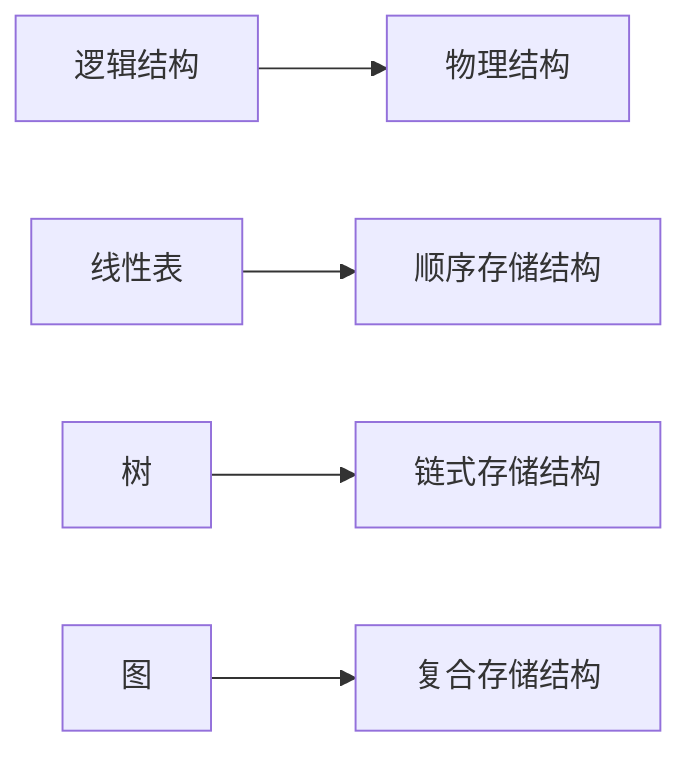
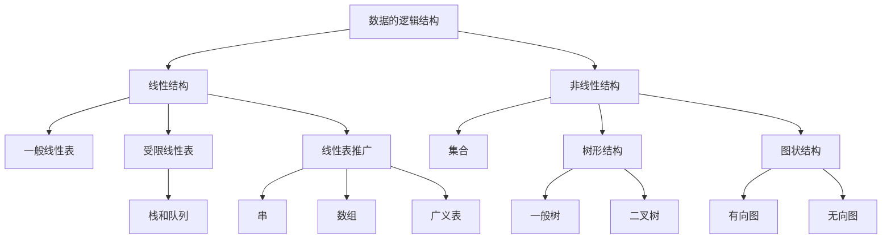

# 数据结构

## 课程信息

- **课程名称**：数据结构
- **教学形式**：线上 + 线下
- **学时**：14 周
- **教材**：清华大学《数据结构》
- **平台**：PTA 网站注册并绑定
- **作业要求**：每周一次作业，实验课上交，纸质版（手写）

### 评分标准

| 项目          | 占比      |
| ----------- | ------- |
| 期末考         | 40%     |
| **平时成绩**    | **60%** |
| ├ 出勤        | 5%      |
| ├ 平时作业 & 实验 | 10%     |
| ├ 实验考试      | 25%     |
| └ 期中考试      | 20%     |

> [!note] 网课要求
> 自学网课的时长需 **≥ 视频总时长的 60%**。

---

## 一、绪论

### 1.1 数据结构的分类

#### 逻辑结构

逻辑结构描述数据元素之间的逻辑关系：

| 类型        | 关系    | 生活实例 |
| --------- | ----- | ---- |
| 集合        | 无特定关系 | —    |
| 线性结构      | 一对一   | 电话簿  |
| 树型结构      | 一对多   | 磁盘目录 |
| 图状 / 网状结构 | 多对多   | 交通网络 |

> 形式化定义：
> $$\text{Data-Structure} = (D, S)$$
> 其中 $D$ 为数据元素的集合，$S$ 为数据元素之间关系的集合。

#### 存储结构（物理结构）

| 存储方式 | 特点 |
| --- | --- |
| **顺序存储结构** | 地址连续 |
| **链式存储结构** | 对地址无连续要求 |
| **复合存储结构** | 多种方式结合 |

逻辑结构与存储结构的对应关系：



#### 数据逻辑结构层次关系



### 1.2 抽象数据类型（ADT）

**抽象数据类型**（Abstract Data Type, **ADT**）由三部分组成：

1. **数据对象**
2. **数据关系**
3. **基本操作**

> [!tip] 课程要求
> 熟悉 **C++ STL** 的常用容器（如 `vector`、`list`、`stack`、`queue`）以及 `sort` 等常用算法。

### 1.3 C 语言实现提示

- 一维数组 → 对应 **顺序存储**
- 结构体 → 对应 **链式存储**
- 课程代码并非纯 C，部分会用到 **C++** 特性。

---

## 二、算法效率的度量

### 2.1 时间复杂度

算法的时间复杂度记为：

$$T(n) = O(f(n))$$

#### 常见时间复杂度

| 名称 | 复杂度 |
| --- | --- |
| 常量时间阶 | $O(1)$ |
| 对数时间阶 | $O(\log_2 n)$ |
| 线性时间阶 | $O(n)$ |
| 线性对数时间阶 | $O(n \log n)$ |
| k 次方时间阶 | $O(n^k)$ |

#### 时间复杂度增长顺序

$$O(1) < O(\log n) < O(n) < O(n \log n) < O(n^2) < O(n^3) < O(2^n) < O(n!) < O(n^n)$$

#### 多项式定理

> [!theorem] 多项式时间复杂度定理
> 若
> $$A(n) = a_m n^m + a_{m-1} n^{m-1} + \cdots + a_1 n + a_0$$
> 是一个 $m$ 次多项式，则
> $$A(n) = O(n^m)$$

#### 例 5：嵌套循环

```c
for (i = 2; i <= n; ++i)
    for (j = 2; j <= i - 1; ++j)
        { ++x; a[i][j] = x; }
```

语句频度：

$$1 + 2 + 3 + \cdots + (n-2) = \frac{(1 + n - 2)(n - 2)}{2} = \frac{(n - 1)(n - 2)}{2} = n^2 - 3n + 2$$

因此，时间复杂度为 $O(n^2)$，即**平方阶**。

> - $O(1)$：基本运算执行次数固定，总时间由常数（零次多项式）限界。
> - $O(n^2)$：算法执行时间由二次多项式限界。

### 2.2 特殊时间复杂度案例

#### 例 1：素数判断算法

```c
void prime(int n)
{
    int i = 2;
    while ((n % i) != 0 && i * 1.0 < sqrt(n))
        i++;
    if (i * 1.0 > sqrt(n))
        printf("%d 是一个素数\n", n);
    else
        printf("%d 不是一个素数\n", n);
}
```

- 嵌套最深层语句：`i++`
- 循环次数由条件 `(n % i) != 0 && i * 1.0 < sqrt(n)` 决定
- 时间复杂度：$O(\sqrt{n})$ 或 $O(n^{1/2})$

#### 例 2：冒泡排序法

```c
void bubble_sort(int a[], int n)
{
    for (i = n - 1; change = TRUE; i > 1 && change; --i) {
        change = FALSE;
        for (j = 0; j < i; ++j)
            if (a[j] > a[j + 1]) {
                a[j] <-> a[j + 1];
                change = TRUE;
            }
    }
}
```

| 情况 | 比较/交换次数 | 时间复杂度 |
| --- | --- | --- |
| 最好 | 0 次交换 | $O(n)$ |
| 最坏 | $1 + 2 + \cdots + (n-1) = \frac{n(n-1)}{2}$ | $O(n^2)$ |
| 平均 | — | $O(n^2)$ |

> [!question] 待补充
> - 平均时间复杂度怎么计算？
> - 空间复杂度。

---

## 三、线性表

### 3.1 线性表的特点

1. 存在唯一的**第一个**元素。
2. 存在唯一的**最后一个**元素。
3. 除第一个元素外，每个元素均有**唯一前驱**。
4. 除最后一个元素外，每个元素均有**唯一后继**。

### 3.2 线性表的 ADT 定义

```text
ADT List {
    数据对象：
        D = { a_i | a_i ∈ ElemSet, i = 1, 2, ..., n, n ≥ 0 }

    数据关系：
        R = { <a_{i-1}, a_i> | a_{i-1}, a_i ∈ D, i = 2, 3, ..., n }

    基本操作：
        InitList(&L)  // & 表示 C++ 的引用，见下方示例
        操作结果：构造一个空的线性表 L；
        ...
} ADT List
```

### 3.3 C++ 引用

> [!note] 引用本质
> C++ 的引用相当于**形参与实参共享同一块内存**，非常适合用来改变实参的值。

#### 示例：传值 vs 传引用

```cpp
#include <stdio.h>

// 修改形参，实参不影响
void f1(int i, int *q) {
    i++;
    q++;
}

// 修改形参，实参同时改变
void f2(int &i, int *&q) {
    i++;
    q++;
}

int main() {
    int a = 10, b[] = {20, 30};
    int *p = b;

    f1(a, p);
    printf("a = %d, *p = %d\n", a, *p);  // a=10, *p=20

    f2(a, p);
    printf("a = %d, *p = %d\n", a, *p);  // a=11, *p=30

    return 0;
}
```

#### 运行结果

```text
a=10, *p=20
a=11, *p=30
```

> [!tip] 引用 vs return
> **引用**比 `return` 更方便传出多个结果。

---

## 附录：速查表

### 逻辑结构 vs 存储结构

| 逻辑结构 | 典型存储结构 |
| --- | --- |
| 线性表 | 顺序存储 |
| 树 | 链式存储 |
| 图 | 复合存储 |

### 常见时间复杂度速记

```
O(1) < O(log n) < O(n) < O(n log n) < O(n^2) < O(n^3) < O(2^n) < O(n!) < O(n^n)
```
