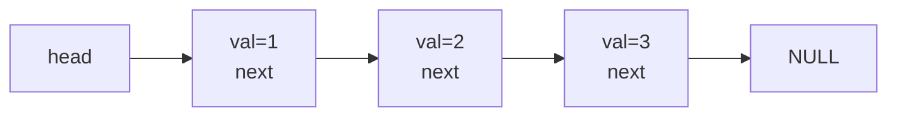
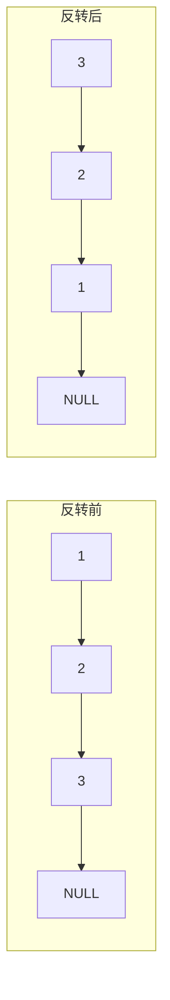
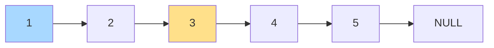

# C++ 链表相关

> [!abstract] 这份笔记包含什么
> 从 `习题.pdf` 中抽取的**全部链表代码**，统一排版、补全注释、修正原文因复制导致的粘连（`intval` → `int val`）与 Bug，并标注每个算法的易错点。
> - 主线：建表 → 遍历 → 增删改 → 快慢指针 → 综合题
> - 附录：指针 / 引用（链表操作的语法地基）

## 目录

- [[#一、节点定义]]
- [[#二、建立链表（尾插法）]]
- [[#三、建立链表（头插法）]]
- [[#四、遍历与输出]]
- [[#五、删除所有值为 v 的节点]]
- [[#六、反转链表]]
- [[#七、合并两个链表并排序]]
- [[#八、倒数第 k 个节点（快慢指针）]]
- [[#九、链表的中间节点 / 后半段]]
- [[#十、链表加法（两数相加）]]
- [[#十一、删除重复节点]]
- [[#十二、附录：指针与引用]]
- [[#十三、坑位清单]]
- [[#十四、万能模板（可直接复制）]]

---

## 一、节点定义

> [!note] 命名说明
> `实验2` 用 `struct node`，`实验3` 用 `struct ListNode`，**两者完全等价**，考试/作业时按题目要求替换名字即可。下面统一用 `node`。

```cpp
#include <iostream>
using namespace std;

// 单链表节点 = 数据域 + 指针域
struct node {
    int  val;      // 数据域：存放本节点的值
    node* next;    // 指针域：指向下一个节点；最后一个节点为 NULL
};
```



> [!tip] 结构体自引用为什么写成 `node* next` 而不是 `node next`？
> 如果写成 `node next`，结构体大小将无限递归无法确定；指针大小固定（8 字节 / 4 字节），所以必须用指针。

---

## 二、建立链表（尾插法）

### 2.1 写法 A：`head + tail` 双指针（推荐）

> [!info] 核心思想
> 用 `tail` 记住当前最后一个节点，新节点直接挂到 `tail->next`，**O(1) 完成一次尾插**。
> 若没有 `tail`，每次插入都要从头遍历到尾，整体退化成 O(n²)。

```cpp
// 尾插法建表：输入若干整数，以 -1 结束（-1 不存入链表）
// 返回：链表头指针；若没有任何有效输入，返回 NULL
node* createList() {
    node* head = NULL;  // 头指针：整条链表的唯一入口，初始为空表
    node* tail = NULL;  // 尾指针：始终指向当前最后一个节点
    int x;

    // cin >> x 返回流对象，可作布尔判断（读到 EOF / 类型错误时为假）
    while (cin >> x && x != -1) {
        // C++11 列表初始化，等价于：
        //   node* newnode = new node; newnode->val = x; newnode->next = NULL;
        node* newnode = new node{x, NULL};

        if (head == NULL) {      // 情况①：空表 —— 新节点既是头也是尾
            head = newnode;
            tail = head;
        } else {                 // 情况②：非空 —— 挂到尾部再更新尾指针
            tail->next = newnode; // 原尾节点接上新节点
            tail = newnode;       // 新节点成为新的尾
        }
    }
    return head;
}
```

> [!warning] 最容易漏的一步
> **空表分支里 `tail = head` 必须写**。只写 `head = newnode` 的话，`tail` 仍是 `NULL`，下一次插入执行 `tail->next` 会直接段错误。

### 2.2 写法 B：`p1 + p2`（先读值再判断，实验3 风格）

```cpp
// 另一种写法：先 new 出节点再读入值，读到 -1 时把该节点丢弃
node* createList() {
    node* head = NULL;
    node *p1, *p2;
    p1 = new node;      // p1：新读入的节点
    p2 = p1;            // p2：始终指向"当前最后一个有效节点"
    cin >> p1->val;

    while (p1->val != -1) {     // 读到 -1 结束
        if (head == NULL)
            head = p1;          // 第一个有效节点作为头节点
        else
            p2->next = p1;      // 接到尾部
        p2 = p1;                // p2 前移到新的末尾
        p1 = new node;          // 为下一次读入准备新节点
        cin >> p1->val;
    }

    p2->next = NULL;            // 收尾：最后一个有效节点的 next 置空
    delete p1;                  // 释放读入 -1 的那个多余节点
    return head;
}
```

> [!bug] 这种写法有两个隐患（OJ 上偶尔会卡）
> 1. 若第一个输入就是 `-1`（空表），`head` 保持 `NULL`，后面 `p2->next = NULL` 虽然不崩，但**逻辑上已无意义**；建议开头先判空。
> 2. 每次循环都要 `new` 一个新节点再丢弃，**多一次堆分配**。
>
> 结论：能自己写代码就优先用 **2.1 的 `head + tail` 写法**，只在题目要求"逐节点读入"结构时才用这种。

### 2.3 尾插法 vs 头插法对照

| 对比项 | 尾插法 | 头插法 |
| --- | --- | --- |
| 新节点位置 | 链表末尾 | 链表头部 |
| 输出顺序 | 与输入顺序**一致** | 与输入顺序**相反** |
| 需要的指针 | `head` + `tail` | 只需 `head` |
| 时间复杂度 | O(n) | O(n) |
| 典型用途 | 建表、合并 | 反转、链表加法（低位对齐） |

---

## 三、建立链表（头插法）

> [!tip] 头插法的两句口诀
> **新节点指向老头，再让新节点当头。**

```cpp
// 头插法建表：新节点每次都插到最前面，因此输出顺序与输入顺序相反
node* createList() {
    node* head = NULL;   // 头指针初始为空
    int x;

    while (cin >> x && x != -1) {
        node* newNode = new node{x, NULL};
        newNode->next = head;  // ① 新节点的 next 指向"老的头节点"
        head = newNode;        // ② 更新头指针，新节点成为新头
    }
    return head;
}
```

> [!example] 输入 `1 2 3 -1`
> 尾插法输出：`1 2 3`（顺序不变）
> 头插法输出：`3 2 1`（逆序，等价于**原地反转**）

---

## 四、遍历与输出

```cpp
// 遍历输出整条链表；空表按题目要求输出 -1
void printList(node* head) {
    if (head == NULL) {         // 空表特判，避免非法访问
        cout << "-1 ";
        return;
    }
    node* p = head;             // ★ 用临时指针 p 遍历，不要直接移动 head
    while (p != NULL) {         // 链表遍历的标准终止条件
        cout << p->val << " ";
        p = p->next;            // 后移一步，绝对不能写成 p++
    }
}
```

```cpp
int main() {
    node* head = NULL;
    head = createList();   // 建表
    printList(head);       // 输出
    return 0;
}
```

> [!warning] 两个新手高频错误
> 1. **直接拿 `head` 去遍历**（`head = head->next`）—— 链表头丢失，之后再也找不回这条链。务必另起 `node* p = head`。
> 2. **`p++` 移动指针** —— 链表节点在堆上**不一定连续**，`p++` 是地址加一个 `node` 大小，属于非法访问。必须写 `p = p->next`。

---

## 五、删除所有值为 v 的节点

> [!info] 题目（实验2 No.4）
> 给定链表和值 `v`，删除链表中**所有** `val == v` 的节点并返回新头指针；删空后输出 `-1`。

### 5.1 原版写法（分"头节点 / 非头节点"两种情况）

```cpp
// 删除链表中所有值为 v 的节点，返回新的头指针
node* deleteElements(node* head, int v) {
    node* p1   = NULL;   // 暂存"待删除节点"
    node* p2   = head;   // 遍历指针
    node* temp = NULL;   // 删除头节点时的临时指针

    while (p2 != NULL) {
        // 情况①：头节点本身就要删 —— 头指针会变，必须单独处理
        if (p2->val == v && p2 == head) {
            temp = head;
            head = temp->next;   // 头指针后移
            delete temp;         // 释放原头节点
            p2 = head;           // 重置 p2，继续检查新的头节点
            continue;            // 跳过本次循环剩余部分
        }
        // 情况②：删除 p2 后面的那个节点（p2 自身不动）
        if (p2->next != NULL && p2->next->val == v) {
            p1 = p2->next;       // p1 指向待删节点
            p2->next = p1->next; // 跨过待删节点，接上后面的部分
            delete p1;           // 释放内存
            // 注意：这里 p2 不后移！因为新的 p2->next 可能也是 v
        } else {
            p2 = p2->next;       // 不需要删除，才后移
        }
    }
    return head;
}
```

```cpp
int main() {
    node* head = NULL;
    head = createList();
    int v;
    cin >> v;
    head = deleteElements(head, v);   // ★ 必须接住返回值，头节点可能被删
    printList(head);
    return 0;
}
```

> [!danger] 三处必错点
> 1. **`head = deleteElements(head, v)` 不能省**。删除头节点时头指针会变，不接返回值就会用野指针。
> 2. **删除非头节点后 `p2` 不能后移**。连续两个 `v` 的情况（如 `2 → 2 → 3` 删 2）会漏删第二个。
> 3. **`delete` 之前必须先接好链**（`p2->next = p1->next`），否则链表断裂，后面全部丢失。

### 5.2 推荐写法：虚拟头节点（哑节点）

> [!tip] 为什么更好
> 加一个**不存数据的哨兵节点**挂在最前面，所有真实节点都变成"非头节点"，两种情况合并成一种，代码量减半且不会漏删。

```cpp
node* deleteElements(node* head, int v) {
    node dummy;              // 栈上的虚拟头节点，函数结束自动回收
    dummy.next = head;
    node* p = &dummy;        // p 从虚拟头开始遍历

    while (p->next != NULL) {
        if (p->next->val == v) {
            node* del = p->next;      // 标记待删节点
            p->next = del->next;      // 跨过它
            delete del;               // 释放
        } else {
            p = p->next;              // 只有不删时才后移（连续 v 不会漏）
        }
    }
    return dummy.next;       // 真正的头节点
}
```

---

## 六、反转链表

> [!info] 题目（实验2 No.5）
> 用尾插法建表后反转，输出逆序结果。

```cpp
// 反转单链表，返回新链表的头指针（原链表的尾节点）
node* reverseList(node* head) {
    // 空表或只有一个节点，反转后还是自己，直接返回
    if (head == NULL || head->next == NULL) {
        return head;
    }

    node* prev    = NULL;   // 前驱节点
    node* current = head;   // 当前正在处理的节点
    node* next    = NULL;   // 后继节点，防止"改指针后找不到后面"

    while (current != NULL) {
        next = current->next;   // ① 先保存后继（否则下一步就断了）
        current->next = prev;   // ② 反转：当前节点指回前驱
        prev = current;         // ③ prev 后移
        current = next;         // ④ current 后移
    }
    return prev;    // current 为 NULL 时，prev 停在原表最后一个节点 = 新表头
}
```

```cpp
int main() {
    node* head = NULL;
    head = createList();            // 尾插法：保持输入顺序
    node* head1 = reverseList(head);// 反转得到逆序
    printList(head1);
    return 0;
}
```



> [!warning] 循环体内四步顺序绝对不能乱
> 必须先 `next = current->next` 保存后继，再改 `current->next`。**顺序颠倒 = 链表断裂，后面的节点全部丢失**。

> [!tip] 记忆口诀
> **先存后、再改指、双双后移；返回 prev。**

---

## 七、合并两个链表并排序

> [!info] 题目（实验2 No.6）
> 输入两个链表，合并成一个**按值升序**的新链表输出。

### 7.1 完整实现

```cpp
#include <iostream>
using namespace std;

struct node {
    int   val;
    node* next;
};

// 尾插法建表（同第二节）
node* createList() {
    node* head = NULL;
    node* tail = NULL;
    int num;
    while (cin >> num && num != -1) {
        node* newNode = new node;
        newNode->val  = num;
        newNode->next = NULL;
        if (head == NULL) {
            head = newNode;
            tail = newNode;
        } else {
            tail->next = newNode;
            tail = newNode;
        }
    }
    return head;
}

// 合并两个链表并升序排序
// 思路：新建第 3 条链表，把两条链表的节点"复制"过去，再做冒泡排序
node* merge(node* head1, node* head2) {
    node* head3 = NULL;   // 新链表头
    node* tail3 = NULL;   // 新链表尾

    // ---- ① 复制第一条链表 ----
    node* p = head1;
    while (p != NULL) {
        node* newNode = new node;
        newNode->val  = p->val;
        newNode->next = NULL;
        if (head3 == NULL) {          // 新表为空
            head3 = newNode;
            tail3 = newNode;
        } else {                      // 尾插
            tail3->next = newNode;
            tail3 = newNode;
        }
        p = p->next;
    }

    // ---- ② 复制第二条链表（逻辑完全相同）----
    p = head2;
    while (p != NULL) {
        node* newNode = new node;
        newNode->val  = p->val;
        newNode->next = NULL;
        if (head3 == NULL) {
            head3 = newNode;
            tail3 = newNode;
        } else {
            tail3->next = newNode;
            tail3 = newNode;
        }
        p = p->next;
    }

    // ---- ③ 冒泡排序（交换节点的值，不动指针）----
    if (head3 != NULL) {
        bool   swapped;      // 本轮是否发生过交换（提前结束标志）
        node*  current;
        node*  last = NULL;  // 已排好序部分的边界，每轮向前推进一格
        do {
            swapped = false;
            current = head3;
            while (current->next != last) {        // 只比较未排序区间
                if (current->val > current->next->val) {
                    int temp             = current->val;
                    current->val         = current->next->val;
                    current->next->val   = temp;
                    swapped = true;
                }
                current = current->next;
            }
            last = current;      // 本轮最后一个元素已就位
        } while (swapped);       // 一轮都没交换说明已有序，直接退出
    }

    return head3;
}

int main() {
    node *head1, *head2, *head3;
    head1 = createList();
    head2 = createList();
    head3 = merge(head1, head2);
    printList(head3);
    return 0;
}
```

> [!bug] 原文的一处笔误（已修正）
> PDF 中写成 `node* newNode = newnode;` —— **`new` 与 `node` 之间丢了空格**，编译报错。正确写法是 `new node`。

> [!note] 为什么排序只"换值"不"换指针"？
> 交换节点的值只需 3 行赋值；交换节点本身要处理前驱、后继共 4 个指针，边界极多。数据量不大时**换值是最省事的做法**。

> [!tip] 复杂度
> 复制 O(n+m) + 冒泡 O((n+m)²)，整体 **O(n²)**。若两个链表**本身已有序**，应改用"二路归并"（双指针直接挑较小的节点接上去），可降到 **O(n+m)**：
> ```cpp
> // 二路归并（要求 l1、l2 均已升序）
> node* mergeSorted(node* l1, node* l2) {
>     node dummy;              // 虚拟头节点，省去"谁做头"的判断
>     node* t = &dummy;
>     dummy.next = NULL;
>     while (l1 && l2) {
>         if (l1->val <= l2->val) { t->next = l1; l1 = l1->next; }
>         else                    { t->next = l2; l2 = l2->next; }
>         t = t->next;
>     }
>     t->next = l1 ? l1 : l2;   // 把剩余整段直接接上
>     return dummy.next;
> }
> ```

---

## 八、倒数第 k 个节点（快慢指针）

> [!info] 题目（实验2 No.7）
> 找出链表倒数第 k 个节点，输出其值；不存在则输出 `-1`。

```cpp
// 快慢指针：快指针先走 k+1 步，然后两指针同步前进
// 当快指针走到 NULL 时，慢指针正好停在目标节点
ListNode* getKthFromEnd(ListNode* head, int k) {
    if (head == NULL || k < 0) {     // 空表或 k 非法
        return NULL;
    }

    ListNode* p1 = head;   // 快指针
    ListNode* p2 = head;   // 慢指针

    // 快指针先走 k+1 步
    for (int i = 0; i < k + 1; i++) {
        if (p1 == NULL) {            // 链表长度不足 k+1，不存在倒数第 k 个
            return NULL;
        }
        p1 = p1->next;
    }

    // 两指针同步前进，间距始终保持 k+1
    while (p1 != NULL) {
        p2 = p2->next;
        p1 = p1->next;
    }
    return p2;
}
```

> [!danger] ⚠ 下标口径：这份代码的 k 是"从 0 开始数"
> 实测：`1 → 2 → 3 → 4 → 5`，传 `k = 0` 返回 **5**（最后一个节点）。
> 也就是说 **k = 0 ↔ 日常说的"倒数第 1 个"**。
> - 若题目按**日常 1 起算**（倒数第 1 个 = 尾节点），把循环条件 `i < k + 1` 改成 **`i < k`**；
> - 或者调用时统一写 `getKthFromEnd(head, k - 1)`。
>
> 提交前务必用样例确认 k 的口径，这是本题最常见的 WA 原因。


> 快指针在 `3`、慢指针在 `1`，间距 2；同步走两步后快指针到 NULL，慢指针落在 `3`（k=1 时）。

---

## 九、链表的中间节点 / 后半段

> [!info] 题目（实验2 No.8）
> 输出链表的**后半个链表**（从中间节点开始到末尾）。

```cpp
// 快慢指针：慢指针走 1 步，快指针走 2 步
// 快指针到末尾时，慢指针恰好位于中间（偶数长度时取"偏右"的那个）
ListNode* middleNode(ListNode* head) {
    if (head == NULL) return NULL;      // 空表

    ListNode* slow = head;              // 慢指针：每次 1 步
    ListNode* fast = head;              // 快指针：每次 2 步

    // 条件顺序不能反：先判 fast 非空，再判 fast->next 非空
    while (fast != NULL && fast->next != NULL) {
        slow = slow->next;              // 走 1 步
        fast = fast->next->next;        // 走 2 步
    }
    return slow;                        // 后半段链表的起始节点
}

int main() {
    ListNode* head = createList();
    ListNode* ans  = middleNode(head);
    if (ans == NULL) {
        cout << "-1";
    } else {
        while (ans != NULL) {           // 从中间节点一路输出到尾
            cout << ans->val << " ";
            ans = ans->next;
        }
    }
    return 0;
}
```

> [!warning] 循环条件必须是 `fast != NULL && fast->next != NULL`
> 短路求值保证 `fast->next->next` 不会解引用空指针。写成 `fast->next != NULL && fast != NULL` 会在偶数长度时崩溃。

> [!note] 偶数长度取哪个中间节点？
> - 本写法（`fast` 判空条件如上）：`1 2 3 4` 返回 **3**（偏右）→ 后半段为 `3 4`。
> - 若要**偏左**（返回 `2`），把条件改成 `while (fast->next != NULL && fast->next->next != NULL)`。

---

## 十、链表加法（两数相加）

> [!info] 题目（实验3 No.4）
> 两个链表分别表示两个整数（高位在前，如 `7→2→4→3` 表示 7243），求它们的和并用同样的链表形式输出。

### 10.1 思路

```text
原链表1: 7 → 2 → 4 → 3   (7243)
            ↓ 头插法反转
反转后1: 3 → 4 → 2 → 7   (3427，低位在前)

原链表2: 5 → 6 → 4       (564)
            ↓ 头插法反转
反转后2: 4 → 6 → 5       (465，低位在前)

低位对齐相加：
  3 → 4 → 2 → 7
+ 4 → 6 → 5
= 7 → 0 → 8 → 7         (中间结果，仍是低位在前)

结果链表用"头插法"构建 → 自动反转为高位在前：
  7 → 8 → 0 → 7         (7807) ✅
```

> [!tip] 一句话记流程
> **两次反转把"高位在前"变成"低位在前" → 逐位相加带进位 → 头插法建结果表顺带反转回正确顺序。**

### 10.2 完整代码

```cpp
#include <iostream>
using namespace std;

struct ListNode {
    int       val;
    ListNode* next;
};

// 先读后判式建表（见 2.2 节）
ListNode* createList() {
    ListNode* head = NULL;
    ListNode *p1, *p2;
    p1 = new ListNode;
    p2 = p1;
    cin >> p1->val;
    while (p1->val != -1) {
        if (head == NULL) head = p1;
        else              p2->next = p1;
        p2 = p1;
        p1 = new ListNode;
        cin >> p1->val;
    }
    p2->next = NULL;
    delete p1;
    return head;
}

// 两个"高位在前"的链表相加，返回"高位在前"的结果链表
ListNode* addTwoNumbers(ListNode* l1, ListNode* l2) {
    ListNode *p1, *p2, *p3, *p;
    p1 = NULL;   // 反转后的 l1（低位在前）
    p2 = NULL;   // 反转后的 l2（低位在前）
    p3 = NULL;   // 结果链表（用头插法构建，最终高位在前）
    p  = l1;

    // ---- ① 反转 l1：遍历原表，把每个节点头插到 p1 ----
    while (p != NULL) {
        ListNode* newnode1 = new ListNode;
        newnode1->val  = p->val;
        newnode1->next = p1;     // 头插法 → 实现反转
        p1 = newnode1;
        p  = p->next;
    }

    // ---- ② 反转 l2 ----
    p = l2;
    while (p != NULL) {
        ListNode* newnode2 = new ListNode;
        newnode2->val  = p->val;
        newnode2->next = p2;
        p2 = newnode2;
        p  = p->next;
    }

    // ---- ③ 逐位相加 ----
    int x = 0;
    int y = 0;                          // y：进位
    while (p1 != NULL || p2 != NULL) {  // 只要还有一位没加完
        if (p1 != NULL && p2 != NULL) {          // 两边都有
            x = (p1->val + p2->val + y) % 10;    // 本位数字
            ListNode* newnode3 = new ListNode;
            newnode3->val  = x;
            newnode3->next = p3;                 // 头插法构建结果
            p3 = newnode3;
            y = (p1->val + p2->val + y) / 10;    // 更新进位
            p1 = p1->next;
            p2 = p2->next;
        } else if (p1 != NULL && p2 == NULL) {   // 只剩 l1
            ListNode* newnode3 = new ListNode;
            newnode3->val  = (p1->val + y) % 10;
            newnode3->next = p3;
            p3 = newnode3;
            y = (p1->val + y) / 10;
            p1 = p1->next;
        } else {                                 // 只剩 l2
            ListNode* newnode3 = new ListNode;
            newnode3->val  = (p2->val + y) % 10;
            newnode3->next = p3;
            p3 = newnode3;
            y = (p2->val + y) / 10;
            p2 = p2->next;
        }
    }

    // ---- ④ 最高位还有进位，再补一个节点 ----
    if (y > 0) {
        ListNode* newnode3 = new ListNode;
        newnode3->val  = y;
        newnode3->next = p3;
        p3 = newnode3;
    }
    return p3;
}

int main() {
    ListNode *head1, *head2;
    head1 = createList();
    head2 = createList();
    ListNode* ans = addTwoNumbers(head1, head2);
    if (ans == NULL) {
        cout << "-1";
    } else {
        while (ans != NULL) {
            cout << ans->val << " ";
            ans = ans->next;
        }
        cout << -1;      // ★ 题目要求：结果之后还要再输出一个 -1
    }
    return 0;
}
```

> [!danger] 三个致命细节
> 1. **进位 `y` 必须在算完本位之后再更新**，且要先 `x` 后 `y`（`y` 依赖旧值）。
> 2. **循环结束后还要检查 `y > 0`**，否则 `999 + 1` 会丢掉最高位的 1。
> 3. **结果用头插法**，否则最终输出顺序是反的。

> [!question] 为什么不用"递归/栈"做反转？
> 头插法新建节点的方式**不破坏原链表**，调试友好；代价是 O(n) 额外空间。若允许修改原链表，可直接用第六节 `reverseList` 原地反转，**空间 O(1)**。

---

## 十一、删除重复节点

> [!info] 题目（实验3 No.5）
> 在一个**已排序**链表中，删除所有出现次数 > 1 的节点，只保留只出现过一次的节点。
> 例：`1→2→2→3` → `1→3`（`2` 被整个删掉，不是去重成一个）。

```cpp
// 删除有序链表中所有重复出现的节点
ListNode* delete_duplicates(ListNode* head) {
    // 空表或单节点表不可能有重复
    if (head == NULL || head->next == NULL)
        return head;

    ListNode* p1 = head;        // 当前检查的节点
    ListNode* p2 = head->next;  // p1 的后继，用来发现重复
    ListNode* p  = head;        // 上一个"确定不重复"的节点，用于重新接链

    while (p1 != NULL && p2 != NULL) {
        if (p1->val == p2->val) {          // 发现重复
            int x = p1->val;               // 记下这个重复的值

            // ① 删掉后面所有值为 x 的节点
            while (p2 != NULL && p2->val == x) {
                ListNode* t2 = p2;
                p2 = p2->next;
                delete t2;
            }

            // ② 再删掉 p1 本身
            ListNode* t1 = p1;
            if (p == p1) {                 // 情况A：p1 还是头节点（p 从未移动）
                head = p2;                 // 新头指向 p2
                p1   = head;
                p2   = (head != NULL) ? head->next : NULL;
                p    = head;
            } else {                       // 情况B：p1 在中间
                p->next = p2;              // 上一个安全节点跨过 p1 直接接 p2
                p1 = p2;
                p2 = (p1 != NULL) ? p1->next : NULL;
            }
            delete t1;
        } else {                           // 无重复，三个指针一起后移
            p  = p1;                       // p1 成为新的"上一个安全节点"
            p1 = p1->next;
            p2 = p2->next;
        }
    }
    return head;
}
```

> [!warning] 前提与易错点
> 1. **该算法只在链表有序时成立**。无序链表要先排序，或改用哈希表统计频次。
> 2. 用 `p == p1` 判断"p1 是不是头节点"是个技巧，但可读性差；更清晰的写法同样用**虚拟头节点**。
> 3. 注意本题语义是**删光所有重复值**（LeetCode 82），而不是**去重保留一个**（LeetCode 83）。二者代码不同，别写混。

> [!tip] 虚拟头节点版本（更短更稳）
> ```cpp
> ListNode* delete_duplicates(ListNode* head) {
>     ListNode dummy;
>     dummy.next = head;
>     ListNode* pre = &dummy;      // pre：最后一个"安全"节点
>     ListNode* cur = head;
>
>     while (cur != NULL) {
>         // 探查 cur 开始的一段等值区间
>         bool dup = false;
>         while (cur->next != NULL && cur->next->val == cur->val) {
>             dup = true;
>             ListNode* t = cur->next;
>             cur->next = t->next;
>             delete t;
>         }
>         if (dup) {               // 出现过重复：cur 也要删
>             ListNode* t = cur;
>             cur = cur->next;
>             pre->next = cur;
>             delete t;
>         } else {                 // 唯一：保留，pre 前进
>             pre = cur;
>             cur = cur->next;
>         }
>     }
>     return dummy.next;
> }
> ```

---

## 十二、附录：指针与引用

> [!note] 为什么附录要放这个
> 链表函数里到处是 `node*`、`node*&`、`*p`、`p->next`。**分不清"指针的引用"就看不懂为什么头指针会变**。这一节是实验2 No.9~No.13 的精华。

### 12.1 三种修改参数的方式（No.9 / No.11）

```cpp
#include <iostream>
using namespace std;

// ① 引用传递：a 是实参的别名，改 a 就是改原变量
void modify1(int &a) {
    a = 20;
}

// ② 指针传递：a 存的是地址，*a 解引用后才拿到原变量
void modify2(int *a) {
    *a = 25;
}

// ③ 指针的引用：a 是"指针变量本身"的别名
//    *a 改的是指针指向的内容；改 a 本身还能让实参指针换个指向
void modify3(int *&a) {
    *a = 50;
}

int main() {
    int x, y, z;
    cin >> x >> y >> z;

    modify1(x);          // 直接传变量
    cout << x << endl;   // 20

    modify2(&y);         // 传地址
    cout << y << endl;   // 25

    int* pz = &z;
    modify3(pz);         // 传指针变量本身
    cout << z << endl;   // 50

    return 0;
}
```

### 12.2 三种交换（No.10）

```cpp
// ① 引用交换
void swap1(int &a, int &b) {
    int temp = a;   // 暂存 a
    a = b;          // b 的值给 a
    b = temp;       // 原 a 的值给 b
}

// ② 指针交换：通过解引用操作原变量
void swap2(int *a, int *b) {
    int temp = *a;  // 取出 a 指向的值
    *a = *b;        // b 指向的值写入 a 指向的空间
    *b = temp;
}

// ③ 指针引用交换：pa 是指针的别名，*pa 同样是原变量
void swap3(int *&pa, int *&pb) {
    int temp = *pa;
    *pa = *pb;
    *pb = temp;
}

// 调用方式对比
// swap1(x1, y1);        // 传变量名
// swap2(&x2, &y2);      // 传地址
// int* pa = &a; swap3(pa, pb);   // 传指针变量
```

### 12.3 增量操作（No.11）

```cpp
void add1(int &x, int &y, int n) {      // 引用
    x = x + n;
    y = y + n;
}
void add2(int *x, int *y, int n) {      // 指针
    *x = *x + n;
    *y = *y + n;
}
void add3(int *&x, int *&y, int n) {    // 指针的引用
    *x = *x + n;
    *y = *y + n;
}
// 调用：add1(a, b, 5) / add2(&a, &b, 10) / add3(pa, pb, 7)
```

### 12.4 数组元素交换（No.12）

```cpp
// 引用版：给数组元素起别名
void swapByIndex1(int arr[], int i, int j) {
    int &a = arr[i];      // a 就是 arr[i] 本身
    int &b = arr[j];
    int temp = a;
    a = b;
    b = temp;
}

// 指针版：arr 退化为指向首元素的指针，用指针算术定位
void swapByIndex2(int *arr, int i, int j) {
    int temp     = *(arr + i);   // arr + i = 第 i 个元素的地址
    *(arr + i)   = *(arr + j);   // * 解引用取值
    *(arr + j)   = temp;
}
```

### 12.5 修改字符串中的字符（No.13）

```cpp
void modifyChar1(char &c) { c = 'a'; }   // 引用
void modifyChar2(char *c) { *c = 'r'; }  // 指针

// 调用：
// char str[] = "hello"; modifyChar1(str[1]);  // → "hallo"
// char s2[]  = "world"; modifyChar2(&s2[1]);  // → "wrrld"
```

> [!tip] 一张表总结
> | 形参写法 | 含义 | 能否改原变量的值 | 能否改实参指针的指向 |
> | --- | --- | --- | --- |
> | `int a` | 值传递（拷贝） | ❌ | ❌ |
> | `int &a` | 引用 | ✅ | — |
> | `int *a` | 指针 | ✅（用 `*a`） | ❌ |
> | `int *&a` | 指针的引用 | ✅（用 `*a`） | ✅ |

> [!question] 链表里什么时候必须用 `node*&`？
> 当函数需要**修改调用者手里的头指针本身**时（如在头部插入/删除节点、反转写回），就要传 `node*& head`；
> 只改链上内容、头指针不变时，传 `node* head` 即可（或返回新头指针，本文大部分代码采用"返回新头"的写法）。

---

## 十三、坑位清单

> [!bug] 1. 忘记接住返回的头指针
> `deleteElements(head, v);` ❌ 应为 `head = deleteElements(head, v);` ✅
> 删除/反转/去重都可能改变头节点。

> [!bug] 2. 直接拿 `head` 遍历
> 遍历必须用临时指针 `node* p = head`，否则链表头永久丢失。

> [!bug] 3. 用 `p++` 移动链表指针
> 节点在堆上不连续，必须 `p = p->next`。

> [!bug] 4. 尾插法空表分支漏写 `tail = head`
> 下一次 `tail->next` 会解引用空指针。

> [!bug] 5. 删除节点后立刻后移指针
> 连续相同值会漏删。应在 `else` 分支才移动 `p`。

> [!bug] 6. `delete` 前没接好链
> 顺序永远是：**接链 → 改指针 → `delete`**。

> [!bug] 7. 快慢指针循环条件顺序写反
> 必须 `while (fast != NULL && fast->next != NULL)`，依靠短路避免空指针解引用。

> [!bug] 8. 倒数第 k 个的"下标口径"搞反
> 见 [[#八、倒数第 k 个节点（快慢指针）]]，先确认 k 从 0 还是从 1 起算。

> [!bug] 9. 加法漏掉最高位进位
> 循环结束后必须 `if (y > 0)` 补一个节点。

> [!bug] 10. 内存泄漏
> 本文所有代码为 OJ 服务，均未释放整条链表（进程结束由 OS 回收）。若写成库函数，需配套：
> ```cpp
> void destroyList(node* head) {
>     while (head != NULL) {
>         node* t = head;
>         head = head->next;
>         delete t;          // 同样要先保存 next 再 delete
>     }
> }
> ```

---

## 十四、万能模板（可直接复制）

> [!example] 复制这一段就能跑起一道链表题

```cpp
#include <iostream>
using namespace std;

// ===== 1. 节点定义 =====
struct node {
    int   val;
    node* next;
};

// ===== 2. 尾插法建表（输入 -1 结束）=====
node* createList() {
    node* head = NULL;
    node* tail = NULL;
    int x;
    while (cin >> x && x != -1) {
        node* p = new node{x, NULL};
        if (head == NULL) head = tail = p;
        else { tail->next = p; tail = p; }
    }
    return head;
}

// ===== 3. 遍历输出（空表输出 -1）=====
void printList(node* head) {
    if (head == NULL) { cout << "-1 "; return; }
    for (node* p = head; p != NULL; p = p->next)
        cout << p->val << " ";
}

// ===== 4. 释放整条链表 =====
void destroyList(node* head) {
    while (head != NULL) {
        node* t = head;
        head = head->next;
        delete t;
    }
}

// ===== 5. 常用操作 =====
// 反转
node* reverseList(node* head) {
    node *prev = NULL, *cur = head, *nxt = NULL;
    while (cur != NULL) {
        nxt = cur->next;
        cur->next = prev;
        prev = cur;
        cur = nxt;
    }
    return prev;
}

// 删除所有值为 v 的节点（虚拟头节点版）
node* deleteElements(node* head, int v) {
    node dummy;
    dummy.next = head;
    for (node* p = &dummy; p->next != NULL; ) {
        if (p->next->val == v) {
            node* d = p->next;
            p->next = d->next;
            delete d;
        } else {
            p = p->next;
        }
    }
    return dummy.next;
}

// 找中间节点（偏右）
node* middleNode(node* head) {
    if (head == NULL) return NULL;
    node *slow = head, *fast = head;
    while (fast != NULL && fast->next != NULL) {
        slow = slow->next;
        fast = fast->next->next;
    }
    return slow;
}

// ===== 6. 主函数 =====
int main() {
    node* head = createList();
    printList(head);
    destroyList(head);
    return 0;
}
```

---

> [!quote] 一句话总结
> **建表记 `tail`，遍历另起 `p`；删改先接链，头变接返回；快慢指针看间距，倒数第 k 先确认口径。**
